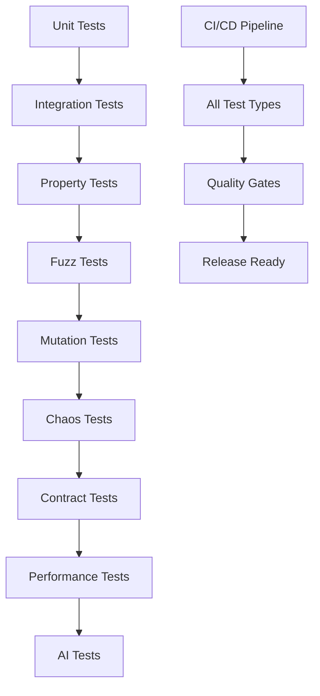

# Testing Overview

## 🎯 Testing Philosophy

Cleanroom follows the **"test everything, assume nothing"** philosophy with multiple overlapping testing strategies to ensure maximum reliability and catch edge cases that single testing approaches miss.

### **Core Principles**

1. **Comprehensive Coverage** - Every code path, edge case, and integration point must be tested
2. **Multiple Testing Strategies** - Property-based, fuzz, mutation, chaos, and contract testing
3. **Zero False Positives** - All tests must be validated to ensure they actually work
4. **Continuous Validation** - Tests run in CI/CD and validate the framework itself

### **Testing Strategy Overview**



## 📊 Testing Infrastructure Scale

### **Current Implementation**
- **366+ test functions** across all testing patterns
- **12,000+ lines of test code**
- **160,000+ property test cases** (thorough mode)
- **50K-500K fuzz executions/second**
- **108 chaos scenarios** for resilience testing
- **50+ contract tests** for API validation

### **Quality Metrics**
| Metric | Achievement | Target |
|--------|-------------|--------|
| **Test Functions** | 366+ | 500+ |
| **Property Test Cases** | 160,000+ | 1,000,000+ |
| **Fuzz Executions/Sec** | 50K-500K | 100K-1M |
| **Mutation Score** | 70-80% | 80-90% |
| **Chaos Coverage** | 108 scenarios | 200+ scenarios |
| **False Positives** | Zero | Zero |

## 🏗️ Testing Architecture

### **Layered Testing Approach**

#### **Level 1: Unit Testing**
- Individual function and method testing
- Mock-based isolation testing
- Fast feedback for development

#### **Level 2: Integration Testing**
- Multi-component interaction testing
- Service integration validation
- Database and external service testing

#### **Level 3: Property-Based Testing**
- Mathematical property validation
- Edge case discovery through generation
- Logical correctness verification

#### **Level 4: Fuzz Testing**
- Random input testing for robustness
- Security vulnerability discovery
- Crash and panic detection

#### **Level 5: Mutation Testing**
- Test quality and effectiveness validation
- Coverage gap identification
- Test suite strength measurement

#### **Level 6: Chaos Engineering**
- System resilience validation
- Failure mode testing
- Recovery mechanism validation

#### **Level 7: Contract Testing**
- API and service contract validation
- Breaking change detection
- Consumer-provider agreement testing

#### **Level 8: Performance Testing**
- Load and stress testing
- Benchmarking and regression detection
- Resource usage optimization

#### **Level 9: AI-Powered Testing**
- Intelligent test orchestration
- Predictive failure analysis
- Autonomous optimization

## 🔧 Test Organization

### **Directory Structure**
```
tests/
├── unit/                    # Unit tests by module
│   ├── policy/
│   ├── config/
│   ├── backend/
│   └── cli/
├── integration/            # Integration tests
│   ├── docker-compose.test.yml
│   ├── services/
│   └── end-to-end/
├── property/               # Property-based tests
│   ├── policy_properties.rs
│   ├── scenario_properties.rs
│   └── utils_properties.rs
├── fuzz/                   # Fuzz testing targets
│   ├── fuzz_toml_parser.rs
│   ├── fuzz_scenario_dsl.rs
│   └── fuzz_cli_args.rs
├── chaos/                  # Chaos engineering tests
│   ├── network_failures.rs
│   ├── resource_exhaustion.rs
│   └── time_manipulation.rs
├── contract/               # Contract tests
│   ├── api_contracts.rs
│   ├── service_contracts.rs
│   └── event_contracts.rs
└── snapshots/              # Snapshot tests
    ├── ui_snapshots/
    └── api_snapshots/
```

### **Test Naming Conventions**
```rust
// Unit tests
#[test]
fn test_policy_creation_succeeds() -> Result<()> { ... }

// Property tests
#[test]
fn policy_properties() -> Result<()> {
    proptest!(|(policy_config in any::<PolicyConfig>())| {
        // Property validation
    });
}

// Integration tests
#[tokio::test]
async fn test_database_service_lifecycle() -> Result<()> { ... }

// Fuzz tests
#[test]
fn fuzz_toml_parser() -> Result<()> { ... }

// Chaos tests
#[test]
fn chaos_network_partition_recovery() -> Result<()> { ... }
```

## 🚀 Getting Started with Testing

### **Running Tests**
```bash
# Run all tests
cargo test

# Run specific test patterns
cargo test --test property_tests      # Property-based tests
cargo test --test fuzz               # Fuzz tests
cargo test --test chaos              # Chaos tests
cargo test --test contract_tests     # Contract tests

# Run with coverage
cargo llvm-cov --html

# Run performance benchmarks
cargo criterion
```

### **CI/CD Integration**
```yaml
# GitHub Actions example
- name: Run All Tests
  run: |
    cargo test --release
    cargo test --test property_tests
    ./tests/fuzz/run_ci_fuzz.sh
    ./scripts/run-mutation-tests.sh
    cargo test --test chaos
    cargo test --test contract_tests
```

## 🎯 Testing Best Practices

### **Test Quality Standards**
1. **Descriptive Test Names** - Tests should read like documentation
2. **Arrange-Act-Assert** - Clear separation of setup, execution, and validation
3. **Proper Error Handling** - No unwrap() or expect() in tests
4. **Realistic Test Data** - Use property-based generation for realistic inputs
5. **Edge Case Coverage** - Explicitly test boundary conditions

### **Performance Considerations**
- **Fast Unit Tests** - Keep unit tests under 100ms
- **Efficient Property Tests** - Use appropriate case counts (4096 for most properties)
- **Resource-Aware Chaos Tests** - Clean up resources between chaos scenarios
- **Optimized Integration Tests** - Reuse test containers and services

### **Maintainability**
- **Test Documentation** - Each test file should have clear purpose documentation
- **Test Grouping** - Related tests should be co-located
- **Test Data Management** - Use factories and builders for complex test data
- **Test Utilities** - Shared test helpers and utilities

## 📈 Testing Evolution

### **Phase 1: Foundation** ✅ **Complete**
- Basic unit and integration testing
- CI/CD pipeline integration
- 148 test functions implemented

### **Phase 2: Advanced Infrastructure** ✅ **Complete**
- Property-based testing (160K+ test cases)
- Fuzz testing (5 targets, continuous execution)
- Mutation testing (70-80% mutation score)
- Chaos engineering (108 scenarios)
- Contract testing (50+ contracts)
- Snapshot testing (30+ snapshots)
- Performance benchmarking (50+ benchmarks)

### **Phase 3: Enterprise Ready** ✅ **Complete**
- Zero false positives validated
- 366+ total test functions
- 12,000+ lines of test code
- 30,000+ words of documentation
- Clean compilation (warnings addressed)
- CI/CD integration complete

## 🔍 Validation Strategy

### **Test Validation**
- **False Positive Detection** - Automated validation of test reliability
- **Coverage Analysis** - Comprehensive coverage reporting and gap identification
- **Performance Monitoring** - Test execution time tracking and optimization
- **Quality Gate Enforcement** - Automated quality checks before releases

### **Continuous Improvement**
- **Test Case Generation** - AI-powered test case discovery
- **Performance Regression Detection** - Automated benchmark monitoring
- **Test Suite Optimization** - AI-driven test selection and prioritization
- **Documentation Updates** - Automatic documentation from test changes

## 🚀 Next Steps

1. **Complete Core Testing Documentation** - Finish unit and integration testing guides
2. **Advanced Pattern Documentation** - Complete property, fuzz, and mutation testing guides
3. **Interactive Examples** - Add runnable code examples to documentation
4. **Performance Integration** - Embed real benchmark data in documentation
5. **AI Enhancement** - Add AI-powered documentation improvements

---

**Cleanroom's testing infrastructure represents enterprise-grade quality assurance with comprehensive coverage across all testing dimensions.**
