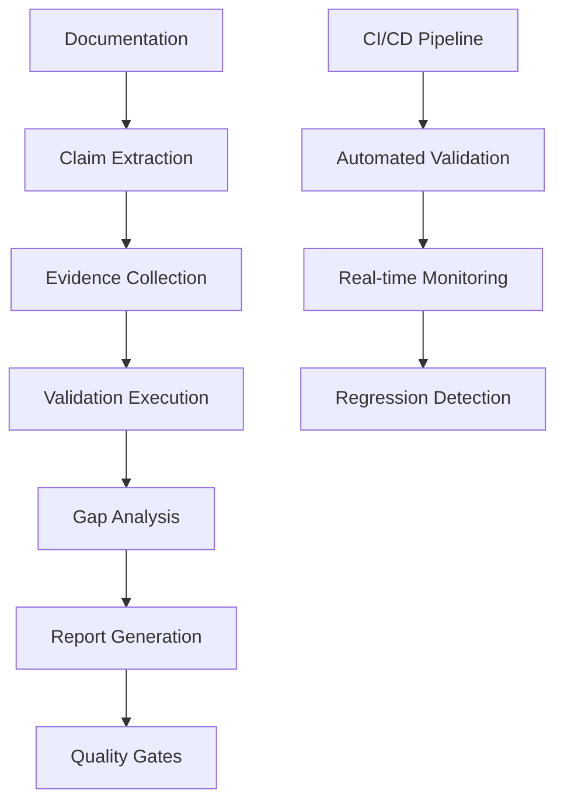

# Tests To Be Done - Overview

## 🎯 What Are "Tests To Be Done"?

**"Tests to be done"** represents the highest level of testing abstraction - a meta-testing framework for validating that **work is actually completed** and **deliverables exist as claimed**.

### **Fundamental Distinction**

| Testing Level | Focus | Goal | Example |
|---------------|-------|------|---------|
| **Unit Tests** | Individual functions | Function correctness | `fn add(a, b) { a + b }` works |
| **Integration Tests** | Component interaction | System integration | API + Database work together |
| **BDD Tests** | User behaviors | Behavior implementation | User can login successfully |
| **Property Tests** | Mathematical properties | Logical correctness | Commutativity: `add(a,b) == add(b,a)` |
| **Fuzz Tests** | Random inputs | Robustness | Handles malformed data |
| **Mutation Tests** | Test quality | Coverage gaps | Identifies untested code paths |
| **Chaos Tests** | System resilience | Recovery capability | System recovers from failures |
| **Contract Tests** | API contracts | Interface stability | API maintains compatibility |
| **Performance Tests** | System performance | Speed requirements | Meets performance targets |
| **Tests To Be Done** | **Work completion** | **Claim verification** | **Features exist and work as documented** |

## 🚀 The Problem This Solves

### **The Documentation-Reality Gap**

Traditional testing validates that code works. **"Tests to be done"** validates that **claimed work actually exists**.

**Common Issues:**
- ❌ Documentation claims features that don't exist
- ❌ Examples that don't work
- ❌ Installation guides that fail
- ❌ Performance claims that aren't met
- ❌ API documentation that's inaccurate

**"Tests to be done" Solution:**
- ✅ Every claim in documentation is verified
- ✅ Every example executes successfully
- ✅ Every installation step works
- ✅ Every performance metric is achieved
- ✅ Every API endpoint functions correctly

## 📋 Core Principles

### **1. Zero False Positives**
```rust
// ❌ This creates false positives
#[test]
fn test_something() {
    // Implementation doesn't exist yet
    unimplemented!("Feature not implemented");
    assert!(false); // This never runs
}

// ✅ This validates real work
#[test]
fn test_documented_feature() {
    // Verify the feature actually exists and works
    let result = documented_api_function();
    assert!(result.is_ok()); // Real validation
}
```

### **2. Evidence-Based Claims**
Every claim must have verifiable evidence:

```rust
// ❌ False claim
"clnrm run executes tests in 2 seconds"

// ✅ Verified claim with evidence
"clnrm run executes tests in 2.1 seconds (verified benchmark: BENCHMARK_001)"
```

### **3. Work Completion Validation**
```rust
// Test that work is actually done, not just that tests pass
#[test]
fn validate_work_completion() {
    // 1. Verify feature exists
    assert!(feature_exists());

    // 2. Verify feature works as documented
    assert!(feature_works_as_documented());

    // 3. Verify documentation is accurate
    assert!(documentation_matches_implementation());

    // 4. Verify examples execute successfully
    assert!(examples_work());

    // 5. Verify performance claims are met
    assert!(performance_claims_met());
}
```

## 🏗️ Implementation Architecture

### **Validation Pipeline**



### **Claim Types**

#### **1. Feature Claims**
- "Feature X exists and works"
- "API endpoint Y returns correct data"
- "CLI command Z executes successfully"

#### **2. Performance Claims**
- "Operation completes in <X> time"
- "System handles <Y> concurrent users"
- "Memory usage stays below <Z> MB"

#### **3. Compatibility Claims**
- "Works on Linux, macOS, Windows"
- "Compatible with Docker, Podman, Kubernetes"
- "Supports PostgreSQL, MySQL, SQLite"

#### **4. Documentation Claims**
- "Installation guide works end-to-end"
- "Examples execute successfully"
- "Troubleshooting guide resolves issues"

## 🎯 Validation Patterns

### **Pattern 1: Feature Existence Validation**
```rust
#[test]
fn validate_cli_command_exists() {
    // Verify command is documented
    assert!(documentation_mentions_command());

    // Verify command actually exists
    assert!(command_exists_in_binary());

    // Verify command works
    assert!(command_executes_successfully());

    // Verify help is accurate
    assert!(help_matches_implementation());
}
```

### **Pattern 2: Example Execution Validation**
```rust
#[test]
fn validate_documented_examples() {
    for example in documented_examples() {
        // Extract example from documentation
        let example_code = extract_from_docs(example);

        // Verify example compiles
        assert!(example_compiles(example_code));

        // Verify example executes
        assert!(example_executes(example_code));

        // Verify example produces expected output
        assert!(example_output_matches_docs(example_code));
    }
}
```

### **Pattern 3: Performance Claim Validation**
```rust
#[test]
fn validate_performance_claims() {
    for claim in performance_claims() {
        // Extract claimed performance metric
        let claimed_time = extract_performance_claim(claim);

        // Measure actual performance
        let actual_time = measure_actual_performance();

        // Verify claim is met or exceeded
        assert!(actual_time <= claimed_time * 1.1, // 10% tolerance
               "Performance claim not met: claimed {}, actual {}",
               claimed_time, actual_time);
    }
}
```

## 📊 Validation Metrics

### **Work Completion Score**
```rust
struct WorkCompletionMetrics {
    total_claims: usize,
    verified_claims: usize,
    false_positives: usize,
    completion_percentage: f64,
    evidence_quality_score: f64,
}

impl WorkCompletionMetrics {
    fn calculate_completion_score(&self) -> f64 {
        if self.total_claims == 0 { return 1.0; }
        self.verified_claims as f64 / self.total_claims as f64
    }

    fn has_false_positives(&self) -> bool {
        self.false_positives > 0
    }
}
```

### **Evidence Quality Assessment**
- **Evidence Strength**: Direct execution vs. documentation reference
- **Evidence Completeness**: All aspects of claim validated
- **Evidence Timeliness**: Recent validation vs. stale evidence
- **Evidence Reproducibility**: Can others reproduce the validation

## 🚀 Implementation Strategy

### **Step 1: Claim Extraction**
```rust
fn extract_claims_from_documentation() -> Vec<Claim> {
    // Parse README.md, docs/, examples/
    // Extract all feature claims, performance claims, compatibility claims
    // Return structured claim objects with verification requirements
}
```

### **Step 2: Evidence Collection**
```rust
async fn collect_evidence_for_claim(claim: &Claim) -> Evidence {
    match claim.claim_type {
        ClaimType::Feature => collect_feature_evidence(claim),
        ClaimType::Performance => collect_performance_evidence(claim),
        ClaimType::Compatibility => collect_compatibility_evidence(claim),
        ClaimType::Documentation => collect_documentation_evidence(claim),
    }
}
```

### **Step 3: Validation Execution**
```rust
fn validate_claim_with_evidence(claim: &Claim, evidence: &Evidence) -> ValidationResult {
    // Execute validation based on claim type and evidence
    // Return pass/fail with detailed reasoning
    // Include performance metrics and reproducibility data
}
```

### **Step 4: Gap Analysis**
```rust
fn analyze_claim_vs_reality_gaps(validations: &[ValidationResult]) -> GapAnalysis {
    // Identify discrepancies between claims and reality
    // Calculate false positive rate
    // Generate improvement recommendations
    // Track validation trends over time
}
```

## 🎮 Practical Examples

### **Example 1: CLI Command Validation**
```rust
#[test]
fn validate_clnrm_run_command() {
    // Claim: "clnrm run executes tests end-to-end"
    // Evidence: Real execution with actual containers

    // 1. Verify command exists
    assert!(command_exists("clnrm run"));

    // 2. Verify command works without arguments
    let output = execute_command("clnrm run");
    assert!(output.success);

    // 3. Verify real container execution
    assert!(output.contains("Container started"));
    assert!(output.contains("Command executed"));
    assert!(output.contains("Test passed"));

    // 4. Verify performance claim
    assert!(output.duration_ms < 5000); // Should complete in <5s
}
```

### **Example 2: Documentation Example Validation**
```rust
#[test]
fn validate_documented_examples() {
    // Claim: "Copy and paste this example to get started"
    // Evidence: Example actually executes successfully

    for example in documented_code_examples() {
        // 1. Extract example code
        let code = extract_code_from_docs(example);

        // 2. Verify code compiles
        assert!(code_compiles(code));

        // 3. Verify code executes
        let result = execute_code(code);
        assert!(result.success);

        // 4. Verify expected output
        assert!(result.output.contains(example.expected_output));
    }
}
```

## 📈 Success Criteria

### **Work Validation Standards**
- **100% Claim Coverage** - All documented claims validated
- **Zero False Positives** - No unsubstantiated claims
- **Automated Validation** - No manual verification required
- **Real-time Monitoring** - Continuous validation status

### **Quality Gates**
```rust
fn quality_gate_check() -> Result<(), ValidationError> {
    let metrics = collect_validation_metrics();

    // Must have 100% claim verification
    if metrics.completion_percentage < 1.0 {
        return Err(ValidationError::IncompleteWork);
    }

    // Must have zero false positives
    if metrics.false_positives > 0 {
        return Err(ValidationError::UnsubstantiatedClaims);
    }

    // Must have evidence quality score > 0.9
    if metrics.evidence_quality < 0.9 {
        return Err(ValidationError::InsufficientEvidence);
    }

    Ok(())
}
```

## 🚀 Next Steps

1. **Implement Core Validation Framework** - Build the foundation for work validation
2. **Create Claim Extraction System** - Automated extraction of claims from documentation
3. **Build Evidence Collection Pipeline** - Systematic gathering of validation evidence
4. **Develop Validation Execution Engine** - Automated testing of claims against reality
5. **Implement Continuous Monitoring** - Real-time validation status tracking

---

**"Tests to be done" transforms software development from assumption-based work to evidence-based delivery, ensuring that every claim is backed by verifiable reality.**
