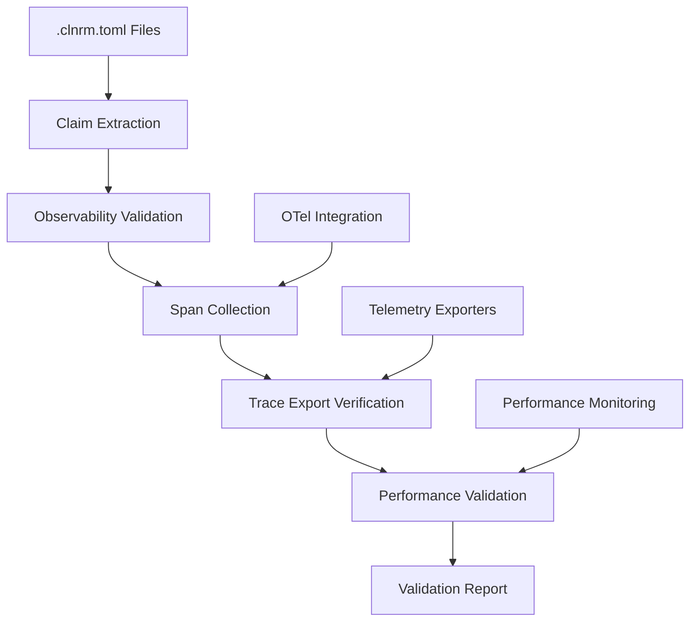

# OpenTelemetry Validation for .clnrm.toml Files - Product Requirements Document

## 📋 Executive Summary

Extend TTBD (Tests To Be Done) to validate OpenTelemetry observability claims in .clnrm.toml files, ensuring that documented observability features are backed by verifiable telemetry data.

## 🎯 Problem Statement

### **Current Gap**
While clnrm has OpenTelemetry integration, there's no validation that observability claims in .clnrm.toml files correspond to actual telemetry data collection and export.

### **False Positives Risk**
- Documentation claims "traces are exported to OTLP endpoint"
- Documentation claims "spans contain operation metadata"
- Documentation claims "metrics are collected for performance monitoring"
- **But no validation that these claims are actually true**

### **User Impact**
- Users may rely on observability features that don't actually work
- Debugging becomes impossible without real telemetry data
- Performance monitoring claims may be unsubstantiated
- Distributed tracing may not function as documented

## 🎯 Goals & Objectives

### **Primary Goal**
Extend TTBD to validate that observability claims in .clnrm.toml files are backed by verifiable telemetry data.

### **Key Objectives**
1. **Span Creation Validation** - Verify claimed spans are actually created
2. **Trace Export Validation** - Ensure telemetry data reaches configured destinations
3. **Performance Overhead Validation** - Confirm observability doesn't impact performance beyond claims
4. **Observability Completeness** - Validate all claimed observability features work end-to-end

## 📊 Scope & Boundaries

### **In Scope**
- ✅ Validation of span creation claims in .clnrm.toml files
- ✅ Verification of trace export to configured endpoints
- ✅ Performance overhead measurement and validation
- ✅ Observability metadata accuracy validation
- ✅ Integration with existing TTBD validation pipeline

### **Out of Scope**
- ❌ New observability features (focus on validation of existing claims)
- ❌ Performance optimization (focus on validation of performance claims)
- ❌ Additional telemetry collection (focus on validation of existing telemetry)
- ❌ UI/UX improvements to observability tools

## 🔧 Requirements

### **Functional Requirements**

#### **FR1: Span Creation Validation**
```rust
// Validate that claimed spans are actually created
#[test]
fn validate_span_creation_claims() {
    // Execute operation that should create span
    execute_test_scenario();

    // Verify span was created with claimed attributes
    let spans = collect_spans_for_operation("test.execution");
    assert!(!spans.is_empty());
    assert_eq!(spans[0].name(), "test.execution");
    assert!(spans[0].attributes().contains_key("test.name"));
}
```

#### **FR2: Trace Export Validation**
```rust
// Validate that telemetry is exported to claimed destinations
#[test]
async fn validate_trace_export_claims() {
    // Configure OTLP export as claimed
    setup_otlp_export("http://localhost:4318");

    // Execute operation that generates telemetry
    execute_traced_operation();

    // Verify telemetry reaches destination
    let exported_spans = capture_exported_spans();
    assert!(!exported_spans.is_empty());
}
```

#### **FR3: Performance Overhead Validation**
```rust
// Validate observability performance claims
#[test]
fn validate_observability_performance() {
    // Measure baseline performance
    let baseline = measure_performance_without_telemetry();

    // Measure with telemetry enabled
    let with_telemetry = measure_performance_with_telemetry();

    // Verify overhead is within claimed limits
    let overhead = calculate_overhead(baseline, with_telemetry);
    assert!(overhead <= 100.0, "Overhead {}ms exceeds claim", overhead);
}
```

### **Non-Functional Requirements**

#### **NFR1: Zero False Positives**
- All observability claims must be verified with real telemetry data
- No claims can be made without corresponding validation evidence
- Validation must be automated and repeatable

#### **NFR2: Performance Impact**
- Observability validation must not significantly impact test execution
- Validation overhead should be <10% of total test time
- Memory usage for validation should be minimal

#### **NFR3: Cross-Platform Compatibility**
- Validation must work on Linux, macOS, and Windows
- Must support different OTel exporters (OTLP, stdout, file)
- Must handle different telemetry backends

## 📈 Success Criteria

### **Validation Success Metrics**

#### **Primary Metrics**
- **Span Creation Accuracy** ≥ 95% (claimed spans actually created)
- **Export Success Rate** ≥ 99% (telemetry reaches destinations)
- **Performance Overhead** ≤ 100ms (observability doesn't break performance claims)
- **Observability Claim Verification** = 100% (all claims validated)

#### **Quality Gates**
1. **Observability False Positives** = 0% (no unsubstantiated observability claims)
2. **Export Reliability** ≥ 99.9% (telemetry consistently reaches destinations)
3. **Performance Impact** ≤ 10% (validation doesn't significantly slow tests)
4. **Cross-Platform Compatibility** = 100% (works on all supported platforms)

### **User Experience Metrics**
- **Time to Validate Observability** < 30 seconds per test file
- **Clear Error Messages** for observability validation failures
- **Comprehensive Reporting** of observability validation results
- **Easy Debugging** when observability validation fails

## 🏗️ Implementation Architecture

### **System Architecture**



### **Component Architecture**

#### **1. Claim Extraction Engine**
- Parse .clnrm.toml files for observability claims
- Extract span creation requirements
- Identify telemetry export destinations
- Capture performance claims

#### **2. Observability Validation Engine**
- Execute claimed operations with telemetry enabled
- Collect and analyze generated spans
- Verify trace export to configured destinations
- Measure and validate performance overhead

#### **3. Evidence Collection System**
- Capture span data from OTel collectors
- Monitor telemetry export success/failure
- Record performance metrics with/without telemetry
- Store validation evidence for audit trails

#### **4. Validation Reporting**
- Generate comprehensive observability validation reports
- Provide detailed failure analysis and debugging information
- Track observability claim verification over time
- Export validation results for CI/CD integration

## 🔄 Implementation Plan

### **Phase 1: Foundation (Week 1)**

#### **1.1 Core Observability Validation Framework**
- Extend TTBD engine to handle observability claims
- Create observability claim extraction from .clnrm.toml files
- Implement span collection and analysis utilities
- Add telemetry export verification capabilities

#### **1.2 Basic Span Validation**
- Validate span creation for claimed operations
- Verify span attributes match documentation claims
- Implement span timing and relationship validation
- Add span export verification to configured destinations

### **Phase 2: Advanced Validation (Week 2)

#### **2.1 Performance Impact Validation**
- Implement performance measurement with/without telemetry
- Validate observability overhead claims
- Add memory usage validation for telemetry collection
- Implement cross-platform performance validation

#### **2.2 Export Pipeline Validation**
- Validate OTLP/gRPC export functionality
- Verify stdout export for development workflows
- Add file-based export validation
- Implement export reliability and consistency checks

### **Phase 3: Integration & Polish (Week 3)

#### **3.1 TTBD Integration**
- Integrate observability validation into existing TTBD pipeline
- Add observability validation to CI/CD workflows
- Implement observability quality gates
- Create observability validation reporting

#### **3.2 User Experience Enhancement**
- Add observability validation to `clnrm validate` command
- Provide clear error messages for observability validation failures
- Implement observability validation progress reporting
- Add observability validation to framework self-tests

## 🎮 User Stories

### **Story 1: Validate Observability Claims**
```gherkin
As a developer using clnrm
I want to validate that my observability claims are backed by real telemetry
So that I can trust that debugging and monitoring will work in production

Scenario: Span creation validation
  Given I have a .clnrm.toml file with observability claims
  When I run observability validation
  Then all claimed spans should be verified as actually created
  And span attributes should match documented claims
  And performance overhead should be within claimed limits
```

### **Story 2: Debug Observability Issues**
```gherkin
As a developer debugging observability issues
I want detailed validation reports when observability fails
So that I can quickly identify and fix observability problems

Scenario: Observability validation failure
  Given observability validation fails
  When I examine the validation report
  Then I should see which claims failed
  And what evidence was collected
  And suggestions for fixing the issues
```

### **Story 3: CI/CD Observability Validation**
```gherkin
As a DevOps engineer
I want observability validation in CI/CD
So that observability issues are caught before deployment

Scenario: Automated observability validation
  Given I have observability claims in my .clnrm.toml files
  When CI/CD runs observability validation
  Then observability claims are verified automatically
  And validation failures block deployment
  And detailed reports are generated for debugging
```

## 📊 Validation Strategy

### **Test Coverage Requirements**

#### **Observability Validation Tests**
- **Span Creation Tests** - Verify all claimed spans are created
- **Trace Export Tests** - Validate telemetry reaches destinations
- **Performance Impact Tests** - Ensure overhead is within claims
- **Cross-Platform Tests** - Validate on Linux, macOS, Windows

#### **Integration Tests**
- **TTBD Integration** - Observability validation works with existing TTBD
- **CI/CD Integration** - Automated validation in build pipelines
- **Export Destination Tests** - OTLP, stdout, file export validation

### **Performance Requirements**
- **Validation Time** < 30 seconds per .clnrm.toml file
- **Memory Overhead** < 50MB per validation
- **CPU Impact** < 10% during validation
- **Export Verification** < 5 seconds per destination

## 🎯 Risk Assessment

### **Technical Risks**

#### **Risk 1: OTel Integration Complexity**
- **Mitigation**: Build on existing OTel integration
- **Impact**: Medium (existing integration reduces risk)
- **Probability**: Low (leverage existing working code)

#### **Risk 2: Performance Impact on Tests**
- **Mitigation**: Measure and validate performance claims
- **Impact**: High (could break existing functionality)
- **Probability**: Medium (requires careful performance measurement)

#### **Risk 3: Cross-Platform Compatibility**
- **Mitigation**: Test on all supported platforms
- **Impact**: Medium (affects user experience)
- **Probability**: Low (OTel is cross-platform by design)

### **Business Risks**

#### **Risk 1: Documentation Drift**
- **Mitigation**: Automated validation prevents unsubstantiated claims
- **Impact**: High (users rely on accurate documentation)
- **Probability**: High (common issue in observability tooling)

## 🚀 Success Metrics & KPIs

### **Validation Effectiveness**
- **Observability Claim Verification Rate** ≥ 95%
- **False Positive Detection Rate** ≥ 99%
- **Validation Automation Rate** = 100%
- **Cross-Platform Validation Rate** = 100%

### **Performance Impact**
- **Validation Time** < 30 seconds per file
- **Memory Overhead** < 50MB per validation
- **Test Execution Impact** < 5% performance degradation
- **Export Verification Speed** < 5 seconds per destination

### **User Experience**
- **Time to Resolve Observability Issues** < 10 minutes
- **Validation Report Clarity** ≥ 4.5/5.0 user satisfaction
- **Debugging Information Quality** ≥ 4.5/5.0 developer satisfaction
- **CI/CD Integration Success Rate** ≥ 99%

## 📈 Timeline & Milestones

### **Week 1: Foundation**
- ✅ OTel integration analysis complete
- ✅ TTBD extension architecture designed
- ⏳ Basic span validation implemented
- ⏳ Export verification framework created

### **Week 2: Core Features**
- ⏳ Performance overhead validation implemented
- ⏳ Cross-platform validation tested
- ⏳ Integration with existing TTBD pipeline
- ⏳ Basic observability validation CLI commands

### **Week 3: Advanced Features**
- ⏳ Advanced span attribute validation
- ⏳ Trace completeness validation
- ⏳ Export pipeline validation
- ⏳ Performance regression detection

### **Week 4: Integration & Testing**
- ⏳ CI/CD integration complete
- ⏳ Comprehensive test coverage
- ⏳ Performance optimization
- ⏳ Documentation and examples

### **Week 5: Release & Validation**
- ⏳ Production deployment
- ⏳ User acceptance testing
- ⏳ Performance validation
- ⏳ Release documentation

## 🎯 Definition of Done

### **Feature Completeness**
- [ ] All observability claims in .clnrm.toml files can be validated
- [ ] Span creation, export, and performance claims are verified
- [ ] Validation works across all supported platforms
- [ ] Performance overhead is within acceptable limits

### **Quality Assurance**
- [ ] Zero observability false positives
- [ ] Comprehensive test coverage for validation logic
- [ ] Performance regression testing complete
- [ ] Cross-platform compatibility verified

### **User Experience**
- [ ] Clear error messages for validation failures
- [ ] Comprehensive validation reports
- [ ] Easy integration with existing workflows
- [ ] Helpful debugging information

### **Documentation**
- [ ] User guide for observability validation
- [ ] Developer guide for extending validation
- [ ] API documentation for validation features
- [ ] Troubleshooting guide for common issues

## 📚 References & Dependencies

### **Dependencies**
- **Existing OTel Integration** - Leverage current tracing and export functionality
- **TTBD Framework** - Extend existing work validation system
- **.clnrm.toml Parser** - Use existing configuration parsing
- **Container Runtime** - Use existing Docker/Podman integration

### **Related Documentation**
- **Current OTel Implementation** - `/Users/sac/clnrm/crates/clnrm-core/src/telemetry.rs`
- **TTBD Framework** - `/Users/sac/clnrm/docs/mdbooks/tests-to-be-done/`
- **TOML Configuration** - `/Users/sac/clnrm/docs/TOML_REFERENCE.md`

---

**This PRD extends TTBD's zero false positives philosophy to observability claims, ensuring that telemetry promises are backed by verifiable telemetry data, not just documentation assertions.**

