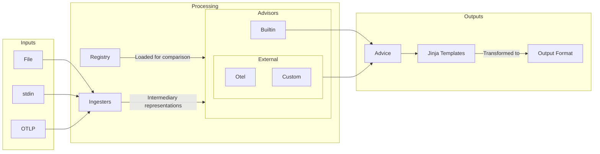

# Weaver Live Check

Live check is a developer tool for assessing sample telemetry and providing advice for improvement.

A Semantic Convention `Registry` is loaded for comparison with samples. `Ingesters` transform various input formats and sources into intermediary representations to be assessed by `Advisors`. The `Advice` produced is transformed via jinja templates to the required output format for downstream consumption.



## Ingesters

Sample data can have various levels of detail; from a simple list of attribute names, to a full OTLP signal structure. This data can come from different sources: files, stdin, OTLP. Therefore you need to choose the appropriate `Ingester` for your job by setting two parameters: `--input-source`, `--input-format`

| Input Source   | Input Format |                                                         |
| -------------- | ------------ | ------------------------------------------------------- |
| `otlp`         | N/A          | OTLP signals (default)                                  |
| &lt;file path> | `text`       | Text file with attribute names or name=value pairs      |
| `stdin`        | `text`       | Standard input with attribute names or name=value pairs |
| &lt;file path> | `json`       | JSON file with an array of samples                      |
| `stdin`        | `json`       | Standard input with a JSON array of samples             |

Some `Ingesters`, like `stdin` and `otlp`, can stream the input data so you receive output at the command line as it comes in. This is really useful in live debugging sessions allowing you to breakpoint, step through your code and see live assessment as the data is received in Weaver.

### OTLP

OTLP live-check is particularly useful in CI/CD pipelines to evaluate the quality of instrumentation observed from all unit tests, integration tests and so on.

This `Ingester` starts an OTLP listener and streams each received OTLP message to the `Advisors`. The currently supported stop conditions are: CTRL+C (SIGINT), SIGHUP, the HTTP /stop endpoint, and a maximum duration of no OTLP message reception. See the usage examples later in this document.

Options for OTLP ingest:

- `--otlp-grpc-address`: Address used by the gRPC OTLP listener
- `--otlp-grpc-port`: Port used by the gRPC OTLP listener
- `--admin-port`: Port used by the HTTP admin port (endpoints: /stop)
- `--inactivity-timeout`: Max inactivity time in seconds before stopping the listener

## Advisors

Sample entities are assessed by the set of `Advisors` and augmented with `Advice`. Built-ins check for fundamental compliance with the `Registry` supplied, for example `missing_attribute` and `type_mismatch`.

Beyond the fundamentals, external `Advisors` can be defined in Rego policies. The OpenTelemetry Semantic Conventions rules are included out-of-the-box by default. They provide `Advice` on name-spacing and formatting aligned with the standard. These default policies can be overridden at the command line with your own.

### Advice

As mentioned, a list of `Advice` is returned in the report for each sample entity. The snippet below shows `Advice` from one `Advisor`, a builtin providing `missing_attribute`. The fields of `Advice` are intended to be used like so:

- `advice_level`: _string_ - one of `violation`, `improvement` or `information` with that order of precedence. Weaver will return with a non-zero exit-code if there is any `violation` in the report.
- `advice_type`: _string_ - a simple machine readable string to represent the advice type
- `signal_type`: _string_ - a type of the signal advice is reported for: `metric`, `span`, or `resource`
- `signal_name`: _string_ - a name of the signal advice is reported for: metric name or span name
- `advice_context`: _any_ - a map that describes details about the advice in a structured way,
  for example `{ "attribute_name": "foo.bar", "attribute_value": "bar" }`.
- `message`: _string_ - verbose string describing the advice. It contains the same details as `advice_context` but
  is formatted and human-readable.

```json
{
  "live_check_result": {
    "all_advice": [
      {
        "advice_level": "violation",
        "advice_type": "missing_attribute",
        "message": "Attribute `hello` does not exist in the registry.",
        "advice_context": {"attribute_name": "hello"},
        "signal_name": "http.client.request.duration",
        "signal_type": "metric"
      }
    ],
    "highest_advice_level": "violation"
  },
  "name": "hello",
  "type": "string",
  "value": "world"
}
```

> **Note**
> The `live_check_result` object augments the sample entity at the pertinent level in the structure. If the structure is `metric`->`[number_data_point]`->`[attribute]`, advice should be give at the `number_data_point` level for, say, required attributes that have not been supplied. Whereas, attribute advice, like `missing_attribute` in the JSON above, is given at the attribute level.

### Custom advisors

Use the `--advice-policies` command line option to provide a path to a directory containing Rego policies with the `live_check_advice` package name. Here's a very simple example that rejects any attribute name containing the string "test":

```rego
package live_check_advice

import rego.v1

# checks attribute name contains the word "test"
deny contains make_advice(advice_type, advice_level, advice_context, message) if {
	input.sample.attribute
	contains(input.sample.attribute.name, "test")
	advice_type := "contains_test"
	advice_level := "violation"
	advice_context := {
		"attribute_name": input.sample.attribute.name
	}
	message := sprintf("Attribute name must not contain 'test', but was '%s'", [input.sample.attribute.name])
}

make_advice(advice_type, advice_level, advice_context, message) := {
  "type": "advice",
  "advice_type": advice_type,
  "advice_level": advice_level,
  "value": value,
  "message": message,
}
```

`input.sample` contains the sample entity for assessment wrapped in a type e.g. `input.sample.attribute` or `input.sample.span`.

`input.registry_attribute`, when present, contains the matching attribute definition from the supplied registry.

`input.registry_group`, when present, contains the matching group definition from the supplied registry.

`data` contains a structure derived from the supplied `Registry`. A jq preprocessor takes the `Registry` (and maps for attributes and templates) to produce the `data` for the policy. If the jq is simply `.` this will passthrough as-is. Preprocessing is used to improve Rego performance and to simplify policy definitions. With this model `data` is processed once whereas the Rego policy runs for every sample entity as it arrives in the stream.

To override the default Otel jq preprocessor provide a path to the jq file through the `--advice-preprocessor` option.

## Output

The output follows existing Weaver paradigms providing overridable jinja template based processing.

Out-of-the-box the output is streamed (when available) to templates providing `ansi` (default) or `json` output via the `--format` option. To override streaming and only produce a report when the input is closed, use `--no-stream`. Streaming is automatically disabled if your `--output` is a path to a directory; by default, output is printed to stdout.

To provide your own custom templates use the `--templates` option.

As mentioned, the exit-code is set non-zero if any `violation` advice is provided in the output. This can be used in tests and/or CI to fail builds for example.

### Statistics

A statistics entity is produced when the input is closed like this snippet:

```json
{
  "advice_level_counts": {
    "improvement": 3,
    "information": 2,
    "violation": 11
  },
  "advice_type_counts": {
    "extends_namespace": 2,
    "illegal_namespace": 1,
    "invalid_format": 2,
    "missing_attribute": 7,
    "missing_namespace": 2,
    "stability": 1,
    "type_mismatch": 1
  },
  "highest_advice_level_counts": {
    "improvement": 1,
    "violation": 8
  },
  "no_advice_count": 6,
  "registry_coverage": 0.007005253806710243,
  "seen_non_registry_attributes": {
    "TaskId": 1,
    "http.request.extension": 1,
    ...
  },
  "seen_registry_attributes": {
    "android.app.state": 0,
    "android.os.api_level": 0,
    ...
  },
  "total_advisories": 16,
  "total_entities": 15,
  "total_entities_by_type": {
    "attribute": 11,
    "resource": 1,
    "span": 1,
    "span_event": 2
  }
}
```

These should be self-explanatory, but:

- `highest_advice_level_counts` is a per advice level count of the highest advice level given to each sample
- `no_advice_count` is the number of samples that received no advice
- `seen_registry_attributes` is a record of how many times each attribute in the registry was seen in the samples
- `seen_non_registry_attributes` is a record of how many times each non-registry attribute was seen in the samples
- `seen_registry_metrics` is a record of how many times each metric in the registry was seen in the samples
- `seen_non_registry_metrics` is a record of how many times each non-registry metric was seen in the samples
- `registry_coverage` is the fraction of seen registry entities over the total registry entities

This could be parsed for a more sophisticated way to determine pass/fail in CI for example.

## Usage examples

Default operation. Receive OTLP requests and output advice as it arrives. Useful for debugging an application to check for telemetry problems as you step through your code. (ctrl-c to exit, or wait for the timeout)

```sh
weaver registry live-check
```

CI/CD - create a JSON report

```sh
weaver registry live-check --format json --output ./outdir &
LIVE_CHECK_PID=$!
sleep 3
# Run the code under test here.
kill -HUP $LIVE_CHECK_PID
wait $LIVE_CHECK_PID
# Check the exit code and/or parse the JSON in outdir
```

Read a json file

```sh
weaver registry live-check --input-source crates/weaver_live_check/data/span.json
```

Pipe a list of attribute names or name=value pairs

```sh
cat attributes.txt | weaver registry live-check --input-source stdin --input-format text
```

Or a redirect

```sh
weaver registry live-check --input-source stdin --input-format text < attributes.txt
```

Or a here-doc

```sh
weaver registry live-check --input-source stdin --input-format text << EOF
code.function
thing.blah
EOF
```

Or enter text at the prompt, an empty line will exit

```sh
weaver registry live-check --input-source stdin --input-format text
code.line.number=42
```

Using `emit` for a round-trip test:

```sh
weaver registry live-check --output ./outdir &
LIVE_CHECK_PID=$!
sleep 3
weaver registry emit --skip-policies
kill -HUP $LIVE_CHECK_PID
wait $LIVE_CHECK_PID
```


# Usage

```text
Manage semantic convention registry and telemetry schema workflows (OpenTelemetry Project)

Usage: weaver [OPTIONS] <COMMAND>

Commands:
  registry    Manage Semantic Convention Registry
  diagnostic  Manage Diagnostic Messages
  completion  Generate shell completions
  help        Print this message or the help of the given subcommand(s)

Options:
      --debug...  Turn debugging information on. Use twice (--debug --debug) for trace-level logs.
      --quiet     Turn the quiet mode on (i.e., minimal output)
      --future    Enable the most recent validation rules for the semconv registry. It is recommended to enable this flag when checking a new registry. Note: `semantic_conventions` main branch should always enable this flag
  -h, --help      Print help
  -V, --version   Print version
```

## registry

```text
Manage Semantic Convention Registry

Usage: weaver registry [OPTIONS] <COMMAND>

Commands:
  check            Validates a semantic convention registry.
  generate         Generates artifacts from a semantic convention registry.
  resolve          Resolves a semantic convention registry.
  search           Searches a registry (Note: Experimental and subject to change)
  stats            Calculate a set of general statistics on a semantic convention registry
  update-markdown  Update markdown files that contain markers indicating the templates used to update the specified sections
  json-schema      Generate the JSON Schema of the resolved registry documents consumed by the template generator and the policy engine.
  diff             Generate a diff between two versions of a semantic convention registry.
  live-check       Check the conformance level of an OTLP stream against a semantic convention registry.
  emit             Emits a semantic convention registry as example signals to your OTLP receiver.
  help             Print this message or the help of the given subcommand(s)

Options:
      --debug...  Turn debugging information on. Use twice (--debug --debug) for trace-level logs.
      --quiet     Turn the quiet mode on (i.e., minimal output)
      --future    Enable the most recent validation rules for the semconv registry. It is recommended to enable this flag when checking a new registry. Note: `semantic_conventions` main branch should always enable this flag
  -h, --help      Print help
```

### registry check

```text
Validates a semantic convention registry.

The validation process for a semantic convention registry involves several steps:
- Loading the semantic convention specifications from a local directory or a git repository.
- Parsing the loaded semantic convention specifications.
- Resolving references and extends clauses within the specifications.
- Checking compliance with specified Rego policies, if provided.

Note: The `-d` and `--registry-git-sub-dir` options are only used when the registry is a Git URL otherwise these options are ignored.

The process exits with a code of 0 if the registry validation is successful.

Usage: weaver registry check [OPTIONS]

Options:
      --debug...
          Turn debugging information on. Use twice (--debug --debug) for trace-level logs.

  -r, --registry <REGISTRY>
          Local folder, Git repo URL, or Git archive URL of the semantic convention registry. For Git URLs, a sub-folder can be specified using the `[sub-folder]` syntax after the URL

          [default: https://github.com/open-telemetry/semantic-conventions.git[model]]

      --quiet
          Turn the quiet mode on (i.e., minimal output)

  -s, --follow-symlinks
          Boolean flag to specify whether to follow symlinks when loading the registry. Default is false

      --baseline-registry <BASELINE_REGISTRY>
          Parameters to specify the baseline semantic convention registry

      --future
          Enable the most recent validation rules for the semconv registry. It is recommended to enable this flag when checking a new registry. Note: `semantic_conventions` main branch should always enable this flag

  -p, --policy <POLICIES>
          Optional list of policy files or directories to check against the files of the semantic convention registry.  If a directory is provided all `.rego` files in the directory will be loaded

      --skip-policies
          Skip the policy checks

      --display-policy-coverage
          Display the policy coverage report (useful for debugging)

      --diagnostic-format <DIAGNOSTIC_FORMAT>
          Format used to render the diagnostic messages. Predefined formats are: ansi, json, gh_workflow_command

          [default: ansi]

      --diagnostic-template <DIAGNOSTIC_TEMPLATE>
          Path to the directory where the diagnostic templates are located

          [default: diagnostic_templates]

  -h, --help
          Print help (see a summary with '-h')
```

### registry generate

```text
Generates artifacts from a semantic convention registry.

Rego policies present in the registry or specified using -p or --policy will be automatically validated by the policy engine before the artifact generation phase.

Note: The `-d` and `--registry-git-sub-dir` options are only used when the registry is a Git URL otherwise these options are ignored.

The process exits with a code of 0 if the generation is successful.

Usage: weaver registry generate [OPTIONS] <TARGET> [OUTPUT]

Arguments:
  <TARGET>
          Target to generate the artifacts for
          
          [default: ]

  [OUTPUT]
          Path to the directory where the generated artifacts will be saved. Default is the `output` directory

          [default: output]

Options:
      --debug...
          Turn debugging information on. Use twice (--debug --debug) for trace-level logs.

  -t, --templates <TEMPLATES>
          Path to the directory where the templates are located. Default is the `templates` directory

          [default: templates]

  -c, --config <CONFIG>
          List of `weaver.yaml` configuration files to use. When there is a conflict, the last one will override the previous ones for the keys that are defined in both

      --quiet
          Turn the quiet mode on (i.e., minimal output)

  -D, --param <PARAM>
          Parameters key=value, defined in the command line, to pass to the templates. The value must be a valid YAML value

      --params <PARAMS>
          Parameters, defined in a YAML file, to pass to the templates

  -r, --registry <REGISTRY>
          Local folder, Git repo URL, or Git archive URL of the semantic convention registry. For Git URLs, a sub-folder can be specified using the `[sub-folder]` syntax after the URL

          [default: https://github.com/open-telemetry/semantic-conventions.git[model]]

  -s, --follow-symlinks
          Boolean flag to specify whether to follow symlinks when loading the registry. Default is false

  -p, --policy <POLICIES>
          Optional list of policy files or directories to check against the files of the semantic convention registry.  If a directory is provided all `.rego` files in the directory will be loaded

      --skip-policies
          Skip the policy checks

      --display-policy-coverage
          Display the policy coverage report (useful for debugging)

      --future
          Enable the most recent validation rules for the semconv registry. It is recommended to enable this flag when checking a new registry

      --diagnostic-format <DIAGNOSTIC_FORMAT>
          Format used to render the diagnostic messages. Predefined formats are: ansi, json, gh_workflow_command

          [default: ansi]

      --diagnostic-template <DIAGNOSTIC_TEMPLATE>
          Path to the directory where the diagnostic templates are located

          [default: diagnostic_templates]

  -h, --help
          Print help (see a summary with '-h')
```

### registry resolve

```text
Resolves a semantic convention registry.

Rego policies present in the registry or specified using -p or --policy will be automatically validated by the policy engine before the artifact generation phase.

Note: The `-d` and `--registry-git-sub-dir` options are only used when the registry is a Git URL otherwise these options are ignored.

The process exits with a code of 0 if the resolution is successful.

Usage: weaver registry resolve [OPTIONS]

Options:
      --debug...
          Turn debugging information on. Use twice (--debug --debug) for trace-level logs.

  -r, --registry <REGISTRY>
          Local folder, Git repo URL, or Git archive URL of the semantic convention registry. For Git URLs, a sub-folder can be specified using the `[sub-folder]` syntax after the URL

          [default: https://github.com/open-telemetry/semantic-conventions.git[model]]

      --quiet
          Turn the quiet mode on (i.e., minimal output)

  -s, --follow-symlinks
          Boolean flag to specify whether to follow symlinks when loading the registry. Default is false

      --future
          Enable the most recent validation rules for the semconv registry. It is recommended to enable this flag when checking a new registry. Note: `semantic_conventions` main branch should always enable this flag

      --lineage
          Flag to indicate if lineage information should be included in the resolved schema (not yet implemented)

  -o, --output <OUTPUT>
          Output file to write the resolved schema to If not specified, the resolved schema is printed to stdout

  -f, --format <FORMAT>
          Output format for the resolved schema If not specified, the resolved schema is printed in YAML format Supported formats: yaml, json Default format: yaml Example: `--format json`

          [default: yaml]

          Possible values:
          - yaml: YAML format
          - json: JSON format

  -p, --policy <POLICIES>
          Optional list of policy files or directories to check against the files of the semantic convention registry.  If a directory is provided all `.rego` files in the directory will be loaded

      --skip-policies
          Skip the policy checks

      --display-policy-coverage
          Display the policy coverage report (useful for debugging)

      --diagnostic-format <DIAGNOSTIC_FORMAT>
          Format used to render the diagnostic messages. Predefined formats are: ansi, json, gh_workflow_command

          [default: ansi]

      --diagnostic-template <DIAGNOSTIC_TEMPLATE>
          Path to the directory where the diagnostic templates are located

          [default: diagnostic_templates]

  -h, --help
          Print help (see a summary with '-h')
```

### registry search

```text
Searches a registry (Note: Experimental and subject to change)

Usage: weaver registry search [OPTIONS] [SEARCH_STRING]

Arguments:
  [SEARCH_STRING]  An (optional) search string to use.  If specified, will return matching values on the command line. Otherwise, runs an interactive terminal UI

Options:
      --debug...
          Turn debugging information on. Use twice (--debug --debug) for trace-level logs.
  -r, --registry <REGISTRY>
          Local folder, Git repo URL, or Git archive URL of the semantic convention registry. For Git URLs, a sub-folder can be specified using the `[sub-folder]` syntax after the URL [default: https://github.com/open-telemetry/semantic-conventions.git[model]]
      --quiet
          Turn the quiet mode on (i.e., minimal output)
  -s, --follow-symlinks
          Boolean flag to specify whether to follow symlinks when loading the registry. Default is false
      --future
          Enable the most recent validation rules for the semconv registry. It is recommended to enable this flag when checking a new registry. Note: `semantic_conventions` main branch should always enable this flag
      --lineage
          Flag to indicate if lineage information should be included in the resolved schema (not yet implemented)
      --diagnostic-format <DIAGNOSTIC_FORMAT>
          Format used to render the diagnostic messages. Predefined formats are: ansi, json, gh_workflow_command [default: ansi]
      --diagnostic-template <DIAGNOSTIC_TEMPLATE>
          Path to the directory where the diagnostic templates are located [default: diagnostic_templates]
  -h, --help
          Print help
```

### registry stats

```text
Calculate a set of general statistics on a semantic convention registry

Usage: weaver registry stats [OPTIONS]

Options:
      --debug...
          Turn debugging information on. Use twice (--debug --debug) for trace-level logs.
  -r, --registry <REGISTRY>
          Local folder, Git repo URL, or Git archive URL of the semantic convention registry. For Git URLs, a sub-folder can be specified using the `[sub-folder]` syntax after the URL [default: https://github.com/open-telemetry/semantic-conventions.git[model]]
      --quiet
          Turn the quiet mode on (i.e., minimal output)
  -s, --follow-symlinks
          Boolean flag to specify whether to follow symlinks when loading the registry. Default is false
      --diagnostic-format <DIAGNOSTIC_FORMAT>
          Format used to render the diagnostic messages. Predefined formats are: ansi, json, gh_workflow_command [default: ansi]
      --future
          Enable the most recent validation rules for the semconv registry. It is recommended to enable this flag when checking a new registry. Note: `semantic_conventions` main branch should always enable this flag
      --diagnostic-template <DIAGNOSTIC_TEMPLATE>
          Path to the directory where the diagnostic templates are located [default: diagnostic_templates]
  -h, --help
          Print help
```

### registry update-markdown

```text
Update markdown files that contain markers indicating the templates used to update the specified sections

Usage: weaver registry update-markdown [OPTIONS] --target <TARGET> <MARKDOWN_DIR>

Arguments:
  <MARKDOWN_DIR>  Path to the directory where the markdown files are located

Options:
      --debug...
          Turn debugging information on. Use twice (--debug --debug) for trace-level logs.
  -r, --registry <REGISTRY>
          Local folder, Git repo URL, or Git archive URL of the semantic convention registry. For Git URLs, a sub-folder can be specified using the `[sub-folder]` syntax after the URL [default: https://github.com/open-telemetry/semantic-conventions.git[model]]
      --quiet
          Turn the quiet mode on (i.e., minimal output)
  -s, --follow-symlinks
          Boolean flag to specify whether to follow symlinks when loading the registry. Default is false
      --dry-run
          Whether or not to run updates in dry-run mode
      --future
          Enable the most recent validation rules for the semconv registry. It is recommended to enable this flag when checking a new registry. Note: `semantic_conventions` main branch should always enable this flag
      --attribute-registry-base-url <ATTRIBUTE_REGISTRY_BASE_URL>
          Optional path to the attribute registry. If provided, all attributes will be linked here
  -t, --templates <TEMPLATES>
          Path to the directory where the templates are located. Default is the `templates` directory. Note: `registry update-markdown` will look for a specific jinja template: {templates}/{target}/snippet.md.j2 [default: templates]
      --target <TARGET>
          If provided, the target to generate snippets with. Note: `registry update-markdown` will look for a specific jinja template: {templates}/{target}/snippet.md.j2
      --diagnostic-format <DIAGNOSTIC_FORMAT>
          Format used to render the diagnostic messages. Predefined formats are: ansi, json, gh_workflow_command [default: ansi]
      --diagnostic-template <DIAGNOSTIC_TEMPLATE>
          Path to the directory where the diagnostic templates are located [default: diagnostic_templates]
  -h, --help
          Print help
```

### registry json-schema

```text
Generate the JSON Schema of the resolved registry documents consumed by the template generator and the policy engine.

The produced JSON Schema can be used to generate documentation of the resolved registry format or to generate code in your language of choice if you need to interact with the resolved registry format for any reason.

Usage: weaver registry json-schema [OPTIONS]

Options:
      --debug...
          Turn debugging information on. Use twice (--debug --debug) for trace-level logs.

  -o, --output <OUTPUT>
          Output file to write the JSON schema to If not specified, the JSON schema is printed to stdout

      --diagnostic-format <DIAGNOSTIC_FORMAT>
          Format used to render the diagnostic messages. Predefined formats are: ansi, json, gh_workflow_command

          [default: ansi]

      --quiet
          Turn the quiet mode on (i.e., minimal output)

      --diagnostic-template <DIAGNOSTIC_TEMPLATE>
          Path to the directory where the diagnostic templates are located

          [default: diagnostic_templates]

      --future
          Enable the most recent validation rules for the semconv registry. It is recommended to enable this flag when checking a new registry. Note: `semantic_conventions` main branch should always enable this flag

  -h, --help
          Print help (see a summary with '-h')
```

### registry diff

```text
Generate a diff between two versions of a semantic convention registry.

This diff can then be rendered in multiple formats:
- a console-friendly format (default: ansi),
- a structured document in JSON format,
- ...

Usage: weaver registry diff [OPTIONS] --baseline-registry <BASELINE_REGISTRY>

Options:
      --debug...
          Turn debugging information on. Use twice (--debug --debug) for trace-level logs.

  -r, --registry <REGISTRY>
          Local folder, Git repo URL, or Git archive URL of the semantic convention registry. For Git URLs, a sub-folder can be specified using the `[sub-folder]` syntax after the URL

          [default: https://github.com/open-telemetry/semantic-conventions.git[model]]

      --quiet
          Turn the quiet mode on (i.e., minimal output)

  -s, --follow-symlinks
          Boolean flag to specify whether to follow symlinks when loading the registry. Default is false

      --baseline-registry <BASELINE_REGISTRY>
          Parameters to specify the baseline semantic convention registry

      --future
          Enable the most recent validation rules for the semconv registry. It is recommended to enable this flag when checking a new registry. Note: `semantic_conventions` main branch should always enable this flag

      --diff-format <DIFF_FORMAT>
          Format used to render the schema changes. Predefined formats are: ansi, json, and markdown

          [default: ansi]

      --diff-template <DIFF_TEMPLATE>
          Path to the directory where the schema changes templates are located

          [default: diff_templates]

  -o, --output <OUTPUT>
          Path to the directory where the generated artifacts will be saved. If not specified, the diff report is printed to stdout

      --diagnostic-format <DIAGNOSTIC_FORMAT>
          Format used to render the diagnostic messages. Predefined formats are: ansi, json, gh_workflow_command

          [default: ansi]

      --diagnostic-template <DIAGNOSTIC_TEMPLATE>
          Path to the directory where the diagnostic templates are located

          [default: diagnostic_templates]

  -h, --help
          Print help (see a summary with '-h')
```

### registry live-check

```text
Check the conformance level of an OTLP stream against a semantic convention registry.

This command starts an OTLP listener and compares each received OTLP message with the
registry provided as a parameter. When the command is stopped (see stop conditions),
a conformance/coverage report is generated. The purpose of this command is to be used
in a CI/CD pipeline to validate the telemetry stream from an application or service
against a registry.

The currently supported stop conditions are: CTRL+C (SIGINT), SIGHUP, the HTTP /stop
endpoint, and a maximum duration of no OTLP message reception.

Usage: weaver registry live-check [OPTIONS]

Options:
      --debug...
          Turn debugging information on. Use twice (--debug --debug) for trace-level logs.

  -r, --registry <REGISTRY>
          Local folder, Git repo URL, or Git archive URL of the semantic convention registry. For Git URLs, a sub-folder can be specified using the `[sub-folder]` syntax after the URL

          [default: https://github.com/open-telemetry/semantic-conventions.git[model]]

      --quiet
          Turn the quiet mode on (i.e., minimal output)

  -s, --follow-symlinks
          Boolean flag to specify whether to follow symlinks when loading the registry. Default is false

      --future
          Enable the most recent validation rules for the semconv registry. It is recommended to enable this flag when checking a new registry. Note: `semantic_conventions` main branch should always enable this flag

      --otlp-grpc-address <OTLP_GRPC_ADDRESS>
          Address used by the gRPC OTLP listener

          [default: 0.0.0.0]

  -p, --otlp-grpc-port <OTLP_GRPC_PORT>
          Port used by the gRPC OTLP listener

          [default: 4317]

  -a, --admin-port <ADMIN_PORT>
          Port used by the HTTP admin port (endpoints: /stop)

          [default: 4320]

  -t, --inactivity-timeout <INACTIVITY_TIMEOUT>
          Max inactivity time in seconds before stopping the listener

          [default: 10]

      --diagnostic-format <DIAGNOSTIC_FORMAT>
          Format used to render the diagnostic messages. Predefined formats are: ansi, json, gh_workflow_command

          [default: ansi]

      --diagnostic-template <DIAGNOSTIC_TEMPLATE>
          Path to the directory where the diagnostic templates are located

          [default: diagnostic_templates]

  -h, --help
          Print help (see a summary with '-h')
```

### registry emit

```text
Emits a semantic convention registry as example signals to your OTLP receiver.

This uses the standard OpenTelemetry SDK, defaulting to OTLP gRPC on localhost:4317.

Usage: weaver registry emit [OPTIONS]

Options:
      --debug...
          Turn debugging information on. Use twice (--debug --debug) for trace-level logs.

  -r, --registry <REGISTRY>
          Local folder, Git repo URL, or Git archive URL of the semantic convention registry. For Git URLs, a sub-folder can be specified using the `[sub-folder]` syntax after the URL

          [default: https://github.com/open-telemetry/semantic-conventions.git[model]]

      --quiet
          Turn the quiet mode on (i.e., minimal output)

  -s, --follow-symlinks
          Boolean flag to specify whether to follow symlinks when loading the registry. Default is false

      --future
          Enable the most recent validation rules for the semconv registry. It is recommended to enable this flag when checking a new registry. Note: `semantic_conventions` main branch should always enable this flag

  -p, --policy <POLICIES>
          Optional list of policy files or directories to check against the files of the semantic convention registry.  If a directory is provided all `.rego` files in the directory will be loaded

      --skip-policies
          Skip the policy checks

      --display-policy-coverage
          Display the policy coverage report (useful for debugging)

      --diagnostic-format <DIAGNOSTIC_FORMAT>
          Format used to render the diagnostic messages. Predefined formats are: ansi, json, gh_workflow_command

          [default: ansi]

      --diagnostic-template <DIAGNOSTIC_TEMPLATE>
          Path to the directory where the diagnostic templates are located

          [default: diagnostic_templates]

      --stdout
          Write the telemetry to standard output

      --endpoint <ENDPOINT>
          Endpoint for the OTLP receiver. OTEL_EXPORTER_OTLP_ENDPOINT env var will override this

          [default: http://localhost:4317]

  -h, --help
          Print help (see a summary with '-h')
```

## diagnostic

```text
Manage Diagnostic Messages

Usage: weaver diagnostic [OPTIONS] <COMMAND>

Commands:
  init  Initializes a `diagnostic_templates` directory to define or override diagnostic output formats
  help  Print this message or the help of the given subcommand(s)

Options:
      --debug...  Turn debugging information on. Use twice (--debug --debug) for trace-level logs.
      --quiet     Turn the quiet mode on (i.e., minimal output)
      --future    Enable the most recent validation rules for the semconv registry. It is recommended to enable this flag when checking a new registry. Note: `semantic_conventions` main branch should always enable this flag
  -h, --help      Print help
```

### diagnostic init

```text
Initializes a `diagnostic_templates` directory to define or override diagnostic output formats

Usage: weaver diagnostic init [OPTIONS] [TARGET]

Arguments:
  [TARGET]  Optional target to initialize the diagnostic templates for. If empty, all default templates will be extracted [default: ]

Options:
      --debug...
          Turn debugging information on. Use twice (--debug --debug) for trace-level logs.
  -t, --diagnostic-templates-dir <DIAGNOSTIC_TEMPLATES_DIR>
          Optional path where the diagnostic templates directory should be created [default: diagnostic_templates]
      --diagnostic-format <DIAGNOSTIC_FORMAT>
          Format used to render the diagnostic messages. Predefined formats are: ansi, json, gh_workflow_command [default: ansi]
      --quiet
          Turn the quiet mode on (i.e., minimal output)
      --diagnostic-template <DIAGNOSTIC_TEMPLATE>
          Path to the directory where the diagnostic templates are located [default: diagnostic_templates]
      --future
          Enable the most recent validation rules for the semconv registry. It is recommended to enable this flag when checking a new registry. Note: `semantic_conventions` main branch should always enable this flag
  -h, --help
          Print help
```

## completion

```text
Generate shell completions

Usage: weaver completion [OPTIONS] <SHELL>

Arguments:
  <SHELL>  The shell to generate the completions for [possible values: bash, elvish, fish, powershell, zsh]

Options:
      --debug...  Turn debugging information on. Use twice (--debug --debug) for trace-level logs.
      --quiet     Turn the quiet mode on (i.e., minimal output)
      --future    Enable the most recent validation rules for the semconv registry. It is recommended to enable this flag when checking a new registry. Note: `semantic_conventions` main branch should always enable this flag
  -h, --help      Print help
```