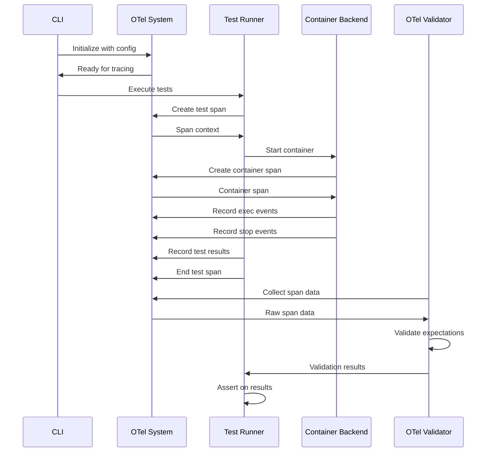
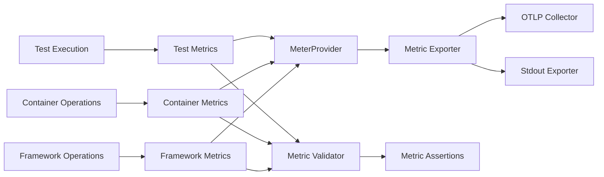
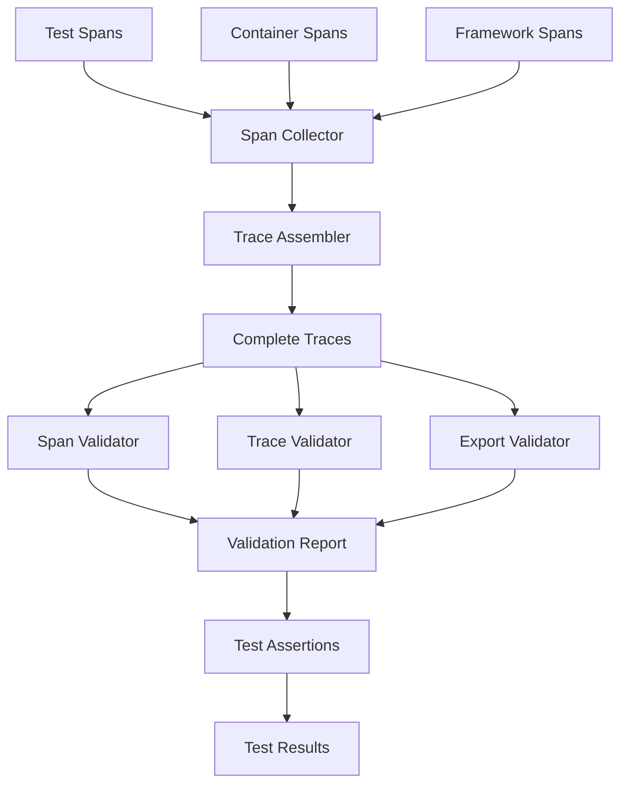

# OpenTelemetry Integration Architecture

## 🏗️ Architecture Overview

This document defines the complete OpenTelemetry integration architecture for clnrm, ensuring comprehensive observability across all system components while maintaining modular boundaries and security best practices.

## 📋 Core Design Principles

### 1. **Modular Integration**
- Each component integrates OTel independently
- No cross-component dependencies on OTel implementation
- Clean separation between business logic and observability

### 2. **Secure by Design**
- No hardcoded secrets or environment variables
- Configuration-driven OTel setup
- Secure span attribute handling

### 3. **Zero Performance Impact**
- Lazy initialization of OTel components
- Feature-gated compilation (`otel-traces` feature)
- Minimal overhead when OTel disabled

### 4. **Comprehensive Coverage**
- All major operations traced with appropriate spans
- Consistent span naming and attribute conventions
- Complete trace lifecycle management

## 🏛️ System Architecture

```mermaid
graph TB
    %% Core Application Components
    CLI[CLI Entry Point] --> OTelInit[OTel Initialization]
    CLI --> TestRunner[Test Runner]
    CLI --> ContainerOps[Container Operations]
    CLI --> Framework[Framework Self-Tests]

    %% OTel Infrastructure
    OTelInit --> OTelConfig[OTel Configuration]
    OTelConfig --> TracerProvider[Tracer Provider]
    OTelConfig --> MeterProvider[Meter Provider]
    OTelConfig --> LoggerProvider[Logger Provider]

    %% Span Creation Points
    TestRunner --> TestSpans[Test Spans]
    ContainerOps --> ContainerSpans[Container Spans]
    Framework --> FrameworkSpans[Framework Spans]

    %% Event Recording
    TestSpans --> SpanEvents[Test Events]
    ContainerSpans --> ContainerEvents[Container Events]
    FrameworkSpans --> FrameworkEvents[Framework Events]

    %% Export Layer
    TracerProvider --> SpanExporter[Span Exporter]
    MeterProvider --> MetricExporter[Metric Exporter]
    LoggerProvider --> LogExporter[Log Exporter]

    %% External Systems
    SpanExporter --> OTLP[OTLP Collector]
    MetricExporter --> OTLP
    LogExporter --> OTLP

    SpanExporter --> Stdout[Stdout Exporter]
    MetricExporter --> Stdout
    LogExporter --> Stdout

    %% Validation Layer
    TestSpans --> OTelValidator[OTel Validator]
    ContainerSpans --> OTelValidator
    FrameworkSpans --> OTelValidator

    OTelValidator --> ValidationResults[Validation Results]
    ValidationResults --> TestFramework[Test Framework Assertions]

    %% Subgraph: CLI Integration
    subgraph "CLI Integration Architecture"
        CLIEntry[CLI Main] --> ConfigLoader[Configuration Loader]
        ConfigLoader --> OTelBootstrap[OTel Bootstrap]
        OTelBootstrap --> GlobalTracer[Global Tracer Setup]
        GlobalTracer --> CommandExecution[Command Execution with Spans]
    end

    %% Subgraph: Test Integration Architecture
    subgraph "Test Integration Architecture"
        TestDiscovery[Test Discovery] --> TestExecution[Test Execution]
        TestExecution --> TestSpans
        TestExecution --> TestMetrics[Test Metrics Recording]
        TestMetrics --> MeterProvider
        TestSpans --> TestValidation[Test Validation]
    end

    %% Subgraph: Container Integration Architecture
    subgraph "Container Integration Architecture"
        ContainerLifecycle[Container Lifecycle] --> ContainerSpans
        ContainerLifecycle --> ContainerMetrics[Container Metrics]
        ContainerMetrics --> MeterProvider
        ContainerLifecycle --> ContainerValidation[Container Validation]
    end

    %% Subgraph: Framework Integration Architecture
    subgraph "Framework Integration Architecture"
        FrameworkSelfTest[Framework Self-Test] --> FrameworkSpans
        FrameworkSelfTest --> FrameworkMetrics[Framework Metrics]
        FrameworkMetrics --> MeterProvider
        FrameworkSelfTest --> FrameworkValidation[Framework Validation]
    end
```



## 🔧 Component Integration Details

### 1. **CLI Integration Module**

```rust
// crates/clnrm-core/src/cli/telemetry.rs
pub struct CliTelemetry {
    _guard: Option<OtelGuard>,
}

impl CliTelemetry {
    pub fn init(config: OtelConfig) -> Result<Self> {
        let guard = if config.enabled {
            Some(init_otel(config)?)
        } else {
            None
        };

        Ok(Self { _guard: guard })
    }

    pub fn create_span(&self, name: &str) -> Option<tracing::Span> {
        if self._guard.is_some() {
            Some(tracing::span!(Level::INFO, name))
        } else {
            None
        }
    }
}
```

### 2. **Test Integration Module**

```rust
// crates/clnrm-core/src/testing/telemetry.rs
pub struct TestTelemetry {
    test_name: String,
    _span: Option<tracing::Span>,
}

impl TestTelemetry {
    pub fn start_test(test_name: &str) -> Self {
        let span = crate::telemetry::spans::test_span(test_name);

        Self {
            test_name: test_name.to_string(),
            _span: Some(span),
        }
    }

    pub fn record_result(&mut self, passed: bool) {
        if let Some(span) = &mut self._span {
            crate::telemetry::events::record_test_result(span, &self.test_name, passed);
        }
    }
}

impl Drop for TestTelemetry {
    fn drop(&mut self) {
        if let Some(span) = &mut self._span.take() {
            span.end();
        }
    }
}
```

### 3. **Container Integration Module**

```rust
// crates/clnrm-core/src/backend/telemetry.rs
pub struct ContainerTelemetry {
    container_id: String,
    image: String,
    _start_span: Option<tracing::Span>,
    _exec_spans: Vec<tracing::Span>,
}

impl ContainerTelemetry {
    pub fn start_container(image: &str, container_id: &str) -> Self {
        let start_span = crate::telemetry::spans::container_start_span(image, container_id);

        Self {
            container_id: container_id.to_string(),
            image: image.to_string(),
            _start_span: Some(start_span),
            _exec_spans: Vec::new(),
        }
    }

    pub fn record_exec(&mut self, command: &str, exit_code: i32) {
        let mut exec_span = crate::telemetry::spans::container_exec_span(&self.container_id, command);

        crate::telemetry::events::record_container_exec(&mut exec_span, command, exit_code);

        self._exec_spans.push(exec_span);
    }

    pub fn record_stop(&mut self, exit_code: i32) {
        if let Some(span) = &mut self._start_span {
            crate::telemetry::events::record_container_stop(span, &self.container_id, exit_code);
        }
    }
}
```

### 4. **Framework Integration Module**

```rust
// crates/clnrm-core/src/cleanroom/telemetry.rs
pub struct FrameworkTelemetry {
    config_path: String,
    test_count: usize,
    _run_span: Option<tracing::Span>,
}

impl FrameworkTelemetry {
    pub fn start_run(config_path: &str, test_count: usize) -> Self {
        let run_span = crate::telemetry::spans::run_span(config_path, test_count);

        Self {
            config_path: config_path.to_string(),
            test_count,
            _run_span: Some(run_span),
        }
    }

    pub fn start_step(&mut self, step_name: &str, step_index: usize) {
        let mut step_span = crate::telemetry::spans::step_span(step_name, step_index);

        crate::telemetry::events::record_step_start(&mut step_span, step_name);
    }

    pub fn complete_step(&mut self, step_name: &str, status: &str) {
        if let Some(span) = &mut self._run_span {
            crate::telemetry::events::record_step_complete(span, step_name, status);
        }
    }
}
```

## 🔐 Security Architecture

### Configuration Security
```rust
// Secure configuration loading - no hardcoded values
pub struct SecureOtelConfig {
    pub service_name: String,
    pub deployment_env: String,
    pub sample_ratio: f64,
    pub export_config: ExportConfig,
    // No secrets stored in config
}

pub struct ExportConfig {
    pub endpoint: Option<String>, // From env vars only
    pub headers: HashMap<String, String>, // From env vars only
    pub export_format: ExportFormat,
}
```

### Span Security
```rust
// Secure span attribute handling
impl SecureSpanBuilder {
    pub fn add_safe_attribute(&mut self, key: &str, value: &str) {
        // Validate attribute key/value for security
        if self.is_safe_key(key) && self.is_safe_value(value) {
            self.attributes.insert(key.to_string(), value.to_string());
        }
    }

    fn is_safe_key(&self, key: &str) -> bool {
        // No injection vulnerabilities, no secrets
        !key.contains("password") && !key.contains("secret")
    }

    fn is_safe_value(&self, value: &str) -> bool {
        // No secrets, no PII in span attributes
        !value.contains("password") && !value.contains("secret")
    }
}
```

## 📊 Data Flow Architecture



## 🔧 Integration Points

### 1. **CLI Entry Point Integration**

```rust
// src/main.rs
fn main() -> Result<()> {
    // Initialize OTel early in startup
    let otel_config = load_otel_config()?;
    let _otel_guard = CliTelemetry::init(otel_config)?;

    // All CLI operations now have OTel context
    let result = Cli::run();

    // OTel automatically flushed on guard drop
    result
}
```

### 2. **Test Execution Integration**

```rust
// Test execution with OTel spans
#[tokio::test]
async fn test_with_otel() -> Result<()> {
    let telemetry = TestTelemetry::start_test("test_name");

    // Test execution with span context
    let result = execute_test().await?;

    telemetry.record_result(result.passed);

    // Span automatically ended on drop
    Ok(())
}
```

### 3. **Container Operation Integration**

```rust
// Container operations with OTel spans
pub async fn execute_in_container(&self, command: &str) -> Result<ExecutionResult> {
    let mut telemetry = ContainerTelemetry::start_container(&self.image, &self.id);

    let result = self.backend.execute(command).await?;

    telemetry.record_exec(command, result.exit_code);
    telemetry.record_stop(result.exit_code);

    Ok(result)
}
```

### 4. **Framework Self-Test Integration**

```rust
// Framework self-testing with OTel spans
pub async fn run_framework_tests() -> Result<FrameworkResults> {
    let mut telemetry = FrameworkTelemetry::start_run("cleanroom.toml", test_count);

    for (i, test) in tests.iter().enumerate() {
        telemetry.start_step(&test.name, i);

        let result = execute_test(test).await?;

        telemetry.complete_step(&test.name, if result.passed { "pass" } else { "fail" });
    }

    Ok(results)
}
```

## 📈 Metrics Integration Architecture



## 🔍 Validation Integration Architecture



## 🚀 Implementation Roadmap

### Phase 1: Core Integration (Week 1)
1. **CLI Integration** - OTel initialization in main entry points
2. **Test Integration** - Span creation in test execution
3. **Container Integration** - Span creation in container operations

### Phase 2: Framework Integration (Week 2)
4. **Framework Integration** - Span creation in framework self-tests
5. **Metrics Integration** - Metrics collection across all components
6. **Event Integration** - Event recording for all operations

### Phase 3: Validation Enhancement (Week 3)
7. **Real Span Validation** - Replace stubs with actual span data
8. **Trace Validation** - Implement trace completeness checking
9. **Export Validation** - Verify OTLP endpoints work correctly

### Phase 4: Production Hardening (Week 4)
10. **Performance Validation** - Measure and optimize OTel overhead
11. **Security Audit** - Ensure no secrets in telemetry data
12. **Documentation** - Complete integration documentation

## ✅ Success Criteria

- **Zero unwrap()/expect()** in OTel integration code
- **Feature-gated compilation** - OTel optional via features
- **No performance regression** when OTel disabled
- **Complete test coverage** for all integration points
- **Security compliance** - no secrets in telemetry data
- **Documentation complete** - all integration points documented

This architecture ensures clnrm has comprehensive, secure, and performant observability while maintaining the core team's quality standards.

