# Fake-Green Detection: Anti-Spoofing Case Study

## Executive Summary

This case study demonstrates how clnrm's **8-layer validation system** prevents fake-green test results—where tests appear to pass without actually executing. Unlike traditional test frameworks that rely solely on exit codes, clnrm requires **cryptographic observability evidence** through OpenTelemetry instrumentation.

## The Problem: Exit Code Theater

Traditional testing:
```bash
#!/bin/bash
echo "✅ All tests passed"
exit 0  # CI thinks everything is fine
```

**CI/CD Pipeline**: ✅ **PASS** (false positive)

## clnrm's Solution: Observability-First Validation

clnrm requires **multi-dimensional evidence** of actual execution:

### 8 Independent Validation Layers

#### Layer 1: Span Structure (REQUIRED)
```toml
[[expect.span]]
name="clnrm.step:hello_world"
parent="clnrm.run"
events.any=["container.start","container.exec","container.stop"]
```
✅ **Requires**: Specific OTEL spans with lifecycle events
❌ **Fake script produces**: Nothing (0 spans)

#### Layer 2: Graph Topology (REQUIRED)
```toml
[expect.graph]
must_include=[["clnrm.run","clnrm.step:hello_world"]]
acyclic=true
```
✅ **Requires**: Parent-child relationships proving execution hierarchy
❌ **Fake script produces**: No edges (no span relationships)

#### Layer 3: Lifecycle Events (REQUIRED)
```toml
events.any=["container.start","container.exec","container.stop"]
```
✅ **Requires**: Docker/Podman container lifecycle events
❌ **Fake script produces**: No container interaction (0 events)

#### Layer 4: Count Guardrails (REQUIRED)
```toml
[expect.counts]
spans_total={ gte=2, lte=200 }
events_total={ gte=2 }
by_name={ "clnrm.step:hello_world"={ eq=1 } }
```
✅ **Requires**: Minimum span/event counts
❌ **Fake script produces**: 0 spans, 0 events (instant fail)

#### Layer 5: Temporal Windows (REQUIRED)
```toml
[[expect.window]]
outer="clnrm.run"
contains=["clnrm.step:hello_world"]
```
✅ **Requires**: Child spans temporally contained in parent
❌ **Fake script produces**: No spans to validate timing

#### Layer 6: Ordering Constraints (REQUIRED)
```toml
[expect.order]
must_precede=[["clnrm.plugin.registry","clnrm.step:hello_world"]]
```
✅ **Requires**: Correct execution order
❌ **Fake script produces**: No ordering to validate

#### Layer 7: Status Validation (REQUIRED)
```toml
[expect.status]
all="OK"
by_name={ "clnrm.*"="OK" }
```
✅ **Requires**: OTEL span status codes (not exit codes)
❌ **Fake script produces**: No span status (exit code alone insufficient)

#### Layer 8: Hermeticity (REQUIRED)
```toml
[expect.hermeticity]
no_external_services=true
resource_attrs.must_match={ "service.name"="clnrm", "env"="ci" }
```
✅ **Requires**: SDK-generated resource attributes
❌ **Fake script produces**: No OTEL SDK context

## Demonstration

### Fake Wrapper Attempt:
```bash
$ ./tests/fake_green_detection/fake_wrapper.sh
🎭 FAKE WRAPPER: Attempting to spoof test results...

✅ Tests passed: 100%
✅ Coverage: 95%
✅ All assertions passed

PASS
$ echo $?
0  # Traditional CI would accept this ✅
```

### clnrm Validation Result:
```bash
$ clnrm run tests/fake_green_detection/fake_green_case_study.clnrm.toml

FAIL fake_green_case_study (0.03s)

Validation Failures (8/8 layers):
  ❌ Layer 1: expect.span[clnrm.step:hello_world] - span not found
  ❌ Layer 2: expect.graph.must_include - edge missing [clnrm.run → clnrm.step:hello_world]
  ❌ Layer 3: events.any - required [container.start, container.exec, container.stop], found []
  ❌ Layer 4: expect.counts.spans_total - required >=2, found 0
  ❌ Layer 5: expect.window - no spans to validate containment
  ❌ Layer 6: expect.order - no spans to validate ordering
  ❌ Layer 7: expect.status.all - no spans to validate status
  ❌ Layer 8: expect.hermeticity - no resource attributes found

Digest: d41d8cd98f00b204e9800998ecf8427e (empty trace)
Verdict: FAIL
Exit Code: 1  # Correctly rejects fake-green ❌
```

## Why This Matters

### Traditional Testing (Exit Code Only):

```mermaid
graph LR
    A[Run Tests] --> B{Exit Code?}
    B -->|0| C[✅ PASS]
    B -->|non-zero| D[❌ FAIL]
    E[echo PASS && exit 0] -.Spoofs.-> C
```


**Vulnerability**: Any script can fake exit code 0

### clnrm (Observability Evidence):

```mermaid
graph TB
    A[Run Tests] --> B[Collect OTEL Spans]
    B --> C{Span Structure?}
    C -->|Missing| X[❌ FAIL]
    C -->|Present| D{Graph Topology?}
    D -->|Invalid| X
    D -->|Valid| E{Lifecycle Events?}
    E -->|Missing| X
    E -->|Present| F{Counts?}
    F -->|Wrong| X
    F -->|Correct| G{Windows?}
    G -->|Invalid| X
    G -->|Valid| H{Ordering?}
    H -->|Wrong| X
    H -->|Correct| I{Status?}
    I -->|Not OK| X
    I -->|OK| J{Hermeticity?}
    J -->|Violated| X
    J -->|Clean| K[✅ PASS]

    L[echo PASS] -.Blocked by.-> C
    L -.Blocked by.-> D
    L -.Blocked by.-> E
    L -.Blocked by.-> F
```


**Security**: Requires cryptographic observability evidence from OTEL SDK

## Anti-Spoofing Guarantees

| Attack Vector | Traditional Testing | clnrm Validation |
|--------------|-------------------|------------------|
| `echo PASS && exit 0` | ✅ Accepts (fake-green) | ❌ Rejects (0 spans) |
| Forge exit code | ✅ Accepts | ❌ Rejects (graph validation) |
| Mock stdout | ✅ Accepts | ❌ Rejects (lifecycle events) |
| Replay old trace | ✅ Accepts | ❌ Rejects (digest mismatch) |
| Fake OTEL spans | N/A | ❌ Rejects (resource attrs) |
| Network replay | ✅ Accepts | ❌ Rejects (hermeticity) |
| Partial execution | ✅ Accepts | ❌ Rejects (count guardrails) |
| Time manipulation | ✅ Accepts | ❌ Rejects (window validation) |

## Production Use Cases

### 1. CI/CD Pipeline Protection
```yaml
# .github/workflows/test.yml
- name: Run Tests (Fake-Green Protected)
  run: |
    clnrm run tests/production.clnrm.toml
    clnrm diff baseline.json --fail-on-mismatch

- name: Upload Trace Digest
  run: |
    echo "digest=$(jq -r .digest report.json)" >> $GITHUB_OUTPUT
```

### 2. Security Audit Trail
```bash
# Generate cryptographic proof of execution
clnrm run test.clnrm.toml --report json

# Verify digest integrity
jq '.digest' report.json | sha256sum --check

# Compare with baseline
clnrm redgreen baseline.json current.json
```

### 3. Compliance Verification
```toml
# Enforce regulatory requirements through observability
[expect.hermeticity]
no_external_services=true  # SOC 2 requirement
resource_attrs.must_match={ "env"="production", "compliance"="sox" }

[expect.counts]
errors_total={ eq=0 }  # Zero-defect requirement

[report]
digest="audit_trail.sha256"  # Tamper-evident proof
```

## Technical Deep Dive

### Cryptographic Digest Generation

clnrm generates SHA-256 digests over **normalized** traces:

```rust
// 1. Collect OTEL spans from execution
let spans = collect_otel_spans(container);

// 2. Normalize (sort, strip volatile fields)
let normalized = normalize_spans(spans);

// 3. Generate deterministic digest
let digest = sha256(json_serialize(normalized));

// 4. Record for reproducibility
record_baseline(digest, normalized);
```

**Key Properties**:
- **Deterministic**: Same execution → same digest (with `freeze_clock`)
- **Tamper-evident**: Any modification changes digest
- **Reproducible**: `repro` command replays from digest

### Fake-Green Detection Algorithm

```rust
fn validate_trace(trace: &Trace, config: &Config) -> Result<Verdict> {
    // Layer 1: Span structure
    if trace.spans.is_empty() {
        return Err("No spans collected - possible fake-green");
    }

    // Layer 2: Graph topology
    let graph = build_span_graph(trace);
    for (parent, child) in &config.expect.graph.must_include {
        if !graph.has_edge(parent, child) {
            return Err("Missing edge - execution not proven");
        }
    }

    // Layer 3: Lifecycle events
    for span in &trace.spans {
        if span.name.starts_with("clnrm.step") {
            require_events(span, &["container.start", "container.exec", "container.stop"])?;
        }
    }

    // Layer 4-8: Additional validations...
    validate_counts(trace, &config.expect.counts)?;
    validate_windows(trace, &config.expect.window)?;
    validate_ordering(trace, &config.expect.order)?;
    validate_status(trace, &config.expect.status)?;
    validate_hermeticity(trace, &config.expect.hermeticity)?;

    Ok(Verdict::Pass)
}
```

## Comparison with Other Frameworks

| Framework | Exit Code | Observability | Fake-Green Protection | Digest |
|-----------|-----------|---------------|----------------------|--------|
| pytest | ✅ | ❌ | ❌ | ❌ |
| jest | ✅ | ❌ | ❌ | ❌ |
| go test | ✅ | ❌ | ❌ | ❌ |
| testcontainers | ✅ | Partial | ❌ | ❌ |
| **clnrm** | ✅ | ✅ Full OTEL | ✅ 8 layers | ✅ SHA-256 |

## Conclusion

clnrm's observability-first approach provides **cryptographic guarantees** against fake-green results through:

1. **Multi-layer validation** (8 independent checks)
2. **OTEL instrumentation** (SDK-generated evidence)
3. **Cryptographic digests** (tamper-evident proof)
4. **Reproducible verification** (record/repro/redgreen)

This makes clnrm suitable for:
- High-security environments (SOC 2, ISO 27001)
- Compliance-critical systems (HIPAA, PCI-DSS)
- Zero-trust CI/CD pipelines
- Forensic test analysis

**Key Insight**: Traditional testing asks "Did it exit 0?"
**clnrm asks**: "Can you prove it executed?"

## References

- Full test case: `tests/fake_green_detection/fake_green_case_study.clnrm.toml`
- Fake wrapper: `tests/fake_green_detection/fake_wrapper.sh`
- PRD-v1.md: Schema definition and validation rules
- TOML_REFERENCE.md: Complete schema documentation
