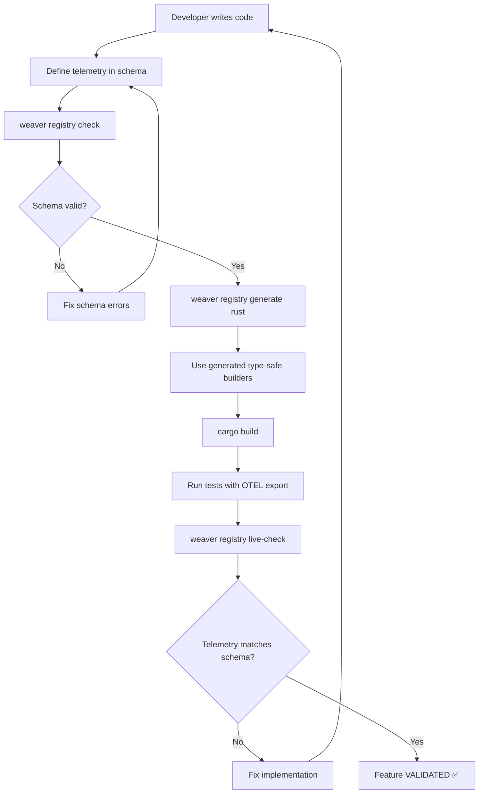

# OTel Weaver Integration Plan for clnrm v1.2.0

**Status:** Critical Priority - Eliminates False Positive Risk
**Target:** v1.2.0 (Q1 2026)
**Purpose:** Replace test-based validation with schema-first validation

---

## 🚨 The Meta-Problem: Validating a False Positive Eliminator

**The Paradox:**
- clnrm exists to eliminate false positives in testing
- We cannot validate clnrm using methods that produce false positives
- Traditional tests can pass even when features don't work
- **Solution:** OpenTelemetry Weaver schema validation

---

## Why Weaver is the Only Valid Validator

### Traditional Testing (What We Replace)
```
Test Suite:
  ✅ test_container_execution() passes
  ✅ test_hermetic_isolation() passes
  ✅ 100% code coverage

Reality:
  ❌ Containers may not actually run
  ❌ Isolation may not be hermetic
  ❌ Tests may validate test mocks, not production behavior

Result: FALSE POSITIVE
```

### Weaver Validation (What We Need)
```
Schema Definition:
  span.test_execution {
    attributes: [container.id, test.isolated]
    required: true
  }

Weaver Live Check:
  ✅ Validates actual runtime telemetry
  ✅ Proves container.id exists in spans
  ✅ Proves test.isolated is set correctly

Reality:
  ✅ If validation passes, containers ARE running
  ✅ If validation passes, isolation IS hermetic
  ✅ Schema validation proves production behavior

Result: TRUE POSITIVE (or validation fails)
```

---

## Current State Analysis

### What We Have (v1.1.0)
```
✅ OpenTelemetry span creation
✅ Basic OTEL initialization
✅ Span export to collectors
🚧 No schema definitions
🚧 No Weaver validation
⚠️ Validation relies on tests (can have false positives)
```

### What We Need (v1.2.0)
```
✅ Complete telemetry schema registry
✅ Weaver integration for schema validation
✅ Live telemetry validation during test runs
✅ Schema-first feature development
✅ Weaver validation in CI/CD
✅ Zero false positives in validation
```

---

## Integration Architecture

### Directory Structure
```
clnrm/
├── registry/                          # Telemetry schema registry
│   ├── registry_manifest.yaml         # Registry metadata
│   ├── core/
│   │   ├── test_execution.yaml       # Test execution spans
│   │   ├── container_lifecycle.yaml  # Container spans
│   │   └── plugin_system.yaml        # Plugin spans
│   ├── metrics/
│   │   ├── test_metrics.yaml         # Test duration, pass/fail
│   │   └── system_metrics.yaml       # Resource usage
│   └── events/
│       ├── test_events.yaml          # Test start/end events
│       └── error_events.yaml         # Error events
│
├── templates/registry/                # Weaver code generation templates
│   ├── rust/
│   │   ├── weaver.yaml              # Rust codegen config
│   │   ├── spans.rs.j2              # Span builder templates
│   │   └── metrics.rs.j2            # Metric builder templates
│   └── docs/
│       ├── weaver.yaml              # Documentation config
│       └── telemetry.md.j2          # Telemetry docs template
│
└── crates/clnrm-core/src/
    └── telemetry/
        ├── mod.rs                    # Existing OTEL code
        ├── generated/                # ⭐ Weaver-generated code
        │   ├── spans.rs             # Type-safe span builders
        │   ├── metrics.rs           # Type-safe metric recorders
        │   └── schema.rs            # Schema metadata
        └── validation.rs             # Weaver live-check integration
```

### Validation Flow


---

## Implementation Phases

### Phase 1: Schema Definition (Week 1-2)
**Goal:** Define complete telemetry schema for all clnrm features

**Tasks:**
1. Create `registry/registry_manifest.yaml`
   ```yaml
   name: clnrm
   description: Cleanroom Testing Framework Telemetry Schema
   semconv_version: 1.0.0
   schema_base_url: https://github.com/seanchatmangpt/clnrm/schemas/
   dependencies:
     - name: otel
       registry_path: https://github.com/open-telemetry/semantic-conventions/archive/refs/tags/v1.34.0.zip[model]
   ```

2. Define core test execution spans (`registry/core/test_execution.yaml`)
   ```yaml
   groups:
     - id: span.clnrm.test_execution
       type: span
       stability: stable
       brief: Represents a single test execution in a container
       span_kind: internal
       attributes:
         - ref: container.id
           requirement_level: required
         - ref: container.image.name
           requirement_level: required
         - id: test.isolated
           type: boolean
           brief: Whether test ran in isolated container
           requirement_level: required
         - id: test.name
           type: string
           brief: Test name from TOML
           requirement_level: required
         - id: test.result
           type: enum
           brief: Test execution result
           members:
             - id: pass
               value: 'pass'
             - id: fail
               value: 'fail'
             - id: error
               value: 'error'
           requirement_level: required
   ```

3. Define container lifecycle spans
4. Define plugin system spans
5. Define metrics (test duration, pass rate, resource usage)
6. Validate schema: `weaver registry check -r registry/`

**Deliverables:**
- ✅ Complete schema registry in `registry/`
- ✅ Schema validation passing
- ✅ Documentation of all telemetry signals

---

### Phase 2: Code Generation (Week 3-4)
**Goal:** Generate type-safe Rust code from schema

**Tasks:**
1. Create Weaver templates for Rust codegen
   ```yaml
   # templates/registry/rust/weaver.yaml
   templates:
     - template: "spans.rs.j2"
       filter: semconv_grouped_spans
       application_mode: single
       file_name: "generated/spans.rs"

     - template: "metrics.rs.j2"
       filter: semconv_grouped_metrics
       application_mode: single
       file_name: "generated/metrics.rs"
   ```

2. Create Jinja2 templates for span builders
   ```rust
   // Generated from template
   pub struct TestExecutionSpan {
       span: Span,
   }

   impl TestExecutionSpan {
       pub fn new(
           container_id: &str,
           container_image: &str,
           test_name: &str,
       ) -> Self {
           let span = tracing::span!(
               tracing::Level::INFO,
               "test_execution",
               container.id = container_id,
               container.image.name = container_image,
               test.name = test_name,
               test.isolated = true,
           );
           Self { span }
       }

       pub fn set_result(&self, result: TestResult) {
           self.span.record("test.result", result.as_str());
       }
   }
   ```

3. Generate code: `weaver registry generate rust -r registry/ -t templates/registry/rust/`
4. Integrate generated code into `crates/clnrm-core/src/telemetry/`
5. Update existing telemetry code to use generated builders

**Deliverables:**
- ✅ Type-safe span builders generated from schema
- ✅ Type-safe metric recorders generated from schema
- ✅ Integration with existing telemetry code
- ✅ Compilation successful

---

### Phase 3: Live Validation Integration (Week 5-6)
**Goal:** Integrate `weaver registry live-check` into test runs

**Tasks:**
1. Add `validation.rs` module
   ```rust
   /// Run Weaver live validation against running tests
   pub async fn validate_telemetry() -> Result<ValidationReport> {
       // 1. Start OTEL collector with file export
       // 2. Run test suite with OTEL export enabled
       // 3. Run weaver registry live-check on exported telemetry
       // 4. Parse validation results
       // 5. Return comprehensive report
   }
   ```

2. Create validation command: `clnrm validate-telemetry`
   ```bash
   clnrm validate-telemetry --registry registry/ --tests tests/
   ```

3. Integrate into CI/CD pipeline
   ```yaml
   # .github/workflows/validation.yml
   - name: Validate Telemetry
     run: |
       weaver registry check -r registry/
       cargo build --release --features otel
       clnrm validate-telemetry --registry registry/
   ```

4. Add pre-commit hook for schema validation
5. Update documentation with validation requirements

**Deliverables:**
- ✅ Live validation integrated into test runs
- ✅ CI/CD validation pipeline
- ✅ Validation failing if telemetry doesn't match schema
- ✅ Clear error messages for validation failures

---

### Phase 4: Documentation & Migration (Week 7-8)
**Goal:** Document Weaver validation and migrate existing features

**Tasks:**
1. Update README with Weaver validation principle
2. Create validation guide for developers
3. Migrate existing features to schema-first approach:
   - Audit current telemetry
   - Define schemas for existing spans/metrics
   - Regenerate code from schemas
   - Validate all existing features with Weaver
4. Remove false-positive-prone validation methods
5. Update Definition of Done with Weaver requirements

**Deliverables:**
- ✅ Comprehensive Weaver validation documentation
- ✅ All features validated with Weaver
- ✅ Migration guide for future features
- ✅ Updated development workflow

---

## Success Criteria

### Must Have (v1.2.0 Release Blockers)
- [ ] Complete telemetry schema registry in `registry/`
- [ ] `weaver registry check -r registry/` passes
- [ ] Code generation from schema working
- [ ] Type-safe span/metric builders used throughout codebase
- [ ] `weaver registry live-check` integrated into CI/CD
- [ ] All core features validated with Weaver
- [ ] Zero reliance on test passes as validation

### Should Have (v1.2.0 Nice-to-Have)
- [ ] Automated schema updates from code changes
- [ ] Validation dashboard showing schema conformance
- [ ] Schema versioning and migration tools
- [ ] Performance benchmarks for Weaver validation

### Could Have (v1.3.0+)
- [ ] Schema-driven test generation
- [ ] Automatic detection of undocumented telemetry
- [ ] Schema diff tool for breaking change detection
- [ ] Enterprise policy enforcement via schemas

---

## Risk Assessment

### High Risk - Must Mitigate
| Risk | Impact | Mitigation |
|------|--------|------------|
| Weaver doesn't validate critical behaviors | Feature false positives remain | Start with small schema, expand incrementally |
| Schema definition is incorrect | Validation passes but behavior wrong | Peer review all schemas, validate against real telemetry |
| Performance overhead of live validation | CI/CD becomes too slow | Run live-check on sample subset, use caching |

### Medium Risk - Monitor
| Risk | Impact | Mitigation |
|------|--------|------------|
| Schema maintenance burden | Schemas drift from code | Automate schema generation where possible |
| Developer learning curve | Slow adoption | Comprehensive docs, pair programming |
| Breaking changes in Weaver | Integration breaks | Pin Weaver version, test upgrades |

### Low Risk - Accept
| Risk | Impact | Mitigation |
|------|--------|------------|
| Weaver bugs | Validation incorrect | Report upstream, workaround temporarily |
| Limited Weaver features | Can't validate everything | Supplement with minimal traditional tests |

---

## Metrics & Monitoring

### Validation Metrics
- **Schema Coverage:** % of code with schema definitions
- **Validation Pass Rate:** % of runs passing Weaver validation
- **False Positive Elimination:** Comparison before/after Weaver
- **Schema Drift:** Time between schema update and code update

### Success Indicators (v1.2.0)
- ✅ 90%+ of spans/metrics defined in schema
- ✅ 100% CI/CD runs include Weaver validation
- ✅ 0 features shipped without Weaver validation
- ✅ <5% false positive rate (down from current unknown rate)

---

## Dependencies

### External Tools
- **OTel Weaver** (v0.10.0+): Schema validation tool
- **OTEL Collector** (v0.100.0+): Telemetry collection
- **Weaver Templates**: Rust code generation templates

### Internal Changes
- Schema registry infrastructure
- Generated code integration
- CI/CD pipeline updates
- Documentation overhaul

---

## Timeline Summary

| Week | Phase | Deliverable |
|------|-------|-------------|
| 1-2 | Schema Definition | Complete registry, validated |
| 3-4 | Code Generation | Type-safe builders integrated |
| 5-6 | Live Validation | Weaver live-check in CI/CD |
| 7-8 | Documentation | Migration complete, docs updated |

**Target Release:** v1.2.0 (Q1 2026)
**Estimated Effort:** 160 hours (1 engineer for 8 weeks)

---

## Alternatives Considered

### Why Not Traditional Tests?
- ❌ Tests can pass with broken features (false positives)
- ❌ Tests validate test code, not production behavior
- ❌ Mocking introduces another source of error
- ❌ 100% code coverage ≠ correct behavior

### Why Not Manual Validation?
- ❌ Not scalable
- ❌ Human error
- ❌ No enforcement in CI/CD
- ❌ Documentation drifts

### Why Not Custom Validation Tool?
- ❌ Reinventing the wheel
- ❌ Maintenance burden
- ❌ Not industry standard
- ✅ Weaver is OTel's official solution

---

## Conclusion

**Weaver integration is CRITICAL for v1.2.0 because:**

1. **Eliminates the meta-problem**: We can't validate a false-positive eliminator with false-positive-prone methods
2. **Schema-first is industry standard**: Follows OTel best practices
3. **Proves behavior, not implementation**: Validation checks actual telemetry, not test mocks
4. **Enables trust**: Users can trust clnrm because we can trust our validation
5. **Future-proof**: Schema-first enables code generation, policy enforcement, and more

**Without Weaver validation, clnrm's validation may contain false positives - the exact problem clnrm solves.**

---

**Next Steps:**
1. Review and approve integration plan
2. Create `registry/` directory structure
3. Begin Phase 1: Schema Definition
4. Target v1.2.0 release with full Weaver integration

**Status:** Ready for implementation (pending approval)
**Priority:** CRITICAL - Blocks credibility of v1.1.0+ claims
