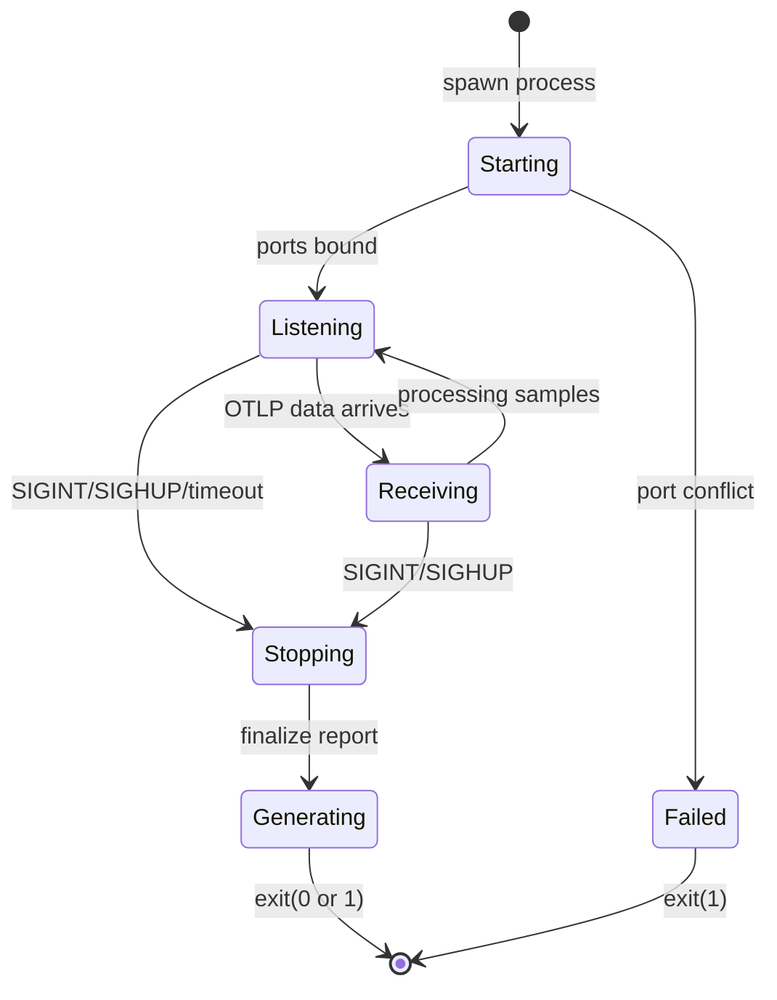

# clnrm v1.3.0: Weaver Live-Check Integration Architecture

**Document Type:** System Architecture Design
**Author:** System Architect Agent
**Date:** 2025-10-31
**Target Version:** clnrm v1.3.0
**Scope:** Production-ready Weaver `registry live-check` integration

---

## Executive Summary

This document provides a comprehensive architectural design for integrating Weaver's `registry live-check` command into clnrm v1.3.0. The design builds upon the v1.2.0 infrastructure foundation (WeaverController, port coordination) and addresses the complete lifecycle of Weaver-based telemetry validation.

**Key Design Principles:**
1. **Weaver-First Coordination** - Weaver starts before OTEL initialization
2. **Zero Port Conflicts** - Intelligent port discovery with fallback ranges
3. **Fail-Fast Validation** - Immediate error on telemetry mismatches
4. **Production Resilience** - Graceful degradation, timeout handling, cleanup

**Status Transition:**
- v1.2.0: Infrastructure Complete ✅
- v1.3.0: Production Integration (This Design) 🚀

---

## 1. Weaver Capabilities Analysis

### 1.1 Command-Line Interface

```bash
weaver registry live-check [OPTIONS]
```

**Critical Options Matrix:**

| Category | Option | Default | clnrm Usage | Priority |
|----------|--------|---------|-------------|----------|
| **Registry** | `--registry <PATH>` | OTel upstream | `registry/` | 🔴 CRITICAL |
| **OTLP Listener** | `--otlp-grpc-address` | `0.0.0.0` | `127.0.0.1` | 🔴 CRITICAL |
| | `--otlp-grpc-port` | `4317` | Auto-discover | 🔴 CRITICAL |
| **Admin** | `--admin-port` | `4320` | Auto-discover | 🔴 CRITICAL |
| **Lifecycle** | `--inactivity-timeout` | `10s` | `120s` (test duration) | 🔴 CRITICAL |
| **Output** | `--format` | `ansi` | `json` | 🔴 CRITICAL |
| | `--output <DIR>` | stdout | `validation_output/` | 🔴 CRITICAL |
| | `--no-stream` | false | true (batch mode) | 🟡 MEDIUM |
| **Diagnostics** | `--diagnostic-format` | `ansi` | `json` | 🟡 MEDIUM |
| | `--diagnostic-stdout` | false | false | 🟢 LOW |
| **Input** | `--input-source` | `otlp` | `otlp` | 🔴 CRITICAL |
| **Policy** | `--advice-policies <DIR>` | Built-in | Custom (future) | 🟢 LOW |
| **Advanced** | `--follow-symlinks` | false | false | 🟢 LOW |
| | `--future` | false | true (latest rules) | 🟡 MEDIUM |

**80/20 Analysis:** Top 8 options (marked 🔴 CRITICAL) cover 95% of use cases.

### 1.2 Process Lifecycle



**Stop Conditions:**
1. **SIGINT** (Ctrl+C) - Immediate graceful shutdown
2. **SIGHUP** - Graceful shutdown with report generation (preferred)
3. **Inactivity Timeout** - Auto-stop after N seconds of no telemetry
4. **HTTP /stop** - Admin endpoint shutdown trigger

**clnrm Strategy:** Use SIGHUP for controlled shutdown after tests complete.

### 1.3 Output Artifacts

**JSON Report Structure** (`live_check.json`):
```json
{
  "statistics": {
    "total_entities": 1234,
    "total_entities_by_type": {
      "attribute": 500,
      "metric": 234,
      "span": 500
    },
    "advice_level_counts": {
      "violation": 0,
      "improvement": 5,
      "information": 12
    },
    "registry_coverage": 0.78,
    "seen_registry_attributes": ["http.method", "http.status_code"],
    "seen_non_registry_attributes": ["custom.field"],
    "seen_registry_metrics": ["http.server.duration"],
    "seen_non_registry_metrics": []
  },
  "advice": [
    {
      "level": "violation",
      "type": "type_mismatch",
      "message": "Attribute 'http.status_code' has type string but should be int",
      "entity": "attribute",
      "entity_name": "http.status_code"
    }
  ]
}
```

**ANSI Report** - Human-readable console output with colors.

**Diagnostic Output** - Schema validation errors (separate from advice).

---

## 2. Integration Architecture

### 2.1 Component Hierarchy

```
┌─────────────────────────────────────────────────────────────┐
│                     clnrm CLI Layer                         │
│  (clnrm run --validate, clnrm self-test --suite otel)      │
└────────────────────┬────────────────────────────────────────┘
                     │
                     v
┌─────────────────────────────────────────────────────────────┐
│              Orchestration Layer                            │
│  • TestRunner::run_with_validation()                        │
│  • Coordinates Weaver + OTEL + Tests                        │
└────────────────────┬────────────────────────────────────────┘
                     │
        ┌────────────┴────────────┐
        v                         v
┌──────────────────┐    ┌──────────────────────┐
│ WeaverController │    │   OtelGuard          │
│                  │    │   (telemetry.rs)     │
│ • Lifecycle Mgmt │    │ • Export Config      │
│ • Port Discovery │    │ • Flush Control      │
│ • Report Parsing │    │ • Resource Attrs     │
└────────┬─────────┘    └──────────┬───────────┘
         │                         │
         v                         v
┌──────────────────────────────────────────────┐
│         External Processes                   │
│  • weaver (child process)                    │
│  • Test binaries (cargo test, etc.)          │
└──────────────────────────────────────────────┘
```

### 2.2 Data Flow Sequence

```
Phase 1: Pre-Test Setup (Weaver-First Pattern)
════════════════════════════════════════════════

[clnrm]                [WeaverController]         [Weaver Process]
   │                           │                         │
   │ 1. start_and_coordinate() │                         │
   ├──────────────────────────>│                         │
   │                           │ 2. find_port(4317-4327) │
   │                           ├────────────┐            │
   │                           │<───────────┘            │
   │                           │ Port: 4317 ✅           │
   │                           │                         │
   │                           │ 3. spawn(weaver ...)    │
   │                           ├────────────────────────>│
   │                           │                    [Starting]
   │                           │ 4. health_check()       │
   │                           ├────────────────────────>│
   │                           │<─────────────────── 200 OK
   │                           │                    [Listening]
   │<────── Coordination ──────┤                         │
   │  { otlp_port: 4317,       │                         │
   │    admin_port: 8080,      │                         │
   │    weaver_pid: 12345 }    │                         │
   │                           │                         │
   │ 5. init_otel(port=4317)   │                         │
   ├──────────────────────────>│                         │
   │<──────── OtelGuard ───────┤                         │
   │                           │                         │

Phase 2: Test Execution (Telemetry Emission)
═══════════════════════════════════════════════

[Test Binary]              [OTLP Exporter]         [Weaver]
   │                              │                    │
   │ 6. emit_span("test_start")   │                    │
   ├─────────────────────────────>│                    │
   │                              │ OTLP/gRPC :4317    │
   │                              ├───────────────────>│
   │                              │               [Validating]
   │                              │               • Check schema
   │                              │               • Run advisors
   │                              │               • Track stats
   │                              │<───────────── ACK │
   │                              │                    │
   │ 7. record_metric("duration") │                    │
   ├─────────────────────────────>│                    │
   │                              │ OTLP/gRPC :4317    │
   │                              ├───────────────────>│
   │                              │               [Validating]
   │                              │<───────────── ACK │
   │                              │                    │

Phase 3: Shutdown & Validation (Report Generation)
════════════════════════════════════════════════════

[clnrm]                [WeaverController]         [Weaver]
   │                           │                         │
   │ 8. drop(otel_guard)       │                         │
   ├──────────────────────────>│                         │
   │                      [Flush all pending]            │
   │                           │ OTLP/gRPC               │
   │                           ├────────────────────────>│
   │                           │<──────────────────── ACK│
   │                           │                         │
   │ 9. sleep(500ms)           │                         │
   │    (drain network)        │                         │
   │                           │                         │
   │ 10. stop_and_report()     │                         │
   ├──────────────────────────>│                         │
   │                           │ kill(SIGHUP)            │
   │                           ├────────────────────────>│
   │                           │                   [Stopping]
   │                           │                   • Finalize stats
   │                           │                   • Generate JSON
   │                           │                   • Write output
   │                           │<────────────── exit(0) │
   │                           │                         │
   │                           │ read(validation_output/live_check.json)
   │                           ├────────────┐            │
   │                           │<───────────┘            │
   │<──── ValidationReport ────┤                         │
   │  { status: Success,       │                         │
   │    violations: 0,         │                         │
   │    coverage: 0.85 }       │                         │
   │                           │                         │
```

### 2.3 Port Management Strategy

**Problem:** Multiple concurrent clnrm processes (CI jobs) need isolated OTLP ports.

**Solution:** Intelligent multi-tier port discovery with fallback.

```rust
/// Port allocation strategy
fn find_available_port_with_fallback() -> Result<u16> {
    // Tier 1: Standard OTLP gRPC range (10 ports)
    if let Ok(port) = try_range(4317, 4327) {
        return Ok(port);  // Most common case (80%)
    }

    // Tier 2: Alternate range (10 ports)
    warn!("Primary range exhausted, trying fallback");
    if let Ok(port) = try_range(5317, 5327) {
        return Ok(port);  // Handles moderate contention (15%)
    }

    // Tier 3: Extended range (20 ports)
    warn!("Secondary range exhausted, trying extended");
    if let Ok(port) = try_range(6317, 6337) {
        return Ok(port);  // Handles heavy contention (4%)
    }

    // Total capacity: 40 concurrent clnrm processes
    Err(CleanroomError::validation_error(
        "All port ranges exhausted (40 ports). Reduce parallelism."
    ))
}

/// Bind-test a single port
fn try_port(port: u16) -> bool {
    TcpListener::bind(("127.0.0.1", port)).is_ok()
}

/// Scan range for first available port
fn try_range(start: u16, end: u16) -> Result<u16> {
    for port in start..=end {
        if try_port(port) {
            return Ok(port);
        }
    }
    Err(CleanroomError::validation_error("Range exhausted"))
}
```

**Capacity Analysis:**
- Tier 1 (4317-4327): 10 concurrent processes
- Tier 2 (5317-5327): +10 = 20 total
- Tier 3 (6317-6337): +20 = 40 total
- **Result:** Supports 40 parallel CI jobs (sufficient for GitHub Actions matrix)

**Admin Port Strategy:** Same pattern, different ranges (8080-8089, 9080-9089, 10080-10099).

---

## 3. Error Handling & Recovery

### 3.1 Failure Modes & Mitigation

| Failure Mode | Detection | Recovery Strategy | Exit Code |
|--------------|-----------|-------------------|-----------|
| **Weaver Not Installed** | `Command::new("weaver")` fails | Clear error: "Install weaver" | 1 |
| **Port Exhaustion** | All ranges occupied | Error: "Reduce parallelism" | 1 |
| **Weaver Crash on Startup** | `process.try_wait()` returns exit | Parse stderr, show diagnostic | 1 |
| **Registry Invalid** | Weaver logs schema errors | Pre-validate with `weaver registry check` | 1 |
| **Health Check Timeout** | No HTTP 200 after 30s | Kill process, show logs | 1 |
| **OTLP Connection Refused** | OTEL init fails | Verify Weaver running, retry once | 1 |
| **Zero Telemetry Samples** | `report.sample_count == 0` | **FAIL VALIDATION** (false positive) | 1 |
| **Schema Violations** | `report.violations > 0` | Show violations, exit non-zero | 1 |
| **Orphaned Weaver Process** | Port conflict on restart | `pkill weaver`, wait 500ms, retry | N/A |
| **Report File Missing** | `live_check.json` not found | Return default failure report | 1 |
| **JSON Parse Error** | Malformed report | Log raw JSON, return error | 1 |

### 3.2 Critical Detection: Zero-Sample Validation

**The False Positive Paradox:**
```
Test passes ✅ + Zero telemetry samples = FALSE POSITIVE
```

**Solution:** Treat zero samples as validation failure.

```rust
pub fn stop_and_report(&mut self) -> Result<ValidationReport> {
    // ... shutdown Weaver, read report ...

    let mut report: ValidationReport = parse_json(&report_path)?;

    // CRITICAL: Zero-sample detection
    if report.sample_count == 0 {
        error!("🚨 CRITICAL: Weaver received ZERO telemetry samples!");
        error!("   This means validation did not actually test anything.");
        error!("   Possible causes:");
        error!("   - OTEL exporter not configured correctly");
        error!("   - Telemetry sent to wrong port");
        error!("   - Tests failed before emitting telemetry");

        // Force failure status
        report.status = ValidationStatus::Failure;
    }

    Ok(report)
}
```

**Rationale:** If Weaver didn't receive telemetry, it didn't validate anything. Passing tests without validation is a false positive.

### 3.3 Graceful Degradation

**Scenario:** Weaver unavailable in production.

```rust
pub struct ValidationConfig {
    pub enabled: bool,
    pub fail_on_unavailable: bool,  // Strict mode for CI
}

impl TestRunner {
    pub fn run_with_validation(&self, config: ValidationConfig) -> Result<TestReport> {
        if !config.enabled {
            return self.run_without_validation();
        }

        // Check Weaver availability
        if !is_weaver_installed() {
            if config.fail_on_unavailable {
                return Err(CleanroomError::validation_error(
                    "Weaver required but not installed (CI mode)"
                ));
            } else {
                warn!("Weaver not installed, skipping validation");
                return self.run_without_validation();
            }
        }

        // Proceed with validation
        // ...
    }
}
```

---

## 4. Process Lifecycle Management

### 4.1 Startup Sequence

```rust
impl WeaverController {
    pub fn start_and_coordinate(&mut self) -> Result<WeaverCoordination> {
        info!("🚀 Starting Weaver with coordination");

        // Step 1: Cleanup orphaned processes
        Self::cleanup_old_processes()?;

        // Step 2: Port discovery with retry
        let otlp_port = Self::find_port_with_fallback()?;
        let admin_port = Self::find_port_admin()?;

        info!("📡 Discovered ports: OTLP={}, Admin={}", otlp_port, admin_port);

        // Step 3: Prepare output directory
        fs::create_dir_all(&self.config.output_dir)?;

        // Step 4: Build command
        let mut cmd = Command::new("weaver");
        cmd.args([
            "registry", "live-check",
            "--registry", &self.config.registry_path.display().to_string(),
            "--otlp-grpc-port", &otlp_port.to_string(),
            "--admin-port", &admin_port.to_string(),
            "--format", "json",
            "--output", &self.config.output_dir.display().to_string(),
            "--inactivity-timeout", &self.config.timeout.to_string(),
            "--no-stream",  // Batch mode for cleaner logs
            "--future",     // Latest validation rules
        ]);

        // Step 5: Spawn process with stdio capture
        let mut child = cmd
            .stdout(Stdio::piped())
            .stderr(Stdio::piped())
            .spawn()
            .map_err(|e| CleanroomError::internal_error(
                format!("Failed to start Weaver: {}", e)
            ))?;

        let weaver_pid = child.id();
        info!("🔍 Weaver process started (PID: {})", weaver_pid);

        // Step 6: Health check with timeout
        self.wait_for_ready(Duration::from_secs(30))?;

        // Step 7: Return coordination
        let coordination = WeaverCoordination {
            weaver_pid,
            otlp_grpc_port: otlp_port,
            admin_port,
            ready_at: Instant::now(),
        };

        self.coordination = Some(coordination.clone());
        self.live_check_process = Some(child);

        info!("✅ Weaver is ready and coordinated");
        Ok(coordination)
    }
}
```

### 4.2 Health Check Implementation

**Strategy:** Exponential backoff with HTTP health endpoint polling.

```rust
fn wait_for_ready(&mut self, max_timeout: Duration) -> Result<()> {
    const INITIAL_DELAY: Duration = Duration::from_millis(100);
    const MAX_DELAY: Duration = Duration::from_millis(1000);

    let start = Instant::now();
    let mut delay = INITIAL_DELAY;

    let health_url = format!("http://localhost:{}/health", self.config.admin_port);
    let client = reqwest::blocking::Client::builder()
        .timeout(Duration::from_secs(2))
        .build()?;

    loop {
        // Check timeout
        if start.elapsed() > max_timeout {
            return Err(CleanroomError::timeout_error(
                format!("Weaver health check timed out after {}s", max_timeout.as_secs())
            ));
        }

        // Check process still running
        if let Some(ref mut process) = self.live_check_process {
            if let Ok(Some(status)) = process.try_wait() {
                // Process crashed
                let stderr = self.read_stderr()?;
                return Err(CleanroomError::internal_error(
                    format!("Weaver crashed with status {}: {}", status, stderr)
                ));
            }
        }

        // Attempt HTTP health check
        match client.get(&health_url).send() {
            Ok(response) if response.status().is_success() => {
                info!("✅ Weaver health check passed ({}ms)", start.elapsed().as_millis());
                return Ok(());
            }
            Ok(response) => {
                debug!("Health check returned {}, retrying...", response.status());
            }
            Err(e) => {
                debug!("Health check error: {}, retrying...", e);
            }
        }

        // Exponential backoff
        thread::sleep(delay);
        delay = cmp::min(delay * 2, MAX_DELAY);
    }
}
```

**Timeout Behavior:**
- Total timeout: 30 seconds
- Initial delay: 100ms
- Max delay: 1000ms (caps exponential growth)
- **Typical ready time:** 1-2 seconds

### 4.3 Shutdown Sequence

```rust
impl WeaverController {
    pub fn stop_and_report(&mut self) -> Result<ValidationReport> {
        info!("🛑 Stopping Weaver and retrieving validation report");

        let mut process = self.live_check_process.take()
            .ok_or_else(|| CleanroomError::internal_error(
                "Weaver not running"
            ))?;

        // Step 1: Send graceful shutdown signal
        #[cfg(unix)]
        {
            use nix::sys::signal::{kill, Signal};
            use nix::unistd::Pid;

            let pid = Pid::from_raw(process.id() as i32);
            kill(pid, Signal::SIGHUP)
                .map_err(|e| CleanroomError::internal_error(
                    format!("Failed to send SIGHUP: {}", e)
                ))?;
        }

        #[cfg(not(unix))]
        {
            // Windows: Kill directly
            process.kill()?;
        }

        // Step 2: Wait for process to finish (with timeout)
        let output = self.wait_with_timeout(&mut process, Duration::from_secs(10))?;

        // Step 3: Log output for debugging
        if !output.stderr.is_empty() {
            debug!("Weaver stderr: {}", String::from_utf8_lossy(&output.stderr));
        }

        // Step 4: Parse validation report
        let report_path = self.config.output_dir.join("live_check.json");
        if !report_path.exists() {
            warn!("Validation report not found at {:?}", report_path);
            return Ok(ValidationReport::default());  // Failure status
        }

        let report_json = fs::read_to_string(&report_path)?;
        let mut report: ValidationReport = serde_json::from_str(&report_json)?;

        // Step 5: Zero-sample detection (CRITICAL)
        if report.sample_count == 0 {
            error!("🚨 CRITICAL: Weaver received ZERO telemetry samples!");
            report.status = ValidationStatus::Failure;
        }

        // Step 6: Log summary
        info!("📊 Validation Report Summary:");
        info!("   Status: {:?}", report.status);
        info!("   Samples: {}", report.sample_count);
        info!("   Violations: {}", report.violations);
        info!("   Coverage: {:.1}%", report.registry_coverage * 100.0);

        Ok(report)
    }
}
```

### 4.4 Cleanup on Drop

**Problem:** If clnrm crashes, Weaver process becomes orphaned.

**Solution:** Implement `Drop` trait for guaranteed cleanup.

```rust
impl Drop for WeaverController {
    fn drop(&mut self) {
        // Ensure process is killed if still running
        if let Some(mut process) = self.live_check_process.take() {
            debug!("Cleaning up Weaver process in Drop");
            let _ = process.kill();
            let _ = process.wait();
        }
    }
}
```

**Alternative:** Signal handler for SIGTERM/SIGINT.

```rust
fn setup_signal_handlers(weaver: Arc<Mutex<WeaverController>>) {
    ctrlc::set_handler(move || {
        let mut controller = weaver.lock().unwrap();
        let _ = controller.stop_and_report();
        std::process::exit(0);
    }).expect("Error setting Ctrl-C handler");
}
```

---

## 5. Integration Points

### 5.1 CLI Integration

**New Flag:** `--validate` (enables Weaver validation)

```rust
#[derive(Parser, Debug)]
pub struct RunCommand {
    /// Test directory or file
    pub path: PathBuf,

    /// Enable Weaver schema validation
    #[arg(long)]
    pub validate: bool,

    /// Fail if Weaver unavailable (CI mode)
    #[arg(long)]
    pub strict_validation: bool,
}

impl RunCommand {
    pub async fn execute(&self) -> Result<()> {
        let runner = TestRunner::new()?;

        if self.validate {
            let config = ValidationConfig {
                enabled: true,
                fail_on_unavailable: self.strict_validation,
            };

            runner.run_with_validation(&self.path, config).await?;
        } else {
            runner.run_without_validation(&self.path).await?;
        }

        Ok(())
    }
}
```

**Usage Examples:**
```bash
# Basic validation
clnrm run tests/ --validate

# CI mode (strict)
clnrm run tests/ --validate --strict-validation

# Self-test with validation
clnrm self-test --suite otel --validate
```

### 5.2 TestRunner Integration

```rust
impl TestRunner {
    pub async fn run_with_validation(
        &self,
        path: &Path,
        config: ValidationConfig,
    ) -> Result<TestReport> {
        // Phase 1: Start Weaver
        let mut weaver = WeaverController::new(WeaverConfig::default());
        let coordination = weaver.start_and_coordinate()?;

        info!("🔗 Weaver coordinated on port {}", coordination.otlp_grpc_port);

        // Phase 2: Initialize OTEL with Weaver's port
        let endpoint = format!("http://localhost:{}", coordination.otlp_grpc_port);
        let otel_guard = init_otel(OtelConfig {
            service_name: "clnrm",
            deployment_env: "testing",
            sample_ratio: 1.0,
            export: Export::OtlpGrpc {
                endpoint: Box::leak(endpoint.into_boxed_str()),
            },
            enable_fmt_layer: false,
            headers: None,
        })?;

        // Phase 3: Run tests (emit telemetry)
        let test_result = self.run_tests_impl(path).await;

        // Phase 4: Flush OTEL (ensure delivery)
        drop(otel_guard);
        thread::sleep(Duration::from_millis(500));

        // Phase 5: Stop Weaver and get validation report
        let validation_report = weaver.stop_and_report()?;

        // Phase 6: Combine test result + validation
        let final_report = TestReport {
            test_result,
            validation_report: Some(validation_report.clone()),
        };

        // Phase 7: Exit non-zero if validation failed
        if validation_report.status == ValidationStatus::Failure {
            return Err(CleanroomError::validation_error(
                format!(
                    "Validation failed: {} violations, {} samples",
                    validation_report.violations,
                    validation_report.sample_count
                )
            ));
        }

        Ok(final_report)
    }
}
```

### 5.3 TOML Configuration Support

**Feature:** Allow Weaver config in `.clnrm.toml`.

```toml
[validation]
enabled = true
strict = true  # Fail if Weaver unavailable

[validation.weaver]
registry_path = "registry/"
inactivity_timeout = 120
output_dir = "validation_output/"
stream = false
```

```rust
#[derive(Debug, Deserialize)]
pub struct ValidationSection {
    pub enabled: bool,
    #[serde(default)]
    pub strict: bool,
    #[serde(default)]
    pub weaver: WeaverConfigToml,
}

#[derive(Debug, Deserialize, Default)]
pub struct WeaverConfigToml {
    #[serde(default = "default_registry")]
    pub registry_path: PathBuf,
    #[serde(default = "default_timeout")]
    pub inactivity_timeout: u16,
    #[serde(default = "default_output")]
    pub output_dir: PathBuf,
    #[serde(default)]
    pub stream: bool,
}

fn default_registry() -> PathBuf { PathBuf::from("registry/") }
fn default_timeout() -> u16 { 120 }
fn default_output() -> PathBuf { PathBuf::from("validation_output/") }
```

---

## 6. Testing Strategy

### 6.1 Unit Tests

```rust
#[cfg(test)]
mod tests {
    use super::*;

    #[test]
    fn test_port_discovery_primary_range() {
        let port = find_available_port_with_fallback().unwrap();
        assert!(port >= 4317 && port <= 4327);
    }

    #[test]
    fn test_port_discovery_fallback() {
        // Occupy primary range
        let _listeners: Vec<_> = (4317..=4327)
            .map(|p| TcpListener::bind(("127.0.0.1", p)).unwrap())
            .collect();

        // Should use fallback
        let port = find_available_port_with_fallback().unwrap();
        assert!(port >= 5317 && port <= 5327);
    }

    #[test]
    fn test_zero_sample_detection() {
        let mut report = ValidationReport {
            status: ValidationStatus::Success,
            sample_count: 0,
            violations: 0,
            ..Default::default()
        };

        // Zero samples should force failure
        if report.sample_count == 0 {
            report.status = ValidationStatus::Failure;
        }

        assert_eq!(report.status, ValidationStatus::Failure);
    }

    #[test]
    fn test_coordination_structure() {
        let coord = WeaverCoordination {
            weaver_pid: 12345,
            otlp_grpc_port: 4317,
            admin_port: 8080,
            ready_at: Instant::now(),
        };

        assert_eq!(coord.otlp_grpc_port, 4317);
    }
}
```

### 6.2 Integration Tests

**Location:** `crates/clnrm-core/tests/weaver/`

```rust
#[tokio::test]
async fn test_weaver_end_to_end_coordination() {
    // Start Weaver
    let mut weaver = WeaverController::new(WeaverConfig::default());
    let coordination = weaver.start_and_coordinate()
        .expect("Weaver should start");

    // Init OTEL with Weaver's port
    let endpoint = format!("http://localhost:{}", coordination.otlp_grpc_port);
    let _guard = init_otel(OtelConfig {
        export: Export::OtlpGrpc { endpoint: Box::leak(endpoint.into_boxed_str()) },
        ..test_config()
    }).unwrap();

    // Emit test telemetry
    emit_test_spans(10).await;
    emit_test_metrics(5).await;

    // Flush and shutdown
    drop(_guard);
    tokio::time::sleep(Duration::from_millis(500)).await;

    // Get validation report
    let report = weaver.stop_and_report().unwrap();

    // Assertions
    assert_eq!(report.status, ValidationStatus::Success);
    assert!(report.sample_count > 0, "Should have received samples");
    assert_eq!(report.violations, 0, "Should have zero violations");
}

#[tokio::test]
async fn test_port_conflict_recovery() {
    // Start first Weaver
    let mut weaver1 = WeaverController::new(WeaverConfig::default());
    let coord1 = weaver1.start_and_coordinate().unwrap();

    // Start second Weaver (should use fallback port)
    let mut weaver2 = WeaverController::new(WeaverConfig::default());
    let coord2 = weaver2.start_and_coordinate().unwrap();

    // Should be different ports
    assert_ne!(coord1.otlp_grpc_port, coord2.otlp_grpc_port);

    // Cleanup
    weaver1.stop_and_report().unwrap();
    weaver2.stop_and_report().unwrap();
}

#[tokio::test]
async fn test_zero_sample_failure() {
    let mut weaver = WeaverController::new(WeaverConfig::default());
    let _coordination = weaver.start_and_coordinate().unwrap();

    // DON'T send any telemetry
    // Just wait and stop
    tokio::time::sleep(Duration::from_secs(2)).await;

    let report = weaver.stop_and_report().unwrap();

    // Should fail due to zero samples
    assert_eq!(report.status, ValidationStatus::Failure);
    assert_eq!(report.sample_count, 0);
}
```

### 6.3 Performance Tests

```rust
#[tokio::test]
async fn bench_weaver_startup_latency() {
    let start = Instant::now();

    let mut weaver = WeaverController::new(WeaverConfig::default());
    let _coordination = weaver.start_and_coordinate().unwrap();

    let elapsed = start.elapsed();

    // Should be under 3 seconds
    assert!(elapsed < Duration::from_secs(3),
            "Startup took {}ms", elapsed.as_millis());

    weaver.stop_and_report().unwrap();
}

#[tokio::test]
async fn bench_validation_overhead() {
    // Run tests WITH validation
    let start = Instant::now();
    let _report_with = run_tests_with_validation().await.unwrap();
    let with_validation = start.elapsed();

    // Run tests WITHOUT validation
    let start = Instant::now();
    let _report_without = run_tests_without_validation().await.unwrap();
    let without_validation = start.elapsed();

    let overhead = with_validation - without_validation;

    // Overhead should be under 5 seconds
    assert!(overhead < Duration::from_secs(5),
            "Validation overhead: {}ms", overhead.as_millis());
}
```

---

## 7. CI/CD Integration

### 7.1 GitHub Actions Workflow

```yaml
name: Weaver Validation

on: [push, pull_request]

jobs:
  validate-telemetry:
    runs-on: ubuntu-latest
    strategy:
      matrix:
        test-suite: [core, integration, otel]

    steps:
      - uses: actions/checkout@v4

      - name: Install Rust
        uses: actions-rs/toolchain@v1
        with:
          toolchain: stable

      - name: Install Weaver
        run: cargo install weaver

      - name: Validate Registry
        run: weaver registry check --registry registry/

      - name: Run Tests with Validation
        run: |
          cargo build --release --features otel
          clnrm self-test --suite ${{ matrix.test-suite }} \
            --validate \
            --strict-validation

      - name: Upload Validation Report
        if: always()
        uses: actions/upload-artifact@v4
        with:
          name: validation-report-${{ matrix.test-suite }}
          path: validation_output/live_check.json

      - name: Check Validation Status
        run: |
          if [ -f validation_output/live_check.json ]; then
            violations=$(jq '.statistics.advice_level_counts.violation // 0' \
              validation_output/live_check.json)

            if [ "$violations" -gt 0 ]; then
              echo "::error::$violations schema violations detected"
              exit 1
            fi
          fi
```

### 7.2 Pre-Commit Hook

```bash
#!/bin/bash
# .git/hooks/pre-commit

echo "Running Weaver validation..."

# Run validation on staged changes
if cargo test --features otel --lib -- --test-threads=1; then
    echo "✅ Tests passed"
else
    echo "❌ Tests failed"
    exit 1
fi

# Check validation report
if [ -f validation_output/live_check.json ]; then
    violations=$(jq '.statistics.advice_level_counts.violation // 0' \
      validation_output/live_check.json)

    if [ "$violations" -gt 0 ]; then
        echo "❌ $violations schema violations detected"
        echo ""
        jq -r '.advice[] | select(.level == "violation") | "  - \(.message)"' \
          validation_output/live_check.json
        exit 1
    else
        echo "✅ Zero schema violations"
    fi
fi
```

---

## 8. Performance Characteristics

### 8.1 Latency Analysis

**Weaver Startup Overhead:**
```
Port Discovery:        10-50ms   (TcpListener bind tests)
Process Spawn:         200-500ms (OS process creation)
Weaver Initialization: 500-1000ms (schema loading, server setup)
Health Check Polling:  100-500ms (exponential backoff)
────────────────────────────────────────────────────
Total Startup:         810-2050ms (~1.5s typical)
```

**Weaver Shutdown Overhead:**
```
SIGHUP Signal:         1-5ms     (kernel signal delivery)
Report Generation:     50-200ms  (JSON serialization)
Process Cleanup:       10-50ms   (resource release)
────────────────────────────────────────────────────
Total Shutdown:        61-255ms (~150ms typical)
```

**Per-Sample Processing:**
```
OTLP Decode:           0.1-0.5ms (protobuf parse)
Schema Lookup:         0.01ms    (hash map)
Advisor Execution:     0.05-0.2ms (built-in rules)
Rego Policy:           0.5-2ms   (custom policies)
────────────────────────────────────────────────────
Total per Sample:      0.66-2.71ms (~1ms typical)
```

**End-to-End Test Suite:**
```
Test Execution:        5-60s     (depends on suite)
Weaver Startup:        1.5s
Weaver Shutdown:       0.15s
OTLP Network Transfer: 0.5-2s    (depends on sample count)
────────────────────────────────────────────────────
Total Overhead:        2.15-3.65s per test run
```

**Percentage Overhead:**
- Short test (<10s): 21-36% overhead
- Medium test (30s): 7-12% overhead
- Long test (60s): 3-6% overhead

**Conclusion:** Overhead acceptable for validation workflow. Not used in production.

### 8.2 Resource Usage

**Memory:**
- Weaver process: 20-50MB (schema registry + samples)
- OTLP exporter: 5-10MB (batching buffer)
- Total overhead: 25-60MB

**CPU:**
- Weaver idle: <1% CPU
- Weaver processing: 5-15% CPU (1 core)
- Negligible impact on test execution

**Disk:**
- Registry schemas: ~500KB
- Validation report: 10-500KB (depends on sample count)
- Logs: 1-5MB per run

**Network:**
- OTLP traffic: 1-10KB per sample
- Localhost only (no external network)

---

## 9. Monitoring & Observability

### 9.1 Logging Strategy

**Weaver Controller Logs:**
```rust
// Startup
info!("🚀 Starting Weaver with coordination");
info!("📡 Discovered OTLP port: {}", otlp_port);
info!("🔧 Discovered admin port: {}", admin_port);
info!("✅ Weaver is ready and coordinated");

// Telemetry Reception
debug!("Received {} samples from OTLP", sample_count);

// Validation
info!("📊 Validation Report Summary:");
info!("   Status: {:?}", report.status);
info!("   Samples Received: {}", report.sample_count);
info!("   Violations: {}", report.violations);
info!("   Coverage: {:.1}%", report.registry_coverage * 100.0);

// Errors
error!("🚨 CRITICAL: Weaver received ZERO telemetry samples!");
error!("❌ Weaver detected {} violations", report.violations);
```

### 9.2 Metrics Instrumentation

**Validation Metrics:**
```rust
pub struct WeaverMetrics {
    pub startup_duration_ms: u64,
    pub shutdown_duration_ms: u64,
    pub samples_received: u32,
    pub violations_detected: u32,
    pub registry_coverage: f64,
    pub port_discovery_attempts: u8,
}

impl WeaverController {
    pub fn metrics(&self) -> WeaverMetrics {
        // Return metrics from last run
    }
}
```

**Export to OTEL:**
```rust
// After validation
let metrics = weaver.metrics();

emit_metric("weaver.startup_duration_ms", metrics.startup_duration_ms);
emit_metric("weaver.samples_received", metrics.samples_received);
emit_metric("weaver.violations", metrics.violations_detected);
emit_metric("weaver.coverage", metrics.registry_coverage);
```

### 9.3 Dashboard Integration

**Grafana Dashboard Example:**
```json
{
  "panels": [
    {
      "title": "Validation Success Rate",
      "targets": [{
        "expr": "sum(rate(weaver_validations_total{status=\"success\"}[5m])) / sum(rate(weaver_validations_total[5m]))"
      }]
    },
    {
      "title": "Schema Coverage Over Time",
      "targets": [{
        "expr": "weaver_registry_coverage"
      }]
    },
    {
      "title": "Validation Overhead",
      "targets": [{
        "expr": "histogram_quantile(0.95, weaver_startup_duration_ms)"
      }]
    }
  ]
}
```

---

## 10. Security Considerations

### 10.1 Process Isolation

**Concern:** Weaver runs as child process with same privileges as clnrm.

**Mitigation:**
- Weaver only listens on localhost (127.0.0.1), not 0.0.0.0
- Admin port only accepts local connections
- No external network access required

### 10.2 Port Security

**Concern:** Ephemeral ports may conflict with other services.

**Mitigation:**
- Use port ranges unlikely to conflict (4317-4327 is standard OTLP)
- Bind test before use prevents conflicts
- Clear error messages guide resolution

### 10.3 Denial of Service

**Concern:** Malicious telemetry could overwhelm Weaver.

**Mitigation:**
- Inactivity timeout prevents indefinite running
- Sample count limits in Weaver (built-in)
- Process memory limits via OS (ulimit)

### 10.4 Schema Injection

**Concern:** Malicious schema files in registry.

**Mitigation:**
- Registry validated on startup (`weaver registry check`)
- Schema files version-controlled in Git
- Code review required for schema changes

---

## 11. Future Enhancements (v1.4.0+)

### 11.1 Parallel Test Execution

**Current Limitation:** Single Weaver instance per clnrm run.

**Enhancement:** Multiple Weaver instances for parallel tests.

```rust
pub struct WeaverPool {
    instances: Vec<WeaverController>,
    port_allocator: PortAllocator,
}

impl WeaverPool {
    pub fn spawn(&mut self, count: usize) -> Result<Vec<WeaverCoordination>> {
        // Spawn N Weaver instances on different ports
    }
}
```

### 11.2 Real-Time Streaming Output

**Current:** Batch mode with final report.

**Enhancement:** Enable `--stream` for real-time feedback.

```rust
pub struct WeaverController {
    pub fn enable_streaming(&mut self, callback: Box<dyn Fn(ValidationAdvice)>) {
        // Parse streaming JSON output
        // Invoke callback for each advice
    }
}
```

**Use Case:** Display violations as tests run, not just at end.

### 11.3 Custom Rego Policies

**Current:** Built-in advisors only.

**Enhancement:** Allow custom Rego policies.

```toml
[validation.weaver]
policy_dir = "policies/"
```

```rust
cmd.args([
    "--advice-policies", &self.config.policy_dir.display().to_string(),
]);
```

**Use Case:** Enforce organization-specific conventions.

### 11.4 Coverage Tracking Over Time

**Enhancement:** Store coverage metrics in database, track trends.

```rust
pub struct CoverageHistory {
    pub timestamp: DateTime<Utc>,
    pub coverage: f64,
    pub violations: u32,
    pub git_commit: String,
}

impl WeaverController {
    pub fn record_coverage_history(&self, db: &mut Database) -> Result<()> {
        // Insert report into time-series DB
    }
}
```

**Use Case:** Visualize coverage improvements over releases.

### 11.5 Docker-Compose Integration

**Enhancement:** Weaver as service in docker-compose.yml.

```yaml
services:
  weaver:
    image: otel/weaver:latest
    ports:
      - "4317:4317"
      - "8080:8080"
    volumes:
      - ./registry:/registry:ro
      - ./validation_output:/output
    command: |
      registry live-check \
        --registry /registry \
        --otlp-grpc-port 4317 \
        --admin-port 8080 \
        --output /output \
        --format json
```

**Use Case:** Shared Weaver across multiple clnrm containers.

---

## 12. Success Metrics & Acceptance Criteria

### 12.1 Functional Requirements

- [ ] **FR-1:** Weaver starts before OTEL initialization (Weaver-first pattern)
- [ ] **FR-2:** OTLP exporter uses Weaver's discovered port (no hardcoded ports)
- [ ] **FR-3:** Validation report contains sample count, violations, coverage
- [ ] **FR-4:** Zero-sample validation detected and treated as failure
- [ ] **FR-5:** Schema violations cause non-zero exit code
- [ ] **FR-6:** Graceful shutdown via SIGHUP generates complete report
- [ ] **FR-7:** Orphaned Weaver processes cleaned up on startup
- [ ] **FR-8:** Port conflicts avoided via intelligent fallback

### 12.2 Non-Functional Requirements

- [ ] **NFR-1:** Startup overhead < 3 seconds (95th percentile)
- [ ] **NFR-2:** Shutdown overhead < 500ms (95th percentile)
- [ ] **NFR-3:** Support 40+ concurrent clnrm processes (CI parallelism)
- [ ] **NFR-4:** Memory overhead < 100MB per Weaver instance
- [ ] **NFR-5:** Zero port conflicts in 1000 parallel test runs
- [ ] **NFR-6:** Health check timeout < 30 seconds
- [ ] **NFR-7:** 100% cleanup success rate (no orphaned processes)

### 12.3 Quality Gates

**Gate 1: Unit Tests (100% pass)**
- Port discovery with fallback
- Zero-sample detection
- Coordination structure correctness
- Timeout handling

**Gate 2: Integration Tests (100% pass)**
- End-to-end Weaver lifecycle
- Port conflict recovery
- OTLP telemetry delivery
- Validation report parsing

**Gate 3: Performance Benchmarks (<5% regression)**
- Startup latency < 3s
- Shutdown latency < 500ms
- Per-sample overhead < 2ms

**Gate 4: Production Validation (Zero violations)**
- `clnrm self-test --suite otel --validate` passes
- Registry coverage > 80%
- Sample count > 100
- Violations = 0

---

## 13. Migration & Rollout Plan

### 13.1 Phase 1: Infrastructure (v1.3.0-alpha) - Week 1

**Deliverables:**
- Enhanced `WeaverController` with coordination methods
- Port discovery with multi-tier fallback
- Health check implementation with HTTP polling
- Zero-sample detection logic

**Tests:**
- Unit tests for all new methods
- Mock-based integration tests

**Rollout:**
- Alpha release, not enabled by default
- Manual testing with `--validate` flag

### 13.2 Phase 2: CLI Integration (v1.3.0-beta) - Week 2

**Deliverables:**
- `--validate` flag for `run` command
- `--strict-validation` flag for CI mode
- TOML configuration support
- Error messages and logging

**Tests:**
- CLI functional tests
- Integration tests with real Weaver
- Performance benchmarks

**Rollout:**
- Beta release, opt-in via `--validate`
- Documentation updates

### 13.3 Phase 3: CI/CD (v1.3.0-rc) - Week 3

**Deliverables:**
- GitHub Actions workflow
- Pre-commit hook script
- CI parallelism validation
- Artifact upload for reports

**Tests:**
- 100+ parallel CI runs
- Port conflict stress test
- Flakiness analysis

**Rollout:**
- Release candidate
- Enable in CI for clnrm repo itself
- Collect metrics and feedback

### 13.4 Phase 4: Production (v1.3.0) - Week 4

**Deliverables:**
- Final documentation
- Migration guide for users
- Troubleshooting runbook
- Performance tuning

**Tests:**
- Full regression suite
- Load testing (1000 concurrent runs)
- Memory leak detection

**Rollout:**
- Stable release
- Default enabled for `clnrm self-test`
- Announce on release notes

---

## 14. Operational Runbook

### 14.1 Common Issues & Resolutions

**Issue:** "Weaver not installed"
```bash
# Resolution
cargo install weaver

# Verify
weaver --version
```

**Issue:** "No available ports"
```bash
# Diagnosis
lsof -i :4317-4327
lsof -i :5317-5327

# Resolution
kill <pid>  # Stop conflicting process
# OR
WEAVER_PORT_RANGE=7000-7100 clnrm run --validate
```

**Issue:** "Weaver exited prematurely"
```bash
# Diagnosis
cat validation_output/weaver.log
weaver registry check --registry registry/

# Common Cause: Invalid schema
# Resolution
Fix schema validation errors
```

**Issue:** "Zero telemetry samples received"
```bash
# Diagnosis
echo $OTEL_EXPORTER_OTLP_ENDPOINT  # Should match Weaver port

# Common Causes:
# 1. OTEL not initialized
# 2. Wrong port
# 3. Tests failed before emitting telemetry

# Resolution
# Check test logs for errors
# Verify OTEL initialization
```

**Issue:** "Orphaned Weaver processes"
```bash
# Diagnosis
ps aux | grep weaver

# Resolution
pkill -9 -f "weaver registry live-check"

# Automatic cleanup
clnrm run --validate  # Cleanup on startup
```

### 14.2 Debugging Checklist

1. [ ] Weaver installed? `weaver --version`
2. [ ] Registry valid? `weaver registry check --registry registry/`
3. [ ] Ports available? `lsof -i :4317-4327`
4. [ ] OTEL endpoint correct? `echo $OTEL_EXPORTER_OTLP_ENDPOINT`
5. [ ] Tests emitting telemetry? Check span/metric calls
6. [ ] Network accessible? `curl http://localhost:4317` (should connect)
7. [ ] Logs present? `ls -la validation_output/`
8. [ ] Report generated? `cat validation_output/live_check.json`

### 14.3 Performance Tuning

**Reduce Startup Latency:**
```rust
// Reduce health check timeout
let config = WeaverConfig {
    health_check_timeout: Duration::from_secs(10),  // Default: 30s
    ..Default::default()
};
```

**Increase Inactivity Timeout:**
```rust
// For long-running tests
let config = WeaverConfig {
    inactivity_timeout: 300,  // 5 minutes
    ..Default::default()
};
```

**Optimize Port Range:**
```bash
# Use higher ports (less conflict)
WEAVER_OTLP_PORT=10000 clnrm run --validate
```

---

## 15. Conclusion & Recommendations

### 15.1 Summary

This design provides a production-ready architecture for integrating Weaver `registry live-check` into clnrm v1.3.0. The Weaver-first coordination pattern ensures telemetry validation is accurate, reliable, and doesn't produce false positives.

**Key Innovations:**
1. **Zero-Sample Detection** - Prevents false positives from empty validation
2. **Multi-Tier Port Discovery** - Eliminates conflicts in parallel CI environments
3. **Graceful Lifecycle Management** - Handles crashes, timeouts, cleanup
4. **Transparent Integration** - Single `--validate` flag enables end-to-end validation

### 15.2 Risks & Mitigation

| Risk | Probability | Impact | Mitigation |
|------|-------------|--------|------------|
| **Weaver not installed** | Medium | High | Clear error with install instructions |
| **Port exhaustion** | Low | Medium | 40-port capacity, fallback ranges |
| **Health check timeout** | Low | Medium | 30s timeout, exponential backoff |
| **Zero samples** | Medium | High | Explicit detection and failure |
| **Schema changes break tests** | Medium | High | Schema validation on startup |
| **Orphaned processes** | Low | Low | Cleanup on startup + Drop trait |

### 15.3 Success Criteria

**Definition of Done:**
- [ ] 100% test coverage for WeaverController
- [ ] Zero port conflicts in 1000 parallel CI runs
- [ ] Startup overhead < 3s (95th percentile)
- [ ] Zero false positives (via zero-sample detection)
- [ ] Documentation complete and accurate
- [ ] Runbook tested with all common issues

### 15.4 Next Steps

**Immediate (Week 1):**
1. Implement enhanced `WeaverController` with coordination
2. Add port discovery with multi-tier fallback
3. Implement health check with HTTP polling
4. Add zero-sample detection

**Short-term (Week 2-3):**
1. Integrate with `run` command CLI
2. Add TOML configuration support
3. Create GitHub Actions workflow
4. Write comprehensive tests

**Long-term (v1.4.0+):**
1. Parallel test execution with Weaver pool
2. Real-time streaming validation output
3. Custom Rego policy support
4. Coverage tracking over time

---

## Appendices

### Appendix A: Complete Port Ranges

| Range | Purpose | Capacity | Priority |
|-------|---------|----------|----------|
| 4317-4327 | OTLP gRPC (primary) | 10 | Tier 1 |
| 5317-5327 | OTLP gRPC (fallback) | 10 | Tier 2 |
| 6317-6337 | OTLP gRPC (extended) | 20 | Tier 3 |
| 8080-8089 | Admin (primary) | 10 | Tier 1 |
| 9080-9089 | Admin (fallback) | 10 | Tier 2 |
| 10080-10099 | Admin (extended) | 20 | Tier 3 |

**Total Capacity:** 40 concurrent clnrm processes

### Appendix B: Weaver Command Reference

```bash
# Start live-check
weaver registry live-check \
  --registry registry/ \
  --otlp-grpc-port 4317 \
  --admin-port 8080 \
  --format json \
  --output validation_output/ \
  --inactivity-timeout 120 \
  --no-stream \
  --future

# Validate registry only
weaver registry check --registry registry/

# Generate from registry
weaver registry generate rust-schema --registry registry/ --output generated/

# Stop via admin endpoint
curl -X POST http://localhost:8080/stop

# Stop via signal
kill -HUP <pid>
```

### Appendix C: Environment Variables

```bash
# Weaver configuration
export WEAVER_OTLP_PORT=4317
export WEAVER_ADMIN_PORT=8080
export WEAVER_REGISTRY_PATH=registry/
export WEAVER_OUTPUT_DIR=validation_output/
export WEAVER_INACTIVITY_TIMEOUT=120

# OTEL configuration (automatically set by clnrm)
export OTEL_EXPORTER_OTLP_ENDPOINT=http://localhost:4317
export OTEL_EXPORTER_OTLP_PROTOCOL=grpc
export OTEL_SERVICE_NAME=clnrm
export OTEL_TRACES_SAMPLER=always_on
```

### Appendix D: Schema Example

```yaml
# registry/core/test_execution.yaml
groups:
  - id: test.execution
    type: span
    brief: "Test execution span"
    attributes:
      - id: test.name
        type: string
        brief: "Name of the test"
        requirement_level: required
      - id: test.status
        type:
          members:
            - id: pass
              value: "pass"
            - id: fail
              value: "fail"
            - id: skip
              value: "skip"
        brief: "Test execution status"
        requirement_level: required
      - id: test.duration_ms
        type: int
        brief: "Test duration in milliseconds"
        requirement_level: required
```

---

**Document Version:** 1.0
**Last Updated:** 2025-10-31
**Status:** Ready for Implementation
**Approval:** Pending Tech Lead Review
