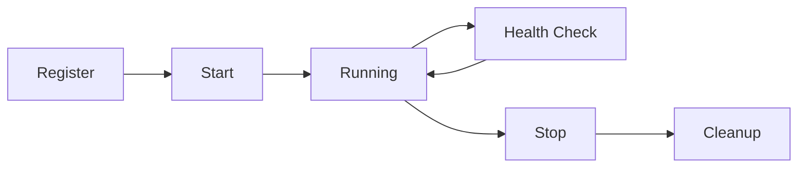

# Plugin Developer Guide

## Introduction

Welcome to the CLNRM Plugin Development Guide! This comprehensive guide will walk you through creating, testing, and publishing plugins for the Cleanroom Testing Platform.

## Table of Contents

1. [Getting Started](#getting-started)
2. [Plugin Architecture](#plugin-architecture)
3. [Creating Your First Plugin](#creating-your-first-plugin)
4. [Plugin API](#plugin-api)
5. [Testing Plugins](#testing-plugins)
6. [Publishing Plugins](#publishing-plugins)
7. [Best Practices](#best-practices)

## Getting Started

### Prerequisites

- Rust 1.70 or later
- CLNRM 0.3.0 or later
- Basic understanding of Rust async programming
- Familiarity with Docker/Testcontainers (optional)

### Plugin Development Environment Setup

```bash
# Install CLNRM
cargo install clnrm

# Create a new plugin project
cargo new --lib my-plugin
cd my-plugin

# Add CLNRM dependencies
cargo add clnrm-core
cargo add tokio --features full
cargo add serde --features derive
```

## Plugin Architecture

### The ServicePlugin Trait

All CLNRM plugins must implement the `ServicePlugin` trait:

```rust
use clnrm_core::{ServicePlugin, ServiceHandle, HealthStatus, Result};
use std::pin::Pin;
use std::future::Future;

pub trait ServicePlugin: Send + Sync {
    /// Get service name
    fn name(&self) -> &str;

    /// Start the service
    fn start(&self) -> Pin<Box<dyn Future<Output = Result<ServiceHandle>> + Send + '_>>;

    /// Stop the service
    fn stop(&self, handle: ServiceHandle) -> Pin<Box<dyn Future<Output = Result<()>> + Send + '_>>;

    /// Check service health
    fn health_check(&self, handle: &ServiceHandle) -> HealthStatus;
}
```

### Plugin Lifecycle



## Creating Your First Plugin

### Example: Redis Plugin

Here's a complete example of a Redis testing plugin:

```rust
use clnrm_core::{ServicePlugin, ServiceHandle, HealthStatus, Result, CleanroomError};
use std::collections::HashMap;
use std::pin::Pin;
use std::future::Future;
use tokio::sync::RwLock;
use std::sync::Arc;

/// Redis plugin configuration
pub struct RedisConfig {
    pub host: String,
    pub port: u16,
    pub password: Option<String>,
}

impl Default for RedisConfig {
    fn default() -> Self {
        Self {
            host: "127.0.0.1".to_string(),
            port: 6379,
            password: None,
        }
    }
}

/// Redis testing plugin
pub struct RedisPlugin {
    name: String,
    config: RedisConfig,
    container_id: Arc<RwLock<Option<String>>>,
}

impl RedisPlugin {
    pub fn new(name: impl Into<String>, config: RedisConfig) -> Self {
        Self {
            name: name.into(),
            config,
            container_id: Arc::new(RwLock::new(None)),
        }
    }
}

impl ServicePlugin for RedisPlugin {
    fn name(&self) -> &str {
        &self.name
    }

    fn start(&self) -> Pin<Box<dyn Future<Output = Result<ServiceHandle>> + Send + '_>> {
        Box::pin(async move {
            // Start Redis container using testcontainers
            use testcontainers::runners::AsyncRunner;
            use testcontainers::GenericImage;

            let redis_image = GenericImage::new("redis", "7-alpine")
                .with_exposed_port(6379);

            let node = redis_image.start().await
                .map_err(|e| CleanroomError::container_error("Failed to start Redis")
                    .with_source(e.to_string()))?;

            let host_port = node.get_host_port_ipv4(6379).await
                .map_err(|e| CleanroomError::container_error("Failed to get Redis port")
                    .with_source(e.to_string()))?;

            // Store container reference
            let mut container_guard = self.container_id.write().await;
            *container_guard = Some(format!("redis-{}", host_port));

            // Build service handle with connection metadata
            let mut metadata = HashMap::new();
            metadata.insert("host".to_string(), self.config.host.clone());
            metadata.insert("port".to_string(), host_port.to_string());
            if let Some(ref password) = self.config.password {
                metadata.insert("password".to_string(), password.clone());
            }

            Ok(ServiceHandle {
                id: uuid::Uuid::new_v4().to_string(),
                service_name: self.name.clone(),
                metadata,
            })
        })
    }

    fn stop(&self, _handle: ServiceHandle) -> Pin<Box<dyn Future<Output = Result<()>> + Send + '_>> {
        Box::pin(async move {
            let mut container_guard = self.container_id.write().await;
            *container_guard = None; // Container drops automatically
            Ok(())
        })
    }

    fn health_check(&self, handle: &ServiceHandle) -> HealthStatus {
        // Check if we have port information
        if handle.metadata.contains_key("port") {
            HealthStatus::Healthy
        } else {
            HealthStatus::Unknown
        }
    }
}

#[cfg(test)]
mod tests {
    use super::*;

    #[tokio::test]
    async fn test_redis_plugin() -> Result<()> {
        let plugin = RedisPlugin::new("test-redis", RedisConfig::default());

        let handle = plugin.start().await?;
        assert_eq!(handle.service_name, "test-redis");

        let status = plugin.health_check(&handle);
        assert_eq!(status, HealthStatus::Healthy);

        plugin.stop(handle).await?;

        Ok(())
    }
}
```

### Plugin Metadata

Create a `plugin.toml` file in your plugin root:

```toml
[plugin]
name = "redis-plugin"
version = "1.0.0"
description = "Redis cache testing plugin"
author = "Your Name <your.email@example.com>"
license = "MIT"
homepage = "https://github.com/yourusername/redis-plugin"
repository = "https://github.com/yourusername/redis-plugin"
keywords = ["cache", "redis", "testing"]

[plugin.cleanroom]
min_version = "0.3.0"

[[plugin.capabilities]]
name = "cache"
category = "cache"
description = "Redis caching capabilities"

[plugin.capabilities.config_schema]
host = "string"
port = "integer"
password = "string (optional)"

[[plugin.dependencies]]
name = "testcontainers"
version = "^0.25"
```

## Plugin API

### ServiceHandle

The `ServiceHandle` struct contains essential service information:

```rust
pub struct ServiceHandle {
    /// Unique service instance ID
    pub id: String,
    /// Service name
    pub service_name: String,
    /// Service metadata (connection details, etc.)
    pub metadata: HashMap<String, String>,
}
```

### HealthStatus

Health check results:

```rust
pub enum HealthStatus {
    Healthy,      // Service is running properly
    Unhealthy,    // Service has issues
    Unknown,      // Cannot determine status
}
```

### Error Handling

Use the `CleanroomError` type for all errors:

```rust
use clnrm_core::CleanroomError;

// Container errors
CleanroomError::container_error("Failed to start container")
    .with_context("Additional context")
    .with_source(format!("Error: {}", e))

// Validation errors
CleanroomError::validation_error("Invalid configuration")

// Internal errors
CleanroomError::internal_error("Unexpected state")
```

## Testing Plugins

### Unit Tests

```rust
#[cfg(test)]
mod tests {
    use super::*;

    #[tokio::test]
    async fn test_plugin_lifecycle() -> Result<()> {
        let plugin = MyPlugin::new("test", MyConfig::default());

        // Test start
        let handle = plugin.start().await?;
        assert!(!handle.id.is_empty());

        // Test health check
        let status = plugin.health_check(&handle);
        assert_eq!(status, HealthStatus::Healthy);

        // Test stop
        plugin.stop(handle).await?;

        Ok(())
    }
}
```

### Integration Tests

```rust
#[cfg(test)]
mod integration_tests {
    use super::*;
    use clnrm_core::CleanroomEnvironment;

    #[tokio::test]
    async fn test_plugin_in_cleanroom() -> Result<()> {
        let env = CleanroomEnvironment::new().await?;
        let plugin = Box::new(MyPlugin::new("test", MyConfig::default()));

        env.register_service(plugin).await?;
        let handle = env.start_service("test").await?;

        // Verify service is running
        let services = env.services().await;
        assert!(services.is_service_running("test"));

        env.stop_service(&handle.id).await?;

        Ok(())
    }
}
```

## Publishing Plugins

### Step 1: Prepare Plugin

```bash
# Ensure all tests pass
cargo test

# Build release version
cargo build --release

# Generate plugin manifest
clnrm marketplace validate-plugin
```

### Step 2: Create Plugin Manifest

Generate a `plugin-manifest.json`:

```json
{
  "name": "my-plugin",
  "version": "1.0.0",
  "description": "My awesome plugin",
  "author": "Your Name",
  "license": "MIT",
  "homepage": "https://github.com/yourusername/my-plugin",
  "repository": "https://github.com/yourusername/my-plugin",
  "keywords": ["testing", "awesome"],
  "capabilities": [
    {
      "name": "my_capability",
      "category": "testing",
      "description": "Does awesome things"
    }
  ],
  "min_cleanroom_version": "0.3.0"
}
```

### Step 3: Publish to Registry

```bash
# Login to registry (if required)
clnrm marketplace login

# Publish plugin
clnrm marketplace publish ./plugin-manifest.json

# Verify publication
clnrm marketplace info my-plugin
```

## Best Practices

### 1. Resource Management

Always clean up resources:

```rust
impl Drop for MyPlugin {
    fn drop(&mut self) {
        // Cleanup resources
        if let Some(ref container_id) = *self.container_id.try_read().ok() {
            // Stop container
        }
    }
}
```

### 2. Configuration Validation

Validate configuration early:

```rust
impl MyConfig {
    pub fn validate(&self) -> Result<()> {
        if self.port == 0 {
            return Err(CleanroomError::validation_error("Port cannot be 0"));
        }
        Ok(())
    }
}
```

### 3. Logging

Use structured logging:

```rust
use tracing::{info, warn, error};

impl ServicePlugin for MyPlugin {
    fn start(&self) -> Pin<Box<dyn Future<Output = Result<ServiceHandle>> + Send + '_>> {
        Box::pin(async move {
            info!("Starting plugin: {}", self.name);
            // ... implementation
            info!("Plugin started successfully");
            Ok(handle)
        })
    }
}
```

### 4. Error Context

Provide helpful error messages:

```rust
fn start(&self) -> Result<ServiceHandle> {
    let result = start_container().await
        .map_err(|e| CleanroomError::container_error("Failed to start container")
            .with_context(format!("Plugin: {}, Image: {}", self.name, self.image))
            .with_source(e.to_string()))?;

    Ok(result)
}
```

### 5. Async Best Practices

- Use `tokio::spawn` for background tasks
- Implement proper cancellation
- Use `Arc` and `RwLock` for shared state
- Avoid blocking operations in async code

### 6. Testing

- Write comprehensive unit tests
- Include integration tests
- Test error scenarios
- Test concurrent usage

### 7. Documentation

- Document all public APIs
- Provide usage examples
- Include troubleshooting guide
- Maintain CHANGELOG

## Advanced Topics

### Custom Health Checks

```rust
fn health_check(&self, handle: &ServiceHandle) -> HealthStatus {
    // Implement actual health check
    match self.ping_service(handle) {
        Ok(true) => HealthStatus::Healthy,
        Ok(false) => HealthStatus::Unhealthy,
        Err(_) => HealthStatus::Unknown,
    }
}
```

### Plugin Dependencies

Declare dependencies in your manifest:

```json
{
  "dependencies": [
    {
      "name": "base-plugin",
      "version_constraint": "^1.0.0",
      "optional": false
    }
  ]
}
```

### Custom Capabilities

Define custom capabilities for specialized plugins:

```json
{
  "capabilities": [
    {
      "name": "custom_capability",
      "category": "custom:my-category",
      "description": "My custom capability",
      "config_schema": {
        "custom_field": "string",
        "custom_number": "integer"
      }
    }
  ]
}
```

## Resources

- [Plugin Registry Format](./plugin-registry-format.md)
- [Marketplace API Reference](./marketplace-api.md)
- [Example Plugins](https://github.com/cleanroom/example-plugins)
- [Community Forum](https://forum.cleanroom.dev)
- [Discord Server](https://discord.gg/cleanroom)

## Support

- GitHub Issues: https://github.com/cleanroom/clnrm/issues
- Documentation: https://docs.cleanroom.dev
- Email: support@cleanroom.dev

## License

This guide is part of the CLNRM project and is licensed under MIT.
