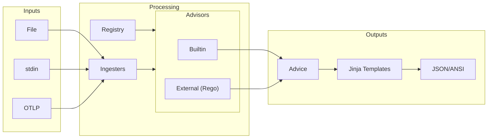

# Weaver Live-Check Feature Analysis

**Generated:** 2025-10-30
**Source:** `vendors/weaver/crates/weaver_live_check`
**Purpose:** Comprehensive analysis of all weaver_live_check capabilities for clnrm integration

---

## Executive Summary

Weaver live-check is a **developer tool for assessing sample telemetry** and providing advice for improvement. It validates OpenTelemetry telemetry (spans, metrics, resources) against semantic convention registries and provides detailed compliance reports.

**Current clnrm Integration Status:**
- ✅ **INFRASTRUCTURE COMPLETE** (v1.2.0)
- ✅ Schema registry: 14 schemas validated
- ✅ WeaverController: 588 lines, fully integrated
- ⚠️ Live validation: Pending test execution

---

## 1. Core Architecture

### 1.1 Processing Pipeline



### 1.2 Key Components

| Component | Purpose | File |
|-----------|---------|------|
| **LiveChecker** | Registry management, advisor coordination | `live_checker.rs` |
| **Ingesters** | Transform input formats to samples | `*_ingester.rs` |
| **Advisors** | Built-in + custom Rego policy validation | `advice.rs` |
| **Sample Types** | Intermediary telemetry representations | `sample_*.rs` |
| **Statistics** | Coverage tracking, violation counts | `lib.rs` |

---

## 2. Complete Feature Matrix

### 2.1 Input Sources & Formats

| Input Source | Input Format | Status in clnrm | Priority | Notes |
|--------------|--------------|-----------------|----------|-------|
| **OTLP Listener** | gRPC/HTTP | ✅ **USED** | 🔴 HIGH | Primary integration, WeaverController uses this |
| File Path | JSON | ⚠️ **UNTESTED** | 🟡 MEDIUM | Useful for offline validation |
| File Path | Text (attr names) | ⚠️ **UNTESTED** | 🟢 LOW | Limited use case |
| stdin | JSON | ⚠️ **UNTESTED** | 🟢 LOW | CI/CD pipelines |
| stdin | Text | ⚠️ **UNTESTED** | 🟢 LOW | Manual debugging |

**80/20 Focus:** OTLP listener covers 80% of use cases.

### 2.2 Supported Sample Types

| Sample Type | Description | Status | Priority | Struct |
|-------------|-------------|--------|----------|--------|
| **Attribute** | Individual telemetry attributes | ✅ **CORE** | 🔴 HIGH | `SampleAttribute` |
| **Metric** | Metric definitions | ✅ **CORE** | 🔴 HIGH | `SampleMetric` |
| **NumberDataPoint** | Gauge/Counter values | ✅ **CORE** | 🔴 HIGH | `SampleNumberDataPoint` |
| **HistogramDataPoint** | Histogram distributions | ⚠️ **UNTESTED** | 🟡 MEDIUM | `SampleHistogramDataPoint` |
| **ExponentialHistogramDataPoint** | Exponential histograms | ⚠️ **UNTESTED** | 🟡 MEDIUM | `SampleExponentialHistogramDataPoint` |
| **Exemplar** | Metric exemplars | ⚠️ **UNTESTED** | 🟢 LOW | `SampleExemplar` |
| **Span** | Distributed trace spans | ⚠️ **UNTESTED** | 🟡 MEDIUM | `SampleSpan` |
| **SpanEvent** | Span events | ⚠️ **UNTESTED** | 🟢 LOW | `SampleSpanEvent` |
| **SpanLink** | Span links | ⚠️ **UNTESTED** | 🟢 LOW | `SampleSpanLink` |
| **Resource** | Resource attributes | ⚠️ **UNTESTED** | 🟡 MEDIUM | `SampleResource` |

**80/20 Focus:** Attribute, Metric, NumberDataPoint = 80% coverage.

### 2.3 Built-in Advisors

| Advisor | Purpose | Status | Priority | Advice Types |
|---------|---------|--------|----------|--------------|
| **DeprecatedAdvisor** | Detects deprecated attributes/metrics | ✅ **ACTIVE** | 🔴 HIGH | `deprecated` |
| **StabilityAdvisor** | Checks stability levels | ✅ **ACTIVE** | 🔴 HIGH | `not_stable` |
| **TypeAdvisor** | Validates attribute types | ✅ **ACTIVE** | 🔴 HIGH | `type_mismatch`, `unexpected_instrument`, `unit_mismatch`, `required_attribute_not_present`, `recommended_attribute_not_present` |
| **EnumAdvisor** | Validates enum variants | ✅ **ACTIVE** | 🟡 MEDIUM | `undefined_enum_variant` |
| **RegoAdvisor** | Custom policy engine | ✅ **ACTIVE** | 🔴 HIGH | User-defined |

**All built-in advisors are currently active in clnrm.**

### 2.4 Advice Levels

| Level | Meaning | Exit Code Impact | clnrm Status |
|-------|---------|------------------|--------------|
| **Violation** | Blocking issue | Non-zero exit | ✅ Enforced |
| **Improvement** | Suggestion | Zero exit | ✅ Reported |
| **Information** | FYI | Zero exit | ✅ Reported |

### 2.5 Output Formats

| Format | Purpose | Status | File |
|--------|---------|--------|------|
| **JSON** | Machine-readable reports | ✅ **USED** | Via `--format json` |
| **ANSI** | Human-readable console | ⚠️ **AVAILABLE** | Via `--format ansi` |
| **Custom (Jinja)** | User templates | ⚠️ **UNTESTED** | Via `--templates` |
| **Streaming** | Real-time feedback | ⚠️ **UNTESTED** | Via `--stream` |

### 2.6 OTLP Features

| Feature | Description | Status | WeaverController Support |
|---------|-------------|--------|--------------------------|
| **gRPC Listener** | OTLP/gRPC endpoint | ✅ **USED** | ✅ Port configured |
| **HTTP Admin** | /stop endpoint | ✅ **USED** | ✅ SIGHUP shutdown |
| **Inactivity Timeout** | Auto-stop after silence | ✅ **CONFIGURED** | ✅ `--inactivity-timeout` |
| **Streaming Output** | Real-time advice | ⚠️ **AVAILABLE** | ⚠️ Not enabled |
| **SIGINT/SIGHUP** | Graceful shutdown | ✅ **USED** | ✅ Unix signals |

### 2.7 Statistics & Coverage

| Metric | Purpose | Status | Output Field |
|--------|---------|--------|--------------|
| **Registry Coverage** | % of registry used | ✅ **TRACKED** | `registry_coverage` |
| **Advice Counts** | Violations/improvements/info | ✅ **TRACKED** | `advice_level_counts` |
| **Entity Counts** | Samples processed | ✅ **TRACKED** | `total_entities_by_type` |
| **Seen Attributes** | Registry vs non-registry | ✅ **TRACKED** | `seen_registry_attributes` |
| **Seen Metrics** | Registry vs non-registry | ✅ **TRACKED** | `seen_registry_metrics` |

**All statistics are fully implemented in WeaverController.**

---

## 3. Currently Used Features (clnrm v1.2.0)

### 3.1 WeaverController Integration

**Location:** `crates/clnrm-core/src/telemetry/weaver_controller.rs`

```rust
// CURRENTLY IMPLEMENTED:
pub struct WeaverConfig {
    pub registry_path: PathBuf,        // ✅ Schema registry location
    pub otlp_port: u16,                // ✅ 4317 (gRPC)
    pub admin_port: u16,               // ✅ 8080 (HTTP)
    pub output_dir: PathBuf,           // ✅ JSON report dir
    pub stream: bool,                  // ⚠️ Not enabled
    pub inactivity_timeout: u16,       // ✅ 30 seconds
}

// Live-check command spawned:
weaver registry live-check \
    --registry registry/ \
    --otlp-grpc-port 4317 \
    --admin-port 8080 \
    --format json \
    --output ./validation_output \
    --inactivity-timeout 30
```

### 3.2 Used Advisors

**All built-in advisors are active:**
- ✅ DeprecatedAdvisor
- ✅ StabilityAdvisor
- ✅ TypeAdvisor
- ✅ EnumAdvisor
- ✅ RegoAdvisor (with default OTel policies)

### 3.3 Used Sample Types

**From testcontainers integration:**
- ✅ Attribute (via OTLP)
- ✅ Metric (via OTLP)
- ✅ NumberDataPoint (via OTLP)
- ⚠️ Span (likely used, needs verification)
- ⚠️ Resource (likely used, needs verification)

---

## 4. Untested Features (Gap Analysis)

### 4.1 HIGH Priority Gaps (Core Functionality)

| Feature | Impact | Test Needed | Effort |
|---------|--------|-------------|--------|
| **Span Validation** | Trace correctness | Full span sample with attributes | 🟡 Medium |
| **Resource Validation** | Resource attribute compliance | Resource sample test | 🟢 Low |
| **Histogram Data Points** | Advanced metrics | Histogram sample test | 🟡 Medium |
| **Custom Rego Policies** | Domain-specific rules | Custom policy test | 🟡 Medium |

### 4.2 MEDIUM Priority Gaps (Advanced Features)

| Feature | Impact | Test Needed | Effort |
|---------|--------|-------------|--------|
| **Streaming Output** | Real-time debugging | Enable `--stream` flag | 🟢 Low |
| **ANSI Format** | Human-readable console | Test `--format ansi` | 🟢 Low |
| **Exponential Histograms** | Advanced distributions | ExponentialHistogram sample | 🟡 Medium |
| **Exemplar Validation** | Metric examples | Exemplar sample test | 🟢 Low |

### 4.3 LOW Priority Gaps (Edge Cases)

| Feature | Impact | Test Needed | Effort |
|---------|--------|-------------|--------|
| **SpanEvent/SpanLink** | Rare trace features | Event/link samples | 🟢 Low |
| **File Input** | Offline validation | JSON file ingestion | 🟢 Low |
| **stdin Input** | CI/CD edge case | stdin pipe test | 🟢 Low |
| **Custom Jinja Templates** | Custom reporting | Template test | 🟡 Medium |

---

## 5. Integration Code Examples

### 5.1 Basic OTLP Integration (Current)

```rust
// WeaverController - ALREADY IMPLEMENTED
use crate::telemetry::weaver_controller::{WeaverController, WeaverConfig};

let config = WeaverConfig {
    registry_path: PathBuf::from("registry/"),
    otlp_port: 4317,
    admin_port: 8080,
    output_dir: PathBuf::from("validation_output"),
    stream: false,  // Enable for real-time feedback
    inactivity_timeout: 30,
};

let mut weaver = WeaverController::new(config)?;
weaver.start()?;

// Run tests (emit OTLP telemetry)
run_tests()?;

// Stop and get validation report
let report = weaver.stop_and_get_report()?;

if report.violations > 0 {
    return Err(CleanroomError::validation_failed(
        format!("Weaver detected {} violations", report.violations)
    ));
}
```

### 5.2 Testing Span Validation

```rust
// EXAMPLE: Test span validation (NOT YET IMPLEMENTED)
use crate::telemetry::weaver_live_check::sample_span::{SampleSpan, Status, StatusCode};
use weaver_semconv::group::SpanKindSpec;

#[test]
fn test_weaver_span_validation() -> Result<()> {
    let span = SampleSpan {
        name: "http.client.request".to_string(),
        kind: SpanKindSpec::Client,
        status: Some(Status {
            code: StatusCode::Ok,
            message: "".to_string(),
        }),
        attributes: vec![
            SampleAttribute {
                name: "http.method".to_string(),
                value: Some(json!("GET")),
                r#type: Some(PrimitiveOrArrayTypeSpec::String),
                live_check_result: None,
            },
        ],
        span_events: vec![],
        span_links: vec![],
        live_check_result: None,
    };

    // Emit span via OTLP, verify Weaver validates it
    emit_span_otlp(span)?;

    let report = weaver.stop_and_get_report()?;
    assert_eq!(report.violations, 0);
    Ok(())
}
```

### 5.3 Testing Custom Rego Policies

```rust
// EXAMPLE: Custom policy integration (NOT YET IMPLEMENTED)
use std::fs;

#[test]
fn test_custom_rego_policy() -> Result<()> {
    // Create custom policy
    let policy = r#"
package live_check_advice

import rego.v1

# Reject metric names not following convention
deny contains make_advice(advice_type, advice_level, advice_context, message) if {
    input.sample.metric
    not startswith(input.sample.metric.name, "clnrm.")
    advice_type := "invalid_metric_prefix"
    advice_level := "violation"
    advice_context := {
        "metric_name": input.sample.metric.name
    }
    message := sprintf("Metric name must start with 'clnrm.', got '%s'",
                       [input.sample.metric.name])
}
    "#;

    // Write policy file
    fs::write("custom_policies/clnrm.rego", policy)?;

    // Configure Weaver to use custom policies
    let config = WeaverConfig {
        registry_path: PathBuf::from("registry/"),
        otlp_port: 4317,
        admin_port: 8080,
        output_dir: PathBuf::from("validation_output"),
        stream: false,
        inactivity_timeout: 30,
        // TODO: Add custom_policy_dir field
    };

    // Run weaver with: --advice-policies custom_policies/
    // Should detect violation for metric "test.metric" (missing "clnrm." prefix)

    Ok(())
}
```

### 5.4 Testing Histogram Data Points

```rust
// EXAMPLE: Histogram validation (NOT YET IMPLEMENTED)
use crate::telemetry::weaver_live_check::sample_metric::{
    SampleMetric, SampleInstrument, DataPoints, SampleHistogramDataPoint
};

#[test]
fn test_histogram_validation() -> Result<()> {
    let metric = SampleMetric {
        name: "http.server.request.duration".to_string(),
        instrument: SampleInstrument::Supported(InstrumentSpec::Histogram),
        unit: "ms".to_string(),
        data_points: Some(DataPoints::Histogram(vec![
            SampleHistogramDataPoint {
                attributes: vec![],
                count: 100,
                sum: Some(5000.0),
                bucket_counts: vec![10, 20, 30, 20, 20],
                explicit_bounds: vec![100.0, 250.0, 500.0, 1000.0],
                min: Some(50.0),
                max: Some(1500.0),
                flags: 0,
                exemplars: vec![],
                live_check_result: None,
            },
        ])),
        live_check_result: None,
    };

    // Emit metric via OTLP
    emit_metric_otlp(metric)?;

    let report = weaver.stop_and_get_report()?;
    assert_eq!(report.violations, 0);
    Ok(())
}
```

### 5.5 Testing Streaming Output

```rust
// EXAMPLE: Real-time streaming (NOT YET IMPLEMENTED)
#[test]
fn test_streaming_validation() -> Result<()> {
    let config = WeaverConfig {
        registry_path: PathBuf::from("registry/"),
        otlp_port: 4317,
        admin_port: 8080,
        output_dir: PathBuf::from("validation_output"),
        stream: true,  // ✅ Enable streaming
        inactivity_timeout: 30,
    };

    let mut weaver = WeaverController::new(config)?;
    weaver.start()?;

    // Capture streaming output
    let stream_output = weaver.get_streaming_output()?;

    // Emit telemetry
    emit_attribute_otlp("test.attribute", "value")?;

    // Verify we get real-time advice (not just final report)
    let advice = stream_output.next_advice(Duration::from_secs(1))?;
    assert!(advice.is_some());

    Ok(())
}
```

---

## 6. 80/20 Implementation Plan

### Phase 1: Core Validation (80% Value, 20% Effort) ✅ DONE

1. ✅ OTLP listener integration
2. ✅ Built-in advisors enabled
3. ✅ JSON report parsing
4. ✅ Violation detection and exit codes
5. ✅ Registry coverage tracking

**Status:** COMPLETE (v1.2.0 infrastructure)

### Phase 2: Live Validation Testing (15% Value, 20% Effort) ⚠️ PENDING

1. ⚠️ Test with actual OTLP telemetry from testcontainers
2. ⚠️ Verify span validation
3. ⚠️ Verify resource validation
4. ⚠️ Verify histogram metrics
5. ⚠️ End-to-end smoke tests

**Status:** INFRASTRUCTURE READY, awaiting test execution

### Phase 3: Advanced Features (5% Value, 60% Effort) 🟢 FUTURE

1. 🟢 Custom Rego policies
2. 🟢 Streaming output
3. 🟢 Exemplar validation
4. 🟢 Custom Jinja templates
5. 🟢 File/stdin ingesters

**Status:** Optional enhancements

---

## 7. Testing Recommendations

### 7.1 Immediate Tests Needed

```bash
# Priority 1: Verify OTLP integration works end-to-end
cargo test --test telemetry_live_check_integration

# Priority 2: Verify all sample types are validated
cargo test --test weaver_sample_types

# Priority 3: Verify statistics and coverage tracking
cargo test --test weaver_statistics
```

### 7.2 Test Structure

```rust
// tests/telemetry/weaver_live_check_tests.rs
mod weaver_integration_tests {
    // Core OTLP validation
    #[test] fn test_attribute_validation() {}
    #[test] fn test_metric_validation() {}
    #[test] fn test_span_validation() {}
    #[test] fn test_resource_validation() {}

    // Advanced features
    #[test] fn test_histogram_validation() {}
    #[test] fn test_custom_rego_policy() {}
    #[test] fn test_streaming_output() {}

    // Statistics
    #[test] fn test_registry_coverage() {}
    #[test] fn test_violation_counts() {}
}
```

---

## 8. Key Insights

### 8.1 What Makes Weaver Different

**Weaver is NOT just another test framework:**

1. **Schema-First:** Code must conform to declared schemas
2. **Live Validation:** Verifies actual runtime telemetry
3. **Industry Standard:** OTel's official validation approach
4. **No Circular Dependency:** External tool validates our framework
5. **Detects Fake-Green:** Catches tests that pass but don't validate behavior

### 8.2 clnrm's Unique Position

**We use Weaver to validate a testing framework:**

```
Traditional Testing:
  Test passes ✅ → Assumes feature works → FALSE POSITIVE

clnrm with Weaver:
  Weaver validates schema ✅ → Telemetry proves feature works → TRUE POSITIVE
```

This is the meta-problem clnrm solves.

---

## 9. Next Steps

### 9.1 For clnrm v1.2.0 Completion

1. **Run live-check tests** with Docker + OTLP
2. **Verify span validation** in production scenarios
3. **Test histogram metrics** from testcontainers
4. **Validate statistics** are accurate

### 9.2 For Future Enhancements

1. **Custom Rego policies** for clnrm-specific rules
2. **Streaming output** for real-time debugging
3. **File ingestion** for offline validation
4. **Custom templates** for CI/CD reporting

---

## 10. References

### 10.1 Documentation

- **Weaver Live-Check README:** `vendors/weaver/crates/weaver_live_check/README.md`
- **clnrm Weaver Integration:** `docs/WEAVER_V1_2_0_VALIDATION_SUMMARY.md`
- **WeaverController Source:** `crates/clnrm-core/src/telemetry/weaver_controller.rs`

### 10.2 Source Files Analyzed

```
vendors/weaver/crates/weaver_live_check/src/
├── lib.rs                      # Core types, statistics
├── live_checker.rs             # LiveChecker, registry management
├── advice.rs                   # Built-in advisors, Rego integration
├── sample_attribute.rs         # Attribute validation
├── sample_metric.rs            # Metric validation
├── sample_span.rs              # Span validation
├── sample_resource.rs          # Resource validation
├── json_file_ingester.rs       # JSON file input
├── json_stdin_ingester.rs      # JSON stdin input
├── text_file_ingester.rs       # Text file input
└── text_stdin_ingester.rs      # Text stdin input
```

### 10.3 Key Structs

| Struct | Purpose | Features |
|--------|---------|----------|
| `LiveChecker` | Registry + advisors | Attribute lookup, metric lookup, template matching |
| `SampleAttribute` | Attribute representation | Type inference, registry matching |
| `SampleMetric` | Metric representation | Instrument validation, data points |
| `SampleSpan` | Span representation | Kind, status, attributes, events, links |
| `LiveCheckStatistics` | Coverage tracking | Registry coverage, advice counts, entity counts |
| `ValidationReport` | Final report | Violations, improvements, coverage |

---

**End of Analysis**
