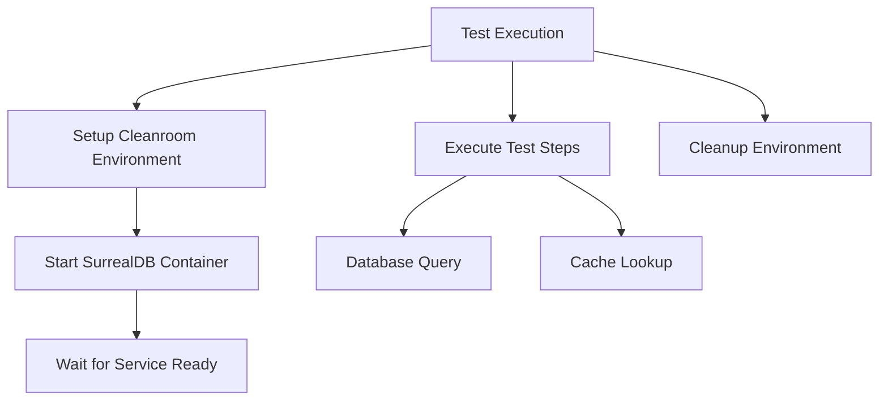

# OpenTelemetry Trace Visualization Examples

This directory contains example trace files for demonstrating the `clnrm graph` command.

## Sample Trace File

The `sample-trace.json` file contains a sample OpenTelemetry trace with hierarchical spans representing a typical test execution workflow:

- Root span: Test Execution
  - Setup Cleanroom Environment
    - Start SurrealDB Container
      - Wait for Service Ready
  - Execute Test Steps
    - Database Query
    - Cache Lookup
  - Cleanup Environment

## Usage Examples

### ASCII Tree Visualization

Display trace as an ASCII tree:

```bash
clnrm graph examples/traces/sample-trace.json --format ascii
```

Output:
```
OpenTelemetry Trace Graph
=========================

└── Test Execution (SERVER)
    ├── Setup Cleanroom Environment (INTERNAL)
    │   └── Start SurrealDB Container (CLIENT)
    │       └── Wait for Service Ready (CLIENT)
    ├── Execute Test Steps (INTERNAL)
    │   ├── Database Query (CLIENT)
    │   └── Cache Lookup (CLIENT)
    └── Cleanup Environment (INTERNAL)
```

### DOT Format (Graphviz)

Generate Graphviz-compatible DOT graph:

```bash
clnrm graph examples/traces/sample-trace.json --format dot > trace.dot
dot -Tpng trace.dot -o trace.png
```

### Mermaid Diagram

Generate Mermaid diagram for markdown documentation:

```bash
clnrm graph examples/traces/sample-trace.json --format mermaid
```

Output:
````markdown

````

### JSON Graph Structure

Export as JSON graph with nodes and edges:

```bash
clnrm graph examples/traces/sample-trace.json --format json
```

Output:
```json
{
  "nodes": [
    {
      "id": "root-001",
      "name": "Test Execution",
      "kind": "SERVER"
    },
    ...
  ],
  "edges": [
    {
      "source": "root-001",
      "target": "span-002"
    },
    ...
  ]
}
```

### Filtering Spans

Filter spans by name pattern:

```bash
clnrm graph examples/traces/sample-trace.json --filter "Database"
```

### Highlighting Missing Edges

Highlight missing parent-child relationships:

```bash
clnrm graph examples/traces/sample-trace.json --highlight-missing
```

## Trace File Format

The trace JSON file should follow this structure:

```json
{
  "spans": [
    {
      "name": "Span Name",
      "span_id": "unique-span-id",
      "parent_span_id": "parent-id-or-null",
      "trace_id": "trace-identifier",
      "kind": "SERVER|CLIENT|INTERNAL"
    }
  ]
}
```

### Required Fields

- `name`: Human-readable span name
- `span_id`: Unique identifier for this span
- `parent_span_id`: ID of parent span, or null for root spans
- `trace_id`: Trace identifier (all spans in same trace share this)
- `kind`: Span kind (SERVER, CLIENT, INTERNAL, PRODUCER, CONSUMER)

## Integration with clnrm

The `clnrm graph` command is designed to work with OTEL traces generated during test execution:

```bash
# Run tests with OTEL tracing enabled
cargo run --features otel -- run tests/

# Visualize the generated trace
clnrm graph .clnrm/traces/latest.json --format ascii
```

## Advanced Usage

### Combine with other commands

```bash
# Record baseline and visualize
clnrm record tests/ -o baseline.json
clnrm graph baseline.json --format mermaid

# Compare traces visually
clnrm diff baseline.json current.json --format tree
clnrm graph baseline.json --format dot > baseline.dot
clnrm graph current.json --format dot > current.dot
```

### CI/CD Integration

```yaml
# .github/workflows/test.yml
- name: Run tests with tracing
  run: cargo run --features otel -- run tests/

- name: Generate trace visualization
  run: clnrm graph .clnrm/traces/latest.json --format mermaid > trace-diagram.md

- name: Upload trace artifact
  uses: actions/upload-artifact@v3
  with:
    name: trace-diagrams
    path: trace-diagram.md
```

## Additional Resources

- OpenTelemetry Specification: https://opentelemetry.io/docs/specs/otel/
- Graphviz Documentation: https://graphviz.org/documentation/
- Mermaid.js Documentation: https://mermaid.js.org/
