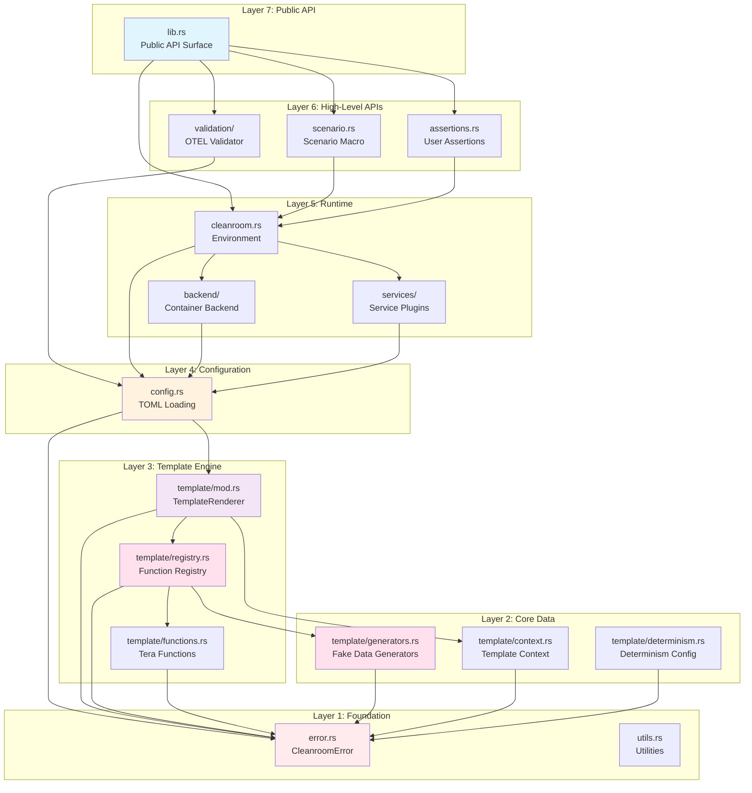
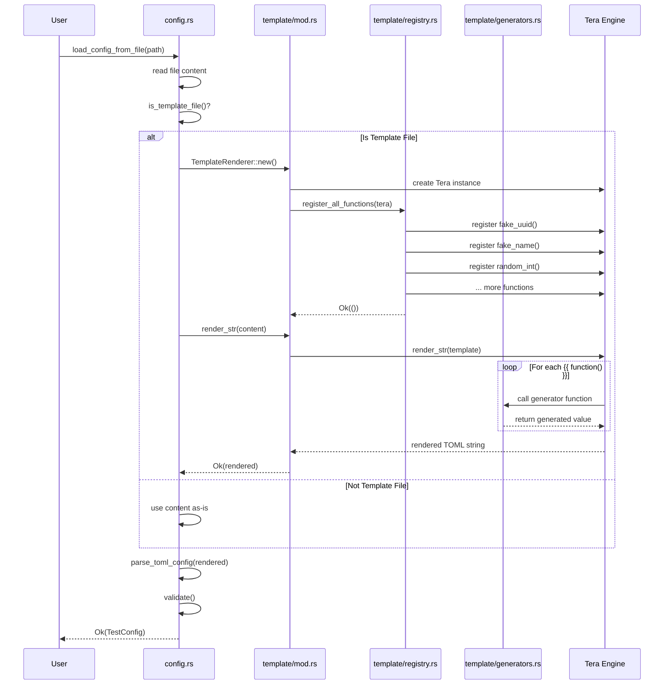
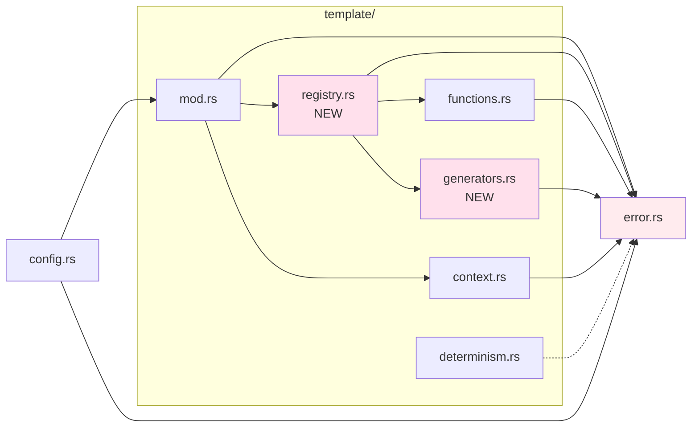
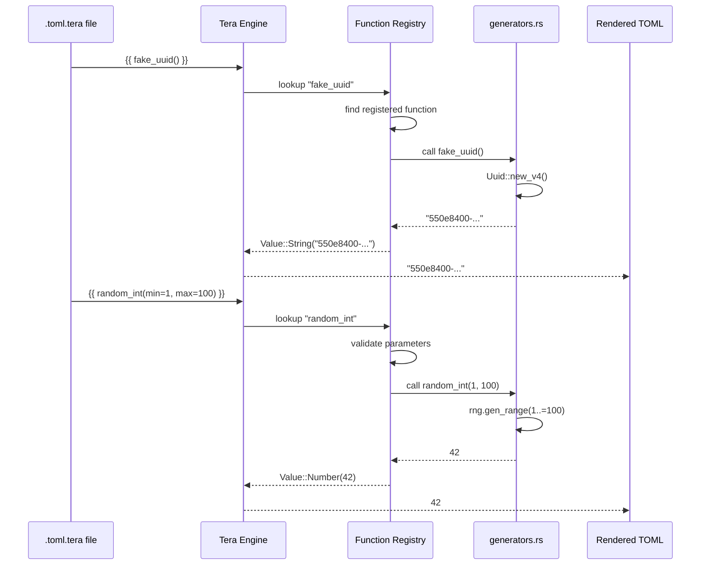
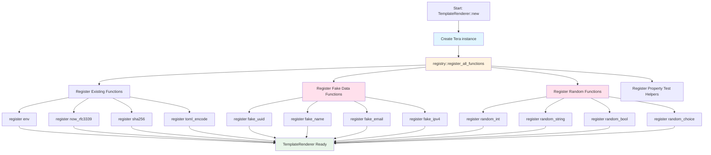
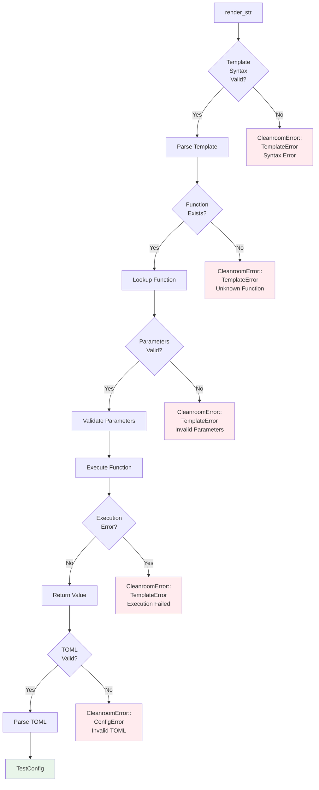
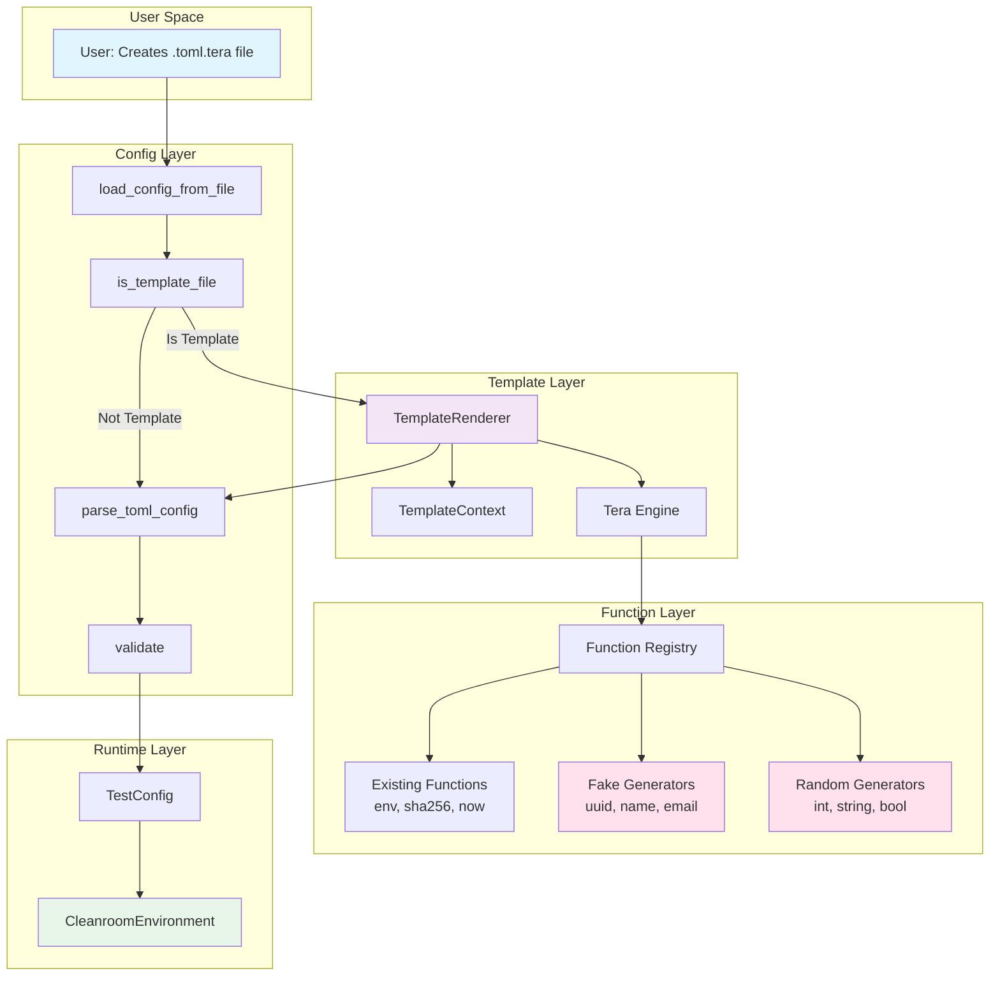
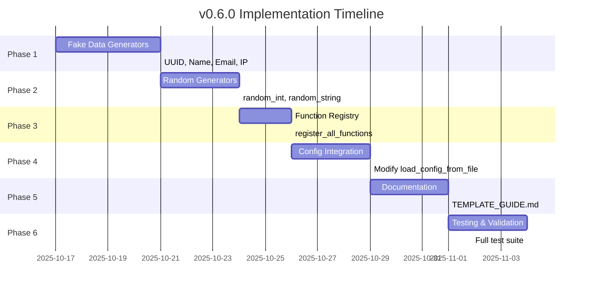
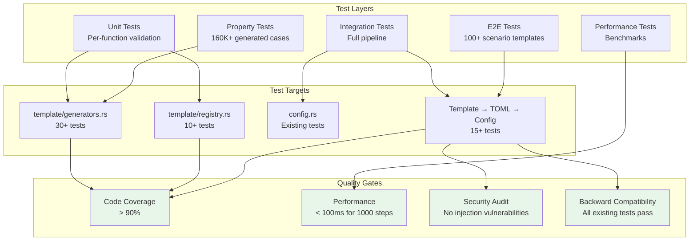
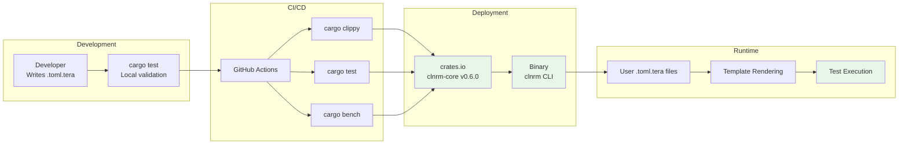

# Architecture Diagrams - CLNRM v0.6.0

**Version**: 0.6.0
**Date**: 2025-10-16
**Format**: Mermaid Diagrams

## System Architecture Overview



## Template System Data Flow



## Module Dependency Graph



## Template Function Call Flow



## Plugin Registration Flow



## Error Handling Flow



## Component Interaction Diagram



## Security Architecture

```mermaid
graph TB
    subgraph "Threat Surface"
        TEMPLATE[User Template<br/>.toml.tera]
        ENV[Environment Variables]
    end

    subgraph "Security Controls"
        SANDBOX[Sandboxed Functions<br/>No I/O, No File System]
        VALIDATION[Parameter Validation<br/>Type Checking]
        NOINJECT[No Template Injection<br/>No File Inclusion]
        ENVFUNC[env() Function<br/>Explicit Access]
        LINT[Secret Detection<br/>Lint Warnings]
    end

    subgraph "Safe Outputs"
        RENDERED[Rendered TOML<br/>Safe String]
        CONFIG[TestConfig<br/>Validated]
    end

    TEMPLATE --> SANDBOX
    TEMPLATE --> VALIDATION
    TEMPLATE --> NOINJECT

    ENV --> ENVFUNC

    SANDBOX --> RENDERED
    VALIDATION --> RENDERED
    NOINJECT --> RENDERED
    ENVFUNC --> RENDERED

    RENDERED --> LINT
    LINT --> CONFIG

    style SANDBOX fill:#e8f5e9
    style VALIDATION fill:#e8f5e9
    style NOINJECT fill:#e8f5e9
    style ENVFUNC fill:#fff3e0
    style LINT fill:#fff3e0
    style CONFIG fill:#e8f5e9
```

## Implementation Phases



## Testing Architecture



## Deployment Architecture



---

## How to Use These Diagrams

### Viewing in GitHub
These Mermaid diagrams render automatically in GitHub Markdown.

### Viewing Locally
Use a Mermaid-compatible Markdown viewer:
- VS Code with Mermaid extension
- Obsidian
- Typora
- Online: https://mermaid.live/

### Exporting to Images
Use Mermaid CLI or online tools to export to PNG/SVG.

### Updating Diagrams
Edit the Mermaid code blocks directly in this file.

---

**Document Status**: ✅ Complete
**Last Updated**: 2025-10-16
